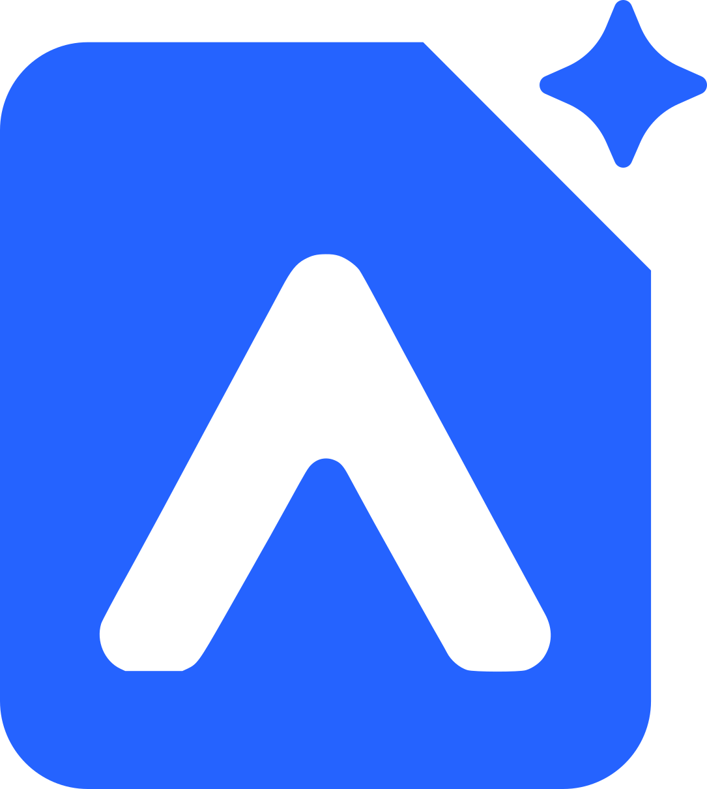

<div align="center">



# AgentDeck SDK

**Compose. Observe. Ship.**

The production runtime for agents you already have.

<!-- The blue variant, not logo.svg: that one is fill="currentColor" for inlining, and an SVG
     loaded through  has nothing to inherit from, so it renders black  -  invisible on
     GitHub's dark theme. See docs/brand/README.md. -->

[](https://github.com/agentdecksdk/agentdeck/actions/workflows/ci.yml)
[](https://github.com/agentdecksdk/agentdeck/releases)
[](pyproject.toml)
[](LICENSE)
[](https://agentdecksdk.com/)

</div>

**A harness for agents you have to operate.** You write agents, workflows and skills as small
Python declarations in a `.agentdeck/` directory; AgentDeck supplies the runtime around them and
leaves the running of a turn to the engines underneath.

```bash
pip install agentdeck-sdk
```

```python
# .agentdeck/agents/greeter/agent.py
from agentdeck import Agent

greeter = Agent(name="Greeter", instructions="You are a friendly scheduling assistant.")
```

```python
# main.py  -  the directory is the registration: no catalog file, no decorator
import asyncio

from agentdeck import Deck


async def main() -> None:
    async with Deck.from_project() as deck:  # discovers ./.agentdeck, fails fast
        result = await deck.run("Greeter", "hello")
        print(result.output)

        await deck.run("Greeter", "and my name is Ada", session_id="wa-123")
        async for event in deck.stream("Greeter", "what's my name?", session_id="wa-123"):
            print(event.kind)  # text.delta … run.completed


asyncio.run(main())
```

**OpenAI Agents SDK × LangGraph × MCP**  -  sessions · streaming · one event log · human approval ·
run control.

If AgentDeck is useful to you, [a star](https://github.com/agentdecksdk/agentdeck) helps other
developers find it.

## Build, operate, connect

| Build | Operate | Connect |
| --- | --- | --- |
| `Agent` | Sessions | OpenAI Agents SDK |
| `Workflow` | Streaming | LangGraph |
| Tools | One event log per run | MCP servers |
| Skills (`SKILL.md`) | Human approval (HITL) | HTTP + SSE (`agentdeck-serve`) |
| `Context[T]` | Run control  -  pause / resume / cancel | Memory, Redis, SQLite, Postgres stores |

## Why it splits that way

**AgentDeck owns configuration; the
[OpenAI Agents SDK](https://github.com/openai/openai-agents-python) and
[LangGraph](https://langchain-ai.github.io/langgraph/) own execution.** There is no agent loop
here, no graph engine, and no reimplementation of either  -  an `Agent` compiles to an SDK agent, a
`Workflow` compiles to a LangGraph graph, and both are run by their own engine. What AgentDeck
adds is the part those libraries deliberately leave to you: where definitions live, how they are
configured, and what you can see and do while a run is in flight.

## Who it is for

You want this if you are putting agents somewhere they have to keep working: several agents and
workflows in one project, a chat surface and a batch path over the same definitions, runs you
need to inspect afterwards, approvals that outlive the process that asked for them.

You do not want this if you are writing one script that calls one model  -  use the Agents SDK
directly, and come back when the wiring around it has become the work. You also do not want it
if you have already built your own harness: AgentDeck is opinionated about project layout and
configuration, and those opinions are the product.

## What it deliberately does not do

- **No DSL.** Definitions are Python. There is no YAML agent format, and there will not be one.
- **No execution engine of its own.** Bugs in the agent loop or in graph execution belong
  upstream, and improvements there arrive without agentdeck doing anything.
- **No sandbox.** Tools, skills and workflow nodes are ordinary Python in your process, and a
  model-chosen tool call is trusted by design. See [SECURITY.md](SECURITY.md) before you give an
  agent something destructive.
- **No auth, no multi-tenancy, no hosted control plane, no marketplace.** `namespace` labels a
  run; it does not authenticate anyone. Put a real gateway in front of the HTTP surface.
- **No model routing, evaluation framework, or prompt management.** One OpenAI-compatible
  endpoint per process, configured by environment.

## Install

```bash
pip install agentdeck-sdk              # or, with the HTTP surface: agentdeck-sdk[serve]
export OPENAI_MODEL=gpt-4.1-mini OPENAI_API_KEY=sk-...
```

The distribution is **`agentdeck-sdk`**; the import stays `agentdeck`. `OPENAI_BASE_URL` points it at any
OpenAI-compatible endpoint instead (a gateway, vLLM, Ollama). Extras: `serve` for the HTTP
surface, `durability` for the Postgres checkpointer and event store (SQLite ships in base  -
`durable=True` works out of the box), `redis` for Redis-backed sessions or event log,
`observability` for Langfuse tracing.

Contributing to agentdeck itself is a different setup  -  see
[CONTRIBUTING.md](CONTRIBUTING.md).

## The project layout

Everything you define lives in a `.agentdeck/` directory next to where you run. The path *is*
the registration: no catalog file, no `__init__.py`, no decorator to remember.

```text
.agentdeck/
├── agents/greeter/agent.py            # an Agent(...)
├── workflows/new_booking/workflow.py  # a Workflow(...)
└── skills/parse-request/              # SKILL.md + optional scripts
```

`Deck` discovers, compiles and validates all of it before the first turn  -  a missing skill, an
unknown MCP name or a workflow that cannot compile fails at `build()`, not in production.

Runnable projects are in [`examples/`](examples/)  -  a chat agent with a tool, a workflow that
pauses for a human approval, an existing LangGraph agent wrapped without rewriting it, and the
one below. All are built by the test suite, so none can quietly stop working.

## Something built with it, that you can use right now

The assistant on **[agentdecksdk.com](https://agentdecksdk.com/)**  -  the panel in the corner of
every documentation page  -  is an AgentDeck agent. Ask it something about AgentDeck and it will
search these docs, read the pages it finds, and cite them.

Its entire source is [`examples/jack`](examples/jack/): 617 lines of Python for
three tools over one `Context[DocsCorpus]`, streaming the run's own events to the browser over
SSE. Not a demo written to look good in a README  -  it is the thing actually serving the site,
including the parts a public endpoint needs and a demo skips: an origin check, a per-day quota, a
token ceiling, and an allowlist deciding which event kinds a browser is allowed to see.

It is also the honest test of the pitch. If *"agents you have to operate"* meant anything, it had
to survive being operated.

## What you get around your definitions

- **Sessions**  -  `session_id=` keeps a conversation across calls and across surfaces, in memory
  or in Redis.
- **One event log per run**  -  every turn, however it was started, appends to the same ordered
  log: text deltas, tool calls, token usage, the result. Status is folded from it, not stored.
- **Run control**  -  an agent or workflow run in flight can be paused, resumed or cancelled by
  id, at documented safe points, from another process.
- **Human approval**  -  a `durable=True` workflow node calls `interrupt()`, the run parks, and
  `deck.runs.list(status=...)` / `Run.answer()` finish it later, possibly somewhere else.
- **An HTTP surface**  -  `agentdeck-serve` puts chat, SSE streaming, workflows, and the approval
  inbox behind FastAPI without any code of yours.
- **Tools, skills and MCP**  -  SDK tools as plain functions, skills as `SKILL.md` directories,
  and named MCP servers from a `.mcp.json` beside your project.

## Documentation

The full docs are at **[agentdecksdk.com](https://agentdecksdk.com/)**:

- [Quickstart](https://agentdecksdk.com/meet-agentdeck/quickstart)  -  install, configure,
  first agent
- [Build Your Deck](https://agentdecksdk.com/build-your-deck/agents)  -  agents, workflows, skills,
  tools, context
- [Runs & Control](https://agentdecksdk.com/runs-and-control/runs)  -  runs, sessions, events,
  lifecycle control
- [Reference](https://agentdecksdk.com/reference/deck)  -  every setting and every `Deck`
  method, generated from the code

## Project

AgentDeck is beta software under active development; breaking changes are listed in
[CHANGELOG.md](CHANGELOG.md).

- **Contributing**  -  [CONTRIBUTING.md](CONTRIBUTING.md). PRs target `dev`; `make check` is the
  gate. Framework internals are laid out in [`agentdeck/README.md`](agentdeck/README.md).
  Issues labelled [`good first issue`](https://github.com/agentdecksdk/agentdeck/labels/good%20first%20issue)
  are scoped to be finishable in an afternoon and each one names the example to run first.
- **Brand**  -  [`docs/brand/`](docs/brand/).
- **Security**  -  [SECURITY.md](SECURITY.md), including what is deliberately out of scope.
- **Code of conduct**  -  [CODE_OF_CONDUCT.md](CODE_OF_CONDUCT.md).
- **License**  -  MIT, see [LICENSE](LICENSE).

### Contributors

<a href="https://github.com/agentdecksdk/agentdeck/graphs/contributors">
  
</a>
