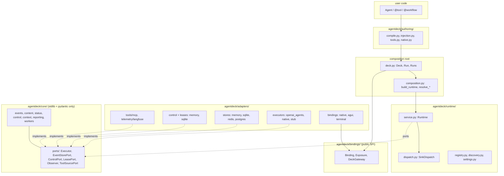

# AgentDeck Architecture, As It Actually Is

Read against `v6.0.3` (`b9a7f76`). This describes what the code does, not what
`CLAUDE.md` or `docs/engineering/architecture.md` claim.

## 1. Where the documented map is wrong

| claim | source | reality |
|---|---|---|
| `agentdeck/surfaces/` holds ingress (HTTP/SSE, CLI) | `CLAUDE.md` §2 | No such package. Ingress is `agentdeck/bindings/` (SPI) + `agentdeck/adapters/bindings/` (impls) + `agentdeck/cli.py`. |
| `App` is the composition root that calls `build_runtime` | `composition.py`, `core/ports/tools.py`, `adapters/tools/mcp/lifecycle.py`, `runtime/service.py` | `App` was deleted. `Deck` is the only composition root. |
| `agentdeck.observability.Langfuse` renders traces | `authoring/runners/agent.py` | It is `agentdeck.observers.LangfuseObserver`. |
| `AgentNode` / `BaseSandboxAgent` / `authoring/nodes.py` | `authoring/runners/agent.py` | All removed. The module's stated reason to exist no longer exists. |
| import-linter has 10 contracts | `docs/engineering/architecture.md` | 12 contracts, all kept. |
| "A port with one implementation has not earned itself" | `docs/engineering/architecture.md` §2 | `ToolSourcePort` has one implementation and zero production callers. |

## 2. Rings, as enforced

`.importlinter` really does hold the line: 12 contracts, all kept, verified in this
audit. The ring order below is the enforced one.



Two things the diagram cannot show and that matter more than the rings:

1. `Deck` reaches **past** the ports directly into concrete adapters
   (`OpenAIAgentsExecutor`, `NativeExecutor`, `MCPLifecycle`, `ExecutionStore`,
   `SessionFactory`). `composition.py` exists to be the one place adapters are
   built, and `deck.py:__aenter__` builds four of them itself.
2. Three module-global mutable singletons cut across every ring:
   `deck._live_deck`, `MCPLifecycle` class attributes, and
   `settings.get_settings`'s `lru_cache`.

## 3. Components and what they actually own

| component | file | owns | leaks |
|---|---|---|---|
| `Deck` | `deck.py` (1722 lines) | catalog, 4-state lifecycle, execution-task registry, minted agents, process claim, binding host | builds concrete adapters; holds a `ThreadPoolExecutor` from `__init__` |
| `Run` | `deck.py` | one run's identity + delegated ops | `__await__` raises bare `RuntimeError` |
| `Runs` | `deck.py` | start / get / list | `get()` raises `ValueError` for bad arguments |
| `Runtime` | `runtime/service.py` (1374 lines) | claim, play, seal, control routing, delegation tree, leases, report ordering | in-memory `_tree` limits cancel cascade to one process |
| `SinkDispatch` | `runtime/dispatch.py` (454 lines) | per-sink queue, breaker, probe, drop accounting | 9 tunable module constants, none configurable by a user |
| `core/status.py` | 390 lines | the only lifecycle law: `STATES`, `TRANSITIONS`, `PRECONDITIONS`, `POLICY` | nothing. This module is the best thing in the tree. |
| `core/events.py` | 500 lines | wire schema, forward-compat degradation | 3 payload kinds with no producer |
| `NativeExecutor` | `adapters/executors/native/` | parked coroutines keyed by `run_id`, in memory | parked bodies survive only inside one process and one `Deck` |
| `OpenAIAgentsExecutor` | `adapters/executors/openai_agents/` | SDK bridge, translation, reconcile | resume = full turn replay |
| `MCPLifecycle` | `adapters/tools/mcp/lifecycle.py` | process-wide server registry | pure class-level global state; the direct cause of one-Deck-per-process |
| `DeckGateway` / `Exposure` | `bindings/` | protocol SPI, endpoint validation, host lifecycle | its own `GatewayError` hierarchy, disjoint from `AgentdeckError` |

## 4. Runtime flow: one top-level run

```mermaid
sequenceDiagram
  participant U as caller
  participant D as Deck
  participant R as Runtime
  participant S as EventStore
  participant X as Executor
  participant K as SinkDispatch

  U->>D: await deck.run(name, input)
  D->>D: _catalog_root(name), _content_for(root, input)
  D->>R: runtime.run(...) -> async generator
  R->>R: _resolve, _bind (gate + reporter), delegate
  R->>S: claim_start(RunStarted)  [conditional append]
  S-->>R: Event(run.started) or SessionBusyError
  R->>K: _fan_out(run.started)
  R-->>D: yield run.started
  D->>D: create_task(_drain(agen)); _executions[run_id] = task
  Note over D: run() then awaits the task to completion
  loop per engine payload
    X-->>R: payload
    R->>S: append -> stamps seq + ts
    R->>K: _fan_out
    R-->>D: yield event
    X->>X: await ctx.gate.checkpoint()
  end
  R->>S: append(run.completed / failed / cancelled)
  D->>S: _events(ctx) replays the segment
  D-->>U: TurnResult (agent) or body value (workflow)
```

The load-bearing invariant is **persist, fan out, yield**, in that order, in
`Runtime._record`. It is honored everywhere and is what makes the store the
single source of truth.

The second load-bearing invariant is that **the store assigns `seq` and `ts`
inside the write**. Nothing in the process holds a counter. This is correct and
is what makes gap-detection meaningful.

## 5. Lifecycle ownership

| lifecycle | owner | started by | ended by | gap |
|---|---|---|---|---|
| Deck (`NEW -> BUILT -> OPEN -> CLOSED`) | `Deck` | `build()` / `__aenter__` | `aclose()` | `aclose()` skips sessions, executors and store if `drain()` raises |
| process claim | `deck._live_deck` module global | `Deck.__init__` | `aclose()` / `Deck._release()` | a test-only static method ships in production |
| MCP servers | `MCPLifecycle` class attributes | `Deck.__aenter__` | `MCPLifecycle.shutdown()` | `_servers`, `_failed`, `_config` are never cleared |
| execution tasks | `Deck._executions` | `_start` / `_invoke` | `_execution_done` done-callback | `aclose()` cancels with a 2 x 1s budget, then abandons |
| run (log) | `Runtime` + store | `claim_start` | terminal append | a suspended run is owed a terminal event that nothing guarantees |
| session claim | store, via `claim_start` | first turn | terminal event on the holder | suspended runs hold their session indefinitely by design |
| parked workflow body | `NativeExecutor._parked` | `execute()` | `_wake` or `aclose()` | cancelled at deck close without sealing its run's log |
| sink consumer tasks | `SinkDispatch` | first `submit` | `Runtime.drain()` | none |
| worker threads | `SyncToolWorkers` | `Deck.__init__` | `NativeExecutor.aclose()` | pool is created even for a Deck never opened |
| binding endpoints | `Exposure._lifecycle` | `expose().serve()` | same | secondary teardown exceptions are dropped, not logged |

## 6. Control plane

Control is deliberately three-phase and table-driven, and this is the
strongest design in the repository.

```
signal()  -> ControlPort.signal          (recorded, not applied)
gate.checkpoint() -> POLICY[status, verb] (read at a safe point)
ControlSignalled.payloads -> control.requested, control.observed, run.<effect>
```

Two paths bypass the gate, both correctly:
`Runtime._cancel_suspended` (a suspended run has no loop to reach a safe point)
and `Runtime._terminate` (writes request + effect with no observation).

The gap: `signal(CANCEL)` cascades to children by walking `Runtime._tree`, an
in-memory dict. A parent and child on different workers do not cascade, and the
docstring states the cascade unconditionally.

## 7. Extension points, ranked by how real they are

| point | implementations | verdict |
|---|---|---|
| `EventStorePort` | 4 (memory, sqlite, redis, postgres) | earned, contract-tested across all 4 |
| `Executor` | 3 (openai_agents, native, stub) | earned, though `suspendable` is `True` in all 3 |
| `ControlPort` / `LeasePort` | 2 each | earned |
| `Observer` | 3 shipped + user-supplied | earned |
| `Binding` (protocol SPI) | 3 in-tree + fixture plugin | earned, versioned, boundary-tested |
| `ToolSourcePort` | 1, called by nothing in production | not earned |

## 8. Where boundaries are unclear

1. **`Deck` vs `composition.py`.** `composition.py` documents itself as "the one
   place adapters are built"; `Deck.__aenter__` builds four adapters directly.
2. **`Deck` vs `Runtime`.** Both own run lifecycle. `Deck` owns execution tasks,
   the follow loop and result shaping; `Runtime` owns claims, sealing and
   control. `Run._result` re-implements a fold that `Deck._events` deliberately
   does differently, and the difference is explained in an 8-line docstring.
3. **`authoring/runners/` vs `adapters/executors/openai_agents/`.** Two ways to
   run an `agents.Agent`. One has the event log, control, observers and sessions;
   the other (`Agent.run()`) has none and returns the SDK's own object.
4. **`bindings/gateway.py` vs `agentdeck.errors`.** `GatewayError` is a separate
   exception root with its own failure-code enum. Defensible as an SPI boundary,
   undocumented as a decision.
5. **`views.py` vs `dispatch._emit`.** A `View` is attached to an `Observer` but
   applied by `SinkDispatch` via `getattr(sink, "view", None)`. The `Observer`
   port does not declare `view`; it is duck-typed.
