# AgentDeck documentation audit

Audited at tag `v6.0.3` (`b9a7f76`), branch `audit/docs-v6.0.3`, clean worktree.
Implementation treated as source of truth. Nothing outside `analysis/` was modified.

Companion files: [EXAMPLE_VALIDATION.md](EXAMPLE_VALIDATION.md),
[DOCS_CONCEPT_MAP.md](DOCS_CONCEPT_MAP.md), [DOCS_GAPS.md](DOCS_GAPS.md).

---

## 1. Executive summary

**Answer to the core question: no.** A developer who learns AgentDeck from its current
documentation forms a mental model that is right about composition and wrong about execution.

The docs are unusually strong where a generator or a test enforces them, and unusually weak where
prose is the only guard. `reference/settings.mdx`, `reference/cli.mdx`, `resources/changelog.mdx`
and `llms.txt` are generated and pinned by `tests/test_generated_reference.py`, so they cannot
drift. `reference/deck.mdx` (603 lines) and `runs-and-control/sessions.mdx` are the two best pages
on the site: precise, executed, and honest about limits. `tests/test_docs_site.py` +
`tests/test_docs_examples.py` are a real anti-rot suite, and both pass at this tag.

What that suite does not cover is the problem. 62 of 83 Python fences on the site are parse-only:
verified to the level of "it is valid Python and its `agentdeck` imports resolve". The quickstart
has **zero** executed fences, and neither does any page under `runs-and-control/`. Every high
severity finding below sits in that uncovered 75%.

Four things a reader is taught that the implementation contradicts:

| Taught | Actual |
|---|---|
| "approvals that outlive the process that asked for them" (README, `llms.txt`) | a suspended `@workflow` body lives in the process that parked it; a resume elsewhere raises `ConfigError` |
| `await run.pause()` then `await run.resume()` (4 places) | `resume()` is a no-op while status is still `running`, so the run pauses and never resumes |
| a `Run` is "a living, controllable execution" with cancel | a native `@workflow` that never calls `ctx.safepoint()` ignores `cancel()` entirely and completes normally |
| resume continues where it stopped | true for a `@workflow`, false for an agent turn: the turn is **replayed from the log** and its tool calls can happen twice |

Two flagship snippets do not run. `README.md`'s headline sample raises `ConfigError` on
`ctx.invoke(agent, ...)` and then `ValidationError` on its return value (both reproduced, §5).
The docs-site landing page's hero snippet serves a `context=`-declaring deck, which
`reference/deck.mdx` explicitly tells you not to do and which `examples/jack/jack/server.py`
explains at length that it cannot do.

Six pages listed in the navigation are content-free stubs: `build-your-deck/skills`,
`integrations/mcp`, `integrations/existing-agents`, `integrations/openai-agents-sdk`,
`runs-and-control/human-input`, `runs-and-control/pause-resume`. Between them they contain two
code snippets, one of which raises.

The philosophy holds up better than the docs do. AgentDeck's public API really is small:
`Deck`, `Agent`, `@tool`, `@workflow`, `Run`, `ToolCtx`/`WorkflowCtx`, `Event`. The docs mostly
respect that. Where they leak internals (`agentdeck.core.*` imports on two reference pages, a
protocol/channel/surface taxonomy with no channels in it) it is narrow and fixable. The real
philosophy failure is the opposite of over-explaining: the docs oversimplify execution until it
reads as free, and the cost lands at runtime.

### The ten questions, answered

| # | Question | Answer | Evidence |
|---|---|---|---|
| 1 | Are the docs technically correct? | Mostly, with seven distinct defects. The generated pages cannot be wrong; the executed fences are right; 13 of 131 traced examples are broken. | §5, [EXAMPLE_VALIDATION](EXAMPLE_VALIDATION.md) §12 |
| 2 | Are examples still valid against the current API? | 88 of 131 fully valid, 16 valid but misleading, 13 broken. Both flagship snippets (`README.md`, the landing page) fail. | DOC-001, DOC-002, DOC-004 |
| 3 | Do docs describe actual or intended behavior? | Actual, except for control and suspension, where four claims describe the intended durable-replay design that `native/executor.py` says is deferred. | DOC-003, DOC-006, DOC-007, DOC-012 |
| 4 | Are important constraints missing? | Yes, five that bite silently: turn replay on resume, safe points as a body contract, `memory://` defaults, a suspended workflow's process affinity, and no binding being able to supply a context. | [DOCS_GAPS](DOCS_GAPS.md) tiers 1 and 2 |
| 5 | Are concepts introduced in the right order? | No. Deck, Run and Session are each used 9 to 11 pages before they are defined; a v5 migration page is position 2; there is no Execution page at all. | §2, §12, [DOCS_CONCEPT_MAP](DOCS_CONCEPT_MAP.md) §2 |
| 6 | Are users taught abstractions they do not need? | A few, and all narrow: `UnsupportedControlError` (unraisable), the three-way binding taxonomy (one arm empty), `Agent.run()` (documented only as a warning). | DOC-016, DOC-043, DOC-049 |
| 7 | Are examples hiding lifecycle, execution or error-handling realities? | Yes, three: the quickstart hides the three startup warnings, every pause/resume example hides that a control is a request, and no example shows what a resumed agent turn costs. | DOC-005, DOC-006, DOC-026 |
| 8 | Is the mental model consistent across the site? | No. Four site-internal contradictions: `agentdeck.core.*` forbidden and taught, disconnect-cancels asserted both ways, approval durability claimed and denied, serving a context shown and forbidden. | DOC-004, DOC-017, DOC-038, DOC-003 |
| 9 | Can a developer move from basic to advanced without relearning? | Not on two paths. Pause/resume must be unlearned to be used correctly, and "resume continues where it stopped" must be unlearned for agents. | DOC-005, DOC-006, §12 |
| 10 | Does the documentation reflect keeping agentic complexity in-house? | In composition, yes: the public API is genuinely small and the docs respect it. In execution, no: complexity that the runtime cannot absorb (cooperative cancellation, turn replay, process affinity) is presented as absorbed. | §16 |

---

## 2. Documentation surface map

### Every place a user learns AgentDeck

| Surface | Location | Count | Verified by |
|---|---|---|---|
| Docs site | `docs-site/content/**/*.mdx` | 46 pages | `test_docs_site.py`, `test_docs_examples.py` |
| Nav config | `docs-site/content/**/_meta.ts` | 12 files | `test_nav_keys_match_pages_in_every_section` |
| Repo README | `README.md` | 1 | fences parse-only |
| Package README | `agentdeck/README.md` | 1 | fences parse-only |
| Example READMEs | `examples/*/README.md` | 5 | `test_examples.py` (build + 1 output check) |
| Example code | `examples/*/run.py`, `.agentdeck/**` | 12 files | `test_examples.py` (builds only) |
| Reference application | `examples/jack/**` | 11 files, 265-line README | `test_jack_server.py` |
| Docstrings | `agentdeck/**/*.py` | 106 files | not published; drift unchecked |
| Error messages | `agentdeck/**` raise sites | many | `test_docs_site_links_in_error_messages_reach_a_real_page` |
| LLM ingest | `docs-site/public/llms.txt`, `llms-full.txt` | 2 | generated, pinned |
| MCP index config | `context7.json` | 1 | indexes `docs-site/content` + `examples` |
| Contributor docs | `CLAUDE.md`, `docs/engineering/**`, `docs/patterns/**` | 15 | not user-facing, but linked from CONTRIBUTING |
| Design docs (linked from user pages) | `docs/design/protocols/**` | 12 | linked from `bindings/index.mdx`, `bindings/native.mdx` |
| Changelog | `CHANGELOG.md` -> `resources/changelog.mdx` | 1 | generated, pinned |

### Intended learning path vs actual structure

```mermaid
flowchart TD
    subgraph intended["Intended (task brief)"]
      i1[entry] --> i2[quickstart] --> i3[core concepts] --> i4[tools / runs / context]
      i4 --> i5[execution] --> i6[reporter / observability] --> i7[protocols / surfaces] --> i8[advanced]
    end
    subgraph actual["Actual nav order"]
      a1["Meet: Overview"] --> a2["Meet: What's new in 6.0"] --> a3["Meet: Quickstart"] --> a4["Meet: Mental Model"]
      a4 --> a5["Build: Agents, Tools, Workflows, Skills, Context, Deck"]
      a5 --> a6["Runs: Runs, Sessions, Events, Lifecycle, Pause/Resume, Human Input"]
      a6 --> a7["Bindings"] --> a8["Operate: Deployment"] --> a9["Integrations"] --> a10["Examples"] --> a11["Jack"] --> a12["Reference"] --> a13["Resources"]
    end
```



Divergences that matter:

| Divergence | Effect |
|---|---|
| A v5 migration page (`whats-new-6`) sits at position 2, before the quickstart | a first-time reader is shown "what broke" before knowing what a Deck is |
| Mental Model comes *after* Quickstart | the quickstart has to teach `Run`, `events(follow=)` and `status()` with no vocabulary in place |
| `Deck` is the last page in "Build Your Deck" | every prior page's snippets construct one first |
| No "Execution" section exists | execution mode, safe points, replay and cancellability are scattered across Tools, Workflows, Context and Lifecycle |
| No "Reporter" / observability section exists | `ctx.reporter` lives inside `build-your-deck/context.mdx`; `Observer` lives inside `reference/deck.mdx` |
| "Bindings" is one section covering protocol + channel + surface | the three-way distinction is introduced before any need for it |

---

## 3. Current public API mental model

Reconstructed from the implementation, not the docs.

### Exported from `agentdeck` (`agentdeck/__init__.py`, `__all__`)

`Agent`, `AgentInstance`, `Deck`, `Run`, `TurnResult`, `RunStatus`, `Event`, `Observer`,
`ToolCtx`, `WorkflowCtx`, `tool`, `workflow`, `views`, `__version__`, and the content blocks
`ContentBlock`, `TextBlock`, `ImageBlock`, `AudioBlock`, `DataBlock`, `ResourceBlock`.

### Other public modules

| Module | Public names |
|---|---|
| `agentdeck.errors` | `AgentdeckError`, `ConfigError`, `ContextTypeError`, `DuplicateKeyError`, `InputError`, `NotFoundError`, `RunStateError`, `RunSuspendedError`, `SessionBusyError`, `SkillError`, `StoreError`, `UnsupportedControlError` |
| `agentdeck.observers` | `ConsoleObserver`, `FileObserver`, `LangfuseObserver`, `instrument_agents_sdk` |
| `agentdeck.testing` | `ScriptedModel`, `patch_model`, `scripted_model_server` |
| `agentdeck.views` | `View`, `all`, `chat`, `tools`, `reports`, `lifecycle`, `errors`, `usage` |
| `agentdeck.bindings` | `Binding`, `BindingInfo`, `Endpoint`, `HttpEndpoint`, `StdioEndpoint`, `Exposure`, `DeckGateway`, `Capabilities`, `TargetInfo`, `GatewayError`, `GatewayFailureCode`, `PROTOCOL_SPI_VERSION`, and lazily `Native`, `Terminal`, `AGUI` |
| `agentdeck.authoring` | `Agent`, `AgentDeclaration`, `InterruptResult` |
| `agentdeck.mcp` | `MCP`, `McpServerSettings` |
| `agentdeck.skills` | `Skills` |
| `agentdeck.cli` | `agentdeck chat`, `agentdeck runs signal` |

### `Deck`

| Member | Signature | Notes |
|---|---|---|
| `Deck(...)` | `*, agents=(), workflows=(), skills=None, mcp=None, context=None, observers=None, session_factory=None` | one per process; a second while the first is open raises `ConfigError` |
| `Deck.from_project` | `(path=PROJECT_DIR, **kwargs)` | discovers `agents/`, `workflows/`, `skills/`, and `../.mcp.json` |
| `build()` | `() -> Deck` | idempotent; local files only; no network |
| `__aenter__` / `aclose()` | | opens engines, store, sessions, observers, MCP; `CLOSED` is terminal |
| `run` | `(name, input, *, context=None, session_id=None, namespace=None, key=None)` | `TurnResult` for an agent; the body's value (or `InterruptResult`) for a workflow |
| `stream` | same keywords | `AsyncGenerator[Event]`; awaits the driving task after the last event |
| `runs` | `-> Runs` | `start` / `get` / `list`, nothing else |
| `expose` / `serve` / `serve_async` / `asgi` | `(binding, *bindings, host="0.0.0.0", port=8000)` | `serve` refuses to run inside a live loop |
| `session_for` | `(session_id) -> Session` | undocumented on the site |
| `agents` / `workflows` / `skills` / `settings` / `is_open` | properties | `agents` is a `MappingProxyType`; `workflows` is a fresh `dict` per call |

### `Run` and `Runs`

| Member | Signature | Notes |
|---|---|---|
| `Runs.start` | `(name, input, *, session_id=None, namespace=None, key=None, context=None)` | raises `SessionBusyError`, `DuplicateKeyError` |
| `Runs.get` | `(id=None, *, namespace=None, key=None)` | exactly one of `id` / `key`; takes no `context` |
| `Runs.list` | `(*, namespace=None, status=None, limit=None)` | single namespace only |
| `Run.id` / `.key` / `.namespace` / `.session_id` | attributes | fixed at construction |
| `Run.can` | `-> Controls(pause, resume, cancel)` | read off the last-seen status, not the store |
| `Run.status()` | `-> RunStatus` | coroutine; refreshes `_seen` |
| `Run.pause(reason=None)` | | records intent; returns before the run stops |
| `Run.resume()` | | **no-op while `RUNNING`**; refuses `WAITING_ANSWER` |
| `Run.cancel(reason=None)` | | records intent; lands only at a safe point |
| `Run.pending()` | `-> InterruptResult \| None` | `thread_id` is the run id here |
| `Run.answer(value)` | | raises `InputError` (not `ValueError`) for a bad shape or a non-option |
| `Run.events(*, from_seq=0, follow=False)` | `-> AsyncIterator[Event]` | `follow` ends at a terminal **or a suspension** |
| `await run` | | `TurnResult` / body value; raises `RunSuspendedError`, or a bare `RuntimeError` for cancelled/rehydrated-failed |

### Contexts

| | `ToolCtx[T]` | `WorkflowCtx[T]` |
|---|---|---|
| `data`, `agent`, `run_id`, `session_id`, `reporter` | yes | yes |
| `safepoint()` | async body only (`ConfigError` on a sync body) | yes |
| `ask(question, *, options=None, **fields)` | no | yes |
| `invoke(target, *a, **kw)`, `parallel(*runs)` | no | yes |
| `agents.create()`, `agents.fork()` | no | yes |

`ctx.invoke` accepts a catalog **name**, a `NativeDefinition`, or an `AgentInstance`. It does
**not** accept a bare `agentdeck.Agent`.

### Reporter

`Reporter` (`agentdeck/core/reporting.py`) has exactly four methods, all synchronous, all
fire-and-forget: `info`, `warning`, `error`, `report`. It is reachable only as `ctx.reporter`. It
is never constructed by user code and is not exported from any public module.

### Execution

`NativeExecution` has exactly two members: `ASYNC` and `THREAD`. There is no `PROCESS`. There is
no `execution=` parameter on `@tool` or `@workflow`: the mode is inferred at decoration time from
`inspect.iscoroutinefunction`. A sync body runs on one shared `ThreadPoolExecutor` sized
`min(32, cpu_count + 4)`, with no setting to change it.

Safe points, by executor:

| Executor | Automatic safe points |
|---|---|
| `openai-agents` | after every stream event (`executor.py:135`) |
| `native`, ASYNC body | **none**; only where the body awaits `ctx.safepoint()` |
| `native`, THREAD body | one cancel-only checkpoint after the worker call returns |

### Bindings

`Binding` is a protocol: `info: BindingInfo`, `build(gateway) -> Endpoint`, `async start()`,
`async stop()`. `BindingInfo.kind` is `Literal["protocol", "channel", "surface"]`. Shipped:
`Native.http(path="/", *, namespace=None, name="native")`,
`AGUI.http(path="/agui", *, target=None, namespace=None, name="agui")`,
`Terminal.stdio(*, target=None, session_id=None, name="terminal", stdin=None, stdout=None)`.
`DeckGateway.start()` has **no `context=` parameter**, so no binding can supply one.

---

## 4. Top findings

| ID | Title | Sev |
|---|---|---|
| DOC-001 | `README.md`'s flagship snippet raises `ConfigError` on `ctx.invoke(agent, ...)` | High |
| DOC-002 | The same snippet then raises `ValidationError` by returning a `TurnResult` | High |
| DOC-003 | "Approvals that outlive the process" is false for a suspended `@workflow` | High |
| DOC-004 | The landing page hero serves a `context=` deck the reference forbids serving | High |
| DOC-005 | `await run.pause()` then `await run.resume()` wedges the run, in 4 places | High |
| DOC-006 | Resuming a paused agent turn replays it; repeated tool side effects undocumented | High |
| DOC-007 | `run.cancel()` silently does nothing to a `@workflow` with no `ctx.safepoint()` | High |
| DOC-008 | The quickstart's main block never calls `asyncio.run(main())` | High |
| DOC-009 | `run.answer()` raises `InputError`; docs and docstring both say `ValueError` | High |
| DOC-013 | Six navigated pages are content-free stubs | High |
| DOC-021 | `handoffs=`, `subagents=`, `hooks=`, `base=` are documented nowhere | High |
| DOC-030 | 62 of 83 doc fences are parse-only; the quickstart has zero executed | High |

---

## 5. Full findings

### DOC-001 -- README's flagship snippet raises `ConfigError`

**Severity:** High **Confidence:** High **Type:** Incorrect **Area:** Workflows

*Documentation evidence.* `README.md:63-71`:

```python
@workflow
async def handle_request(ctx: WorkflowCtx, ticket: dict) -> str:
    response = await ctx.invoke(agent, ticket["query"])
```

`agent` is the `Agent(...)` object built at `README.md:57`.

*Implementation evidence.* `agentdeck/deck.py:277-313`, `_invoked_name`: accepts `str`,
`AgentInstance`, `NativeDefinition`. Anything else falls to the `not isinstance(target,
NativeDefinition)` branch and raises.

*Documented behavior.* An `Agent` object can be invoked from a workflow.

*Actual behavior.* Reproduced verbatim against this tag:

```
ConfigError: ctx.invoke() takes a catalog name, a @tool/@workflow definition, or an agent from
ctx.agents; got a Agent. Running an arbitrary object needs the invocation resolver, which is not
built yet - declare it with @tool or @workflow, or register it under a name and invoke it by that.
```

*Why it matters.* This is the snippet on GitHub and on PyPI. It is the first code most readers
will ever run, and it fails at the first line of the workflow body.
`build-your-deck/workflows.mdx:79` uses the same misleading phrasing ("an agent, a
`@tool`/`@workflow`, or an `AgentInstance`") where "an agent" means "a catalog name".

*Recommended direction.* Say "a catalog **name**" wherever `ctx.invoke` targets are listed, and
make the README use `ctx.invoke("SupportBot", ...)`. The word "agent" in that list is the whole
defect.

*Scope.* Single example, plus one reference sentence.

---

### DOC-002 -- The same README snippet returns a `TurnResult` from a `-> str` workflow

**Severity:** High **Confidence:** High **Type:** Incorrect **Area:** Workflows

*Documentation evidence.* `README.md:66,71`: `response = await ctx.invoke(...)` then
`return response`, on a body annotated `-> str`.

*Implementation evidence.* `build-your-deck/workflows.mdx:84-87` is correct that awaiting an agent
child gives a `TurnResult`. A workflow's return value is written to the log as a `DataBlock`
(`agentdeck/deck.py:_as_output` path), and `DataBlock.data` is JSON-only.

*Actual behavior.* With DOC-001 fixed, the snippet raises:

```
ValidationError: 1 validation error for DataBlock
data  input was not a valid JSON value [type=invalid-json-value, input_value=TurnResult(...)]
```

`return response.output` runs clean.

*Why it matters.* Two things. The snippet is broken twice over, and the failure is a raw pydantic
`ValidationError` rather than an `AgentdeckError` naming the actual mistake. `CLAUDE.md` §3 says
every error must state what happened and the exact action to resolve it; this one says neither.

*Recommended direction.* Fix the snippet. Separately, catch a non-JSON workflow return at the
`_as_output` boundary and raise an `InputError` naming the type and `.output`.

*Scope.* Single example, plus a product API error-quality issue.

---

### DOC-003 -- "Approvals that outlive the process" is false for a suspended workflow

**Severity:** High **Confidence:** High **Type:** Incorrect **Area:** Runs

*Documentation evidence.* Three surfaces make the claim:

| Where | Text |
|---|---|
| `README.md:166` | "approvals that outlive the process that asked for them" |
| `docs-site/public/llms.txt:16` | "approvals that outlive the process that requested them" |
| `README.md:140` | "a run parked on input ... can be resumed by an asynchronous worker" |

*Implementation evidence.* `agentdeck/adapters/executors/native/executor.py:105-108`: "a parked
body lives in this process and this executor instance. Surviving a restart is the durable replay
model, which is deferred, so a resume that finds no parked body says exactly that." The refusal
is `ConfigError("this run is not parked on anything: nothing is waiting to be answered.")` at
`executor.py:84`. `reference/deck.mdx:600-603` documents the limit correctly.

*Documented behavior.* A pending approval survives a restart and can be answered by another
worker.

*Actual behavior.* The run stays `WAITING_ANSWER` in the log, but the coroutine holding the
question is gone. Answering from a new process raises `ConfigError`.

*Why it matters.* This is the "Who it is for" claim, i.e. the adoption decision. Someone chooses
AgentDeck for durable human-in-the-loop, builds on it, and discovers at the first deploy that the
approval is not durable. The correct statement is one page away in the reference, which makes this
drift rather than ignorance.

*Recommended direction.* Restate as "approvals that outlive the request", and put the process
affinity limit on the human-input page rather than only at the bottom of a 603-line reference.
Also improve `executor.py:84`'s message: "not parked on anything" reads as a state error, not as
"the process that parked this run is gone".

*Scope.* Multi-page, and the product's positioning.

---

### DOC-004 -- The landing page hero serves a context-declaring deck

**Severity:** High **Confidence:** High **Type:** Incorrect **Area:** Quickstart

*Documentation evidence.* `docs-site/content/index.mdx:22-30`:

```python
jack = Agent(name="Jack", ..., tools=[search_docs, read_doc, read_changelog])
deck = Deck(agents=[jack], context=DocsCorpus)
deck.serve(Native.http("/api"), AGUI.http("/agui"), Terminal.stdio())
```

*Implementation evidence.* `agentdeck/bindings/gateway.py:158-166`: `DeckGateway.start()` has no
`context` parameter, so every binding starts runs with `context=None`.
`reference/deck.mdx:578-583`: "**A context cannot cross the HTTP surface at all.** ... `POST
/runs` will run it with `ctx.data` set to `None`. If a root needs a context, do not serve it."
`examples/jack/jack/server.py:10-22` spells out that Jack cannot use `asgi()` for exactly this
reason and writes its own route over `deck.stream()`.

*Documented behavior.* Compose a context-using agent and serve it over three bindings in one line.

*Actual behavior.* Every one of Jack's three tools would receive `ctx.data is None`. The real Jack
does not use `deck.serve` at all.

*Why it matters.* The highest-traffic page in the product shows a configuration the reference
forbids, attributed to the example that proves it impossible. `resources/known-issues.mdx:64`
files this as a "rough edge ... just things that will cost you a few minutes" (#227), which
understates it by a wide margin.

*Recommended direction.* Either drop `context=DocsCorpus` from the hero, or show Jack's real shape
(`deck.stream()` inside your own route). Reclassify #227 out of "rough edges".

*Scope.* Single page, but the landing page.

---

### DOC-005 -- `pause()` then `resume()` back to back leaves the run paused forever

**Severity:** High **Confidence:** High **Type:** Misleading **Area:** Runs

*Documentation evidence.* Four independent places:

| Where | Snippet |
|---|---|
| `meet-agentdeck/quickstart.mdx:92-96` | `await run.pause()` / `await run.resume()` / `await run.cancel()` |
| `runs-and-control/pause-resume.mdx:14-17` | `await run.pause()` / `await run.resume()` |
| `runs-and-control/lifecycle-and-control.mdx:62-65` | same, with `# running -> paused` comments |
| `README.md:131-133` | `if run.can.pause:` / `await run.pause()` / `await run.resume()` |

*Implementation evidence.* `agentdeck/core/status.py:141`:
`RunStatus.RUNNING -> Operation.RESUME` is `Verdict.NO_OP` ("the run is already running, so there
is no pause to lift"). `agentdeck/deck.py:1460`: `Run.resume` returns early when `_admits`
reports non-`LEGAL`. `Run.pause` records intent and returns before the run stops
(`deck.py:1441-1443`).

*Documented behavior.* Pause, then resume, and the run continues.

*Actual behavior.* Reproduced:

```
after pause+resume, status: running
settled status: paused
can: Controls(pause=False, resume=True, cancel=True)
```

The `resume()` was a silent no-op because the pause had not landed yet. The run then paused and
stayed paused. No exception, no warning.

*Why it matters.* This is the canonical demonstration of AgentDeck's headline capability, and
copying it produces a wedged run that holds its session (until
`AGENTDECK_RUNTIME_STALE_RUN_AFTER_SECONDS`, one hour by default) with nothing in the log saying
anything went wrong.

*Recommended direction.* Never show `pause()` and `resume()` adjacent. Show the wait: poll
`status()` until `PAUSED`, or watch for the `run.paused` event. Then state the rule once, in
`lifecycle-and-control.mdx`: a control is a request, so the next control has to observe the
previous one landing.

*Scope.* Multi-page.

---

### DOC-006 -- Resuming a paused agent turn replays it; tool side effects can repeat

**Severity:** High **Confidence:** High **Type:** Missing **Area:** Execution

*Documentation evidence.* Nothing on the site says this. `reference/deck.mdx:364-365` promises it
("[Run Control] is the full contract: what a safe point is, why a request is not a status change,
and **what a resume replays**") and links to `lifecycle-and-control.mdx`, which never mentions
replay. `build-your-deck/workflows.mdx:25-26` says the opposite for workflows ("the body is not
unwound"), which a reader generalizes. Grepping the whole site for `idempot` returns three hits,
none of them about resume.

*Implementation evidence.* `agentdeck/runtime/service.py:376-380`: "the engine is re-entered
rather than un-suspended, a paused turn left no stack to return to: the log is the checkpoint, so
the run is played again from its own `run.started` input with the log as history. What that means
for a caller is stated where safe points are: a step a paused turn already took can be taken
twice, so tool side effects must tolerate being called again."
`agentdeck/adapters/executors/openai_agents/executor.py:139-141` says the same at the pause site.

*Documented behavior.* Pause suspends and resume continues.

*Actual behavior.* For an agent turn, resume re-executes the turn from its original input. A tool
the turn already called can be called a second time.

*Why it matters.* This is the highest-consequence gap in the docs. A reader who pauses an agent
that has already sent an email, charged a card or written a row sends, charges or writes it twice.
The implementation comment explicitly delegates the explanation to the docs ("stated where safe
points are"), and the docs never wrote it.

*Recommended direction.* State it on `lifecycle-and-control.mdx` as a table row: workflow resume
continues in place, agent resume replays the turn. Add one line to `build-your-deck/tools.mdx`:
a tool an agent may call must tolerate being called twice if that run can be paused.

*Scope.* Multi-page, and arguably a product constraint that deserves its own page.

---

### DOC-007 -- `cancel()` silently does nothing to a workflow with no `safepoint()`

**Severity:** High **Confidence:** High **Type:** Misleading **Area:** Execution

*Documentation evidence.* `meet-agentdeck/quickstart.mdx:89-97` presents cancellation as a
property of a `Run`: "A Run is not just a return value. It is a living, controllable execution
with safe-point pause, resume, and cancellation." `lifecycle-and-control.mdx:70-72` says the run
"acts on it when it next reaches a safe point: between stream items, before dispatching a tool, or
at a node boundary", listing three safe points a native workflow does not have.
`bindings/terminal.mdx:44` advertises `control.cancel`: "Ctrl-C cancels the run in flight."

*Implementation evidence.* `agentdeck/adapters/executors/native/executor.py:192-212`: an ASYNC
native body gets no checkpoint at all; a THREAD body gets one cancel-only checkpoint *after* the
worker call returns. The only in-body safe point is where the author awaits `ctx.safepoint()`.

*Documented behavior.* A run can be cancelled.

*Actual behavior.* Reproduced with a `@workflow` that awaits `asyncio.sleep(3)` and never calls
`ctx.safepoint()`:

```
status after 2.8s: completed
```

`cancel()` returned normally. The run ignored it and finished.

*Why it matters.* Cancellability is presented as something AgentDeck provides and is in fact
something the body must opt into. A sync `@tool` cannot opt in at all: `ctx.safepoint()` raises
`ConfigError` on a THREAD body (`core/context.py:218-224`), so a sync tool run as its own run is
uncancellable in flight, by construction.

*Recommended direction.* Move the safe-point table into a page of its own and make it per
executor. Frame `ctx.safepoint()` in `workflows.mdx` as the precondition for control, not as an
optional flourish: "without one of these, `pause()` and `cancel()` never land."

*Scope.* Multi-page mental model.

---

### DOC-008 -- The quickstart's main block never runs

**Severity:** High **Confidence:** High **Type:** Incomplete **Area:** Quickstart

*Documentation evidence.* `meet-agentdeck/quickstart.mdx:46-55` defines `async def main():` and
stops. No `import asyncio`, no `asyncio.run(main())`. The call appears only later, inside a
collapsed `<details>` troubleshooting box at line 145.

*Implementation evidence.* Reproduced: adding `import asyncio` and `asyncio.run(main())` makes the
snippet work and print exactly the documented event sequence. Without them it defines a coroutine
function and exits with no output.

*Why it matters.* The step is titled "Start a run", and following it starts nothing. There is no
error to search for, which is worse than a traceback. Every other runnable page on the site
(`tools.mdx`, `context.mdx`, `sessions.mdx`, `reference/deck.mdx`) includes both lines, which is
why the pattern reads as an omission rather than a house style. The quickstart has zero `run`
fences, so the anti-rot suite never noticed.

*Recommended direction.* Make the quickstart's fences `run` fences. The suite would have caught
this on the commit that introduced it.

*Scope.* Single page, plus test coverage.

---

### DOC-009 -- `run.answer()` raises `InputError`, not `ValueError`

**Severity:** High **Confidence:** High **Type:** Incorrect **Area:** Runs

*Documentation evidence.* `build-your-deck/workflows.mdx:52`:
`await run.answer("staging")   # ValueError, nothing resumed`.
The source docstring agrees and is equally wrong: `agentdeck/deck.py:1506` "Raises ``ValueError``
if ``value`` is not something the log can carry".

*Implementation evidence.* `agentdeck/core/errors.py:53`: `class InputError(AgentdeckError)`. Not
a `ValueError`. `meet-agentdeck/whats-new-6.mdx:36` records the v6 break: "`InputError` replaces
raw `TypeError`/`ValueError` for caller input".

*Actual behavior.* Reproduced, both refusal paths:

```
refused object -> (InputError, AgentdeckError, Exception) an answer of type object cannot be recorded...
refused dict   -> InputError  run ... waiting on one of [True, False], got a dict ...
```

*Why it matters.* `except ValueError` does not catch it. This is the one error a HITL integration
must handle, and both the site and the docstring name the wrong class, three releases after the
change that renamed it. The same page documents the v6 rename that invalidates its own comment.

*Recommended direction.* Fix `workflows.mdx:52` and `deck.py:1506` together. A test asserting the
raised type against the documented type would keep them aligned.

*Scope.* Single example, plus one docstring.

---

### DOC-010 -- The Human Input page's only example is refused

**Severity:** High **Confidence:** High **Type:** Incorrect **Area:** Runs

*Documentation evidence.* `runs-and-control/human-input.mdx` is 16 lines. Its whole payload:

```python
await run.answer({"approved": True})
```

The page's own framing is "Suspend execution for human approval".

*Implementation evidence.* `core/context.py:445-459`: an `ask` with `options=` refuses anything
outside them. Every approval example elsewhere on the site uses `options=[True, False]`
(`workflows.mdx:16`, `native.py:83`, `context.py:453`).

*Actual behavior.* Reproduced against `ctx.ask("deploy to prod?", options=[True, False])`:

```
answer -> InputError: run ... waiting on one of [True, False], got a dict; the run is still
waiting, so answering again with one of them still works.
```

*Why it matters.* The one page in the navigation named after the feature teaches the one answer
shape that the canonical approval question rejects. It also never shows `ctx.ask` (the thing that
creates the interrupt) or how to find a waiting run, so a reader cannot get to the point where
`answer()` applies.

*Recommended direction.* This page needs writing, not correcting: `ctx.ask` -> `WAITING_ANSWER` ->
find it via `deck.runs.list(status=...)` or `run.pending()` -> `run.answer(one_of_the_options)`,
plus the process-affinity limit from DOC-003.

*Scope.* Single page.

---

### DOC-011 -- Cross-process rehydration claimed without its precondition

**Severity:** Medium **Confidence:** High **Type:** Misleading **Area:** Runs

*Documentation evidence.*

| Where | Claim | Caveat? |
|---|---|---|
| `runs-and-control/runs.mdx:56-65` | "**This works from another process.**" | yes, a `Callout` naming `AGENTDECK_EVENTS` |
| `meet-agentdeck/mental-model.mdx:53-54` | "`deck.runs.get(id)` picks the same run up again, in this process or another one" | no |
| `meet-agentdeck/overview.mdx:26` | "The process died mid-run / durable run identity you can pick up again, in another process" | no |
| `README.md:140` | "rehydrates the handle in another process" | no |

*Implementation evidence.* `agentdeck/runtime/settings.py:375`: `AGENTDECK_EVENTS` defaults to
`memory://`, "in-process, gone when the process exits". Opening a default `Deck` logs three
warnings saying so.

*Why it matters.* Three of four surfaces present a configuration-dependent capability as an
unconditional property of runs. The one page that qualifies it is the one a reader reaches last.

*Recommended direction.* Add the condition to the claim rather than to a separate callout: "with
a durable `AGENTDECK_EVENTS`, `deck.runs.get(id)` picks the same run up in another process."

*Scope.* Multi-page.

---

### DOC-012 -- Pause/Resume claims cross-process without `AGENTDECK_CONTROL`

**Severity:** High **Confidence:** High **Type:** Incorrect **Area:** Execution

*Documentation evidence.* `runs-and-control/pause-resume.mdx:11`: "Pause executing runs and resume
them safely **across processes or workers**." Followed by the DOC-005 snippet and nothing else.
The page is 17 lines and mentions no setting.

*Implementation evidence.* `agentdeck/runtime/settings.py:382-388`: `AGENTDECK_CONTROL` defaults
to `memory://`, and "a signal written in one process is invisible to another, so with the default
backend the `agentdeck runs signal` CLI and a second web worker cannot reach a run at all."

*Actual behavior.* With defaults, cross-process pause does not work at all. The runtime warns
about it on every `Deck` open.

*Why it matters.* The page named after the capability asserts the one thing the default
configuration cannot do, in its subtitle, with no correction anywhere on it.
`reference/cli.mdx` has the same shape: it documents `agentdeck runs signal --control-db`
without saying that a default deck writes its signals somewhere that file cannot see.

*Recommended direction.* Merge this page into `lifecycle-and-control.mdx` or write it, and put
the `AGENTDECK_CONTROL=sqlite://` requirement in the first paragraph of whichever survives.

*Scope.* Single page, plus `reference/cli.mdx`.

---

### DOC-013 -- Six navigated pages are content-free stubs

**Severity:** High **Confidence:** High **Type:** Missing **Area:** Navigation

*Documentation evidence.*

| Page | Lines | Content | Linked from |
|---|---|---|---|
| `build-your-deck/skills.mdx` | 13 | one sentence, no code | nav, `mental-model.mdx` |
| `integrations/mcp.mdx` | 12 | one sentence, no code | nav |
| `integrations/existing-agents.mdx` | 12 | one sentence, no code | nav, `quickstart.mdx:192` |
| `integrations/openai-agents-sdk.mdx` | 12 | one sentence, no code | nav |
| `runs-and-control/human-input.mdx` | 16 | one snippet, refused (DOC-010) | nav, 4 pages |
| `runs-and-control/pause-resume.mdx` | 17 | one snippet, wedges the run (DOC-005) | nav, 3 pages |

*Implementation evidence.* Each stub sits on a real, non-trivial API surface: `Skills(*roots,
validate=True)` with SKILL.md frontmatter rules and a generated `load_skill` tool
(`agentdeck/skills/__init__.py:25-40`); `MCP` and `McpServerSettings` (`agentdeck/mcp.py`);
`Agent(handoffs=[...])` passthrough for SDK agents (`agentdeck/authoring/agent.py:73-77`).

*Why it matters.* `quickstart.mdx:192` sends a reader to "Bring an Existing Agent -> Wrap OpenAI
Agents SDK agents into a Deck" and delivers "Bring your custom agent implementations and wrap them
with AgentDeck's runtime." `lifecycle-and-control.mdx:94` sends a reader to "Pause / Resume: safe
points in more detail" and delivers a page with less detail. Six dead ends is not a gap in
coverage; it is a promise the navigation makes and the content breaks.

*Recommended direction.* Either write them or remove them from `_meta.ts` and redirect their
inbound links. A stub in the nav costs more trust than a missing page.

*Scope.* Documentation architecture.

---

### DOC-014 -- `deck.workflows` mutation silently succeeds

**Severity:** Medium **Confidence:** High **Type:** Incorrect **Area:** Reference

*Documentation evidence.* `reference/deck.mdx:100`: "`deck.agents`/`deck.workflows` are read-only
mappings once built - mutating either raises."

*Implementation evidence.* `agentdeck/deck.py:434` returns `MappingProxyType` for `agents`.
`agentdeck/deck.py:663` returns a fresh dict comprehension for `workflows`.

*Actual behavior.* Reproduced:

```
agents type: mappingproxy      agents mutate -> TypeError
workflows type: dict           workflows mutate -> SILENTLY ALLOWED
```

*Why it matters.* Silently accepting and discarding a write is the worst of the three options. A
caller who registers a workflow this way gets no error and no effect.

*Recommended direction.* Return a `MappingProxyType` from `workflows` too. Then the sentence is
true and needs no change.

*Scope.* Product API.

---

### DOC-015 -- `await run` raises a bare `RuntimeError` outside the taxonomy

**Severity:** Medium **Confidence:** High **Type:** Missing **Area:** Runs

*Documentation evidence.* `reference/deck.mdx:352` lists `await run` as returning "the result".
Lines 372-386 document the `RunSuspendedError` case for `PAUSED`/`WAITING_ANSWER` only. Nothing
covers `CANCELLED` or `FAILED`. `resources/troubleshooting.mdx:13` reassures: "Every error below
is in `agentdeck.errors` and every one is an `AgentdeckError`, so one `except` catches the lot."

*Implementation evidence.* `agentdeck/deck.py:1591-1600` raises
`RuntimeError(f"run {id!r} failed: ...")` and `RuntimeError(f"run {id!r} was cancelled: ...")`.

*Actual behavior.* Reproduced:

```
await cancelled run              -> RuntimeError  run '...' was cancelled: bye
await failed run (rehydrated)    -> RuntimeError  run '...' failed: ValueError in engine 'native'
```

A `FAILED` run this process executed raises the engine's own exception instead, so the same
`await` raises two different types depending on which process is asking. That asymmetry is in
`deck.py`'s docstring and on no page.

*Why it matters.* `except AgentdeckError` around `await run` misses both cases. The
troubleshooting page's central promise is false for the single most common call in the API.

*Recommended direction.* Give these a taxonomy class (`RunFailedError`, `RunCancelledError`, both
`RunStateError`) and document the local-vs-rehydrated asymmetry once. Alternatively document the
`RuntimeError`, but that concedes an error outside a taxonomy the docs advertise as complete.

*Scope.* Product API.

---

### DOC-016 -- `UnsupportedControlError` cannot be raised by any shipped configuration

**Severity:** Medium **Confidence:** Medium **Type:** Misleading **Area:** Reference

*Documentation evidence.* Documented in three places as something to handle:
`reference/run.mdx:26-29` ("no control backend configured"),
`resources/troubleshooting.mdx:40` ("usually no control backend ... Set `AGENTDECK_CONTROL`"),
`reference/deck.mdx:346`. `bindings/native.mdx` lists HTTP `501` for the same condition.

*Implementation evidence.* Two raise paths.
Path A (`deck.py:1483-1488`) needs a non-suspendable executor; all three shipped executors declare
`suspendable = True` (`native/executor.py:111`, `openai_agents/executor.py:88`,
`stub/executor.py:44`), and recovered handles hardcode `_RECOVERED_SUSPENDABLE = True`
(`deck.py:1349`).
Path B (`deck.py:1452`) needs `signal()` to return `False`, which needs no control port;
`composition.resolve_control_port` always returns one or raises (`composition.py:146-168`).

*Actual behavior.* Neither path is reachable at v6.0.3. The documented cause ("no control
backend") is the unreachable one; the reachable-in-principle one is only described vaguely.

*Why it matters.* Three pages and one HTTP status code teach a reader to defend against an error
the SDK cannot produce. That is documentation adding a concept rather than deleting one, which is
the inverse of the stated philosophy.

*Recommended direction.* This is an API question, not a docs question. Keep the class (it is the
right shape for the first non-suspending executor, `agentdeck#337`) and stop teaching it until
something raises it. `run.can` already answers the user-facing question.

*Scope.* Product API.

---

### DOC-017 -- The site both forbids and teaches `agentdeck.core.*`

**Severity:** Medium **Confidence:** High **Type:** Mental-model **Area:** Reference

*Documentation evidence.* `bindings/write-your-own.mdx:59` puts `agentdeck.core.*` in the "may not
use" column of the import-boundary table. Two reference pages teach it:

| Page | Import |
|---|---|
| `reference/events.mdx:118` | `from agentdeck.core.events import KNOWN_KINDS, TERMINAL_KINDS` |
| `runs-and-control/lifecycle-and-control.mdx:32` | `from agentdeck.core.status import RunStatus` |

*Implementation evidence.* `RunStatus` is exported from the root package
(`agentdeck/__init__.py:__all__`), so the second import is gratuitous. `KNOWN_KINDS` and
`TERMINAL_KINDS` are exported from **no** public module, so there is no compliant way to get them.

*Why it matters.* A reader cannot tell whether `agentdeck.core` is public. One page says it is
off limits, two use it, and one of those uses it for something with no alternative. The
`write-your-own` checklist even requires the behavior ("An unknown event kind is skipped, never
raised") whose helper it forbids importing.

*Recommended direction.* Re-export `KNOWN_KINDS`/`TERMINAL_KINDS` from `agentdeck` (or from a
public `agentdeck.events`), then make every doc import go through the public path. One import
namespace is the whole point.

*Scope.* Product API plus multi-page.

---

### DOC-019 -- `events.mdx` says 22 kinds; there are 21

**Severity:** Low **Confidence:** High **Type:** Stale **Area:** Reference

`runs-and-control/events.mdx:84` links "[Event types] - all 22 kinds".
`agentdeck/core/events.py` declares 21 unique `kind: Literal[...]` values, and
`reference/events.mdx` lists exactly 21 (7 lifecycle, 2 control, 4 content, 1 agent, 2 tool,
2 reporting, 3 other). A count in prose is a number that goes stale; the reference page's tables
are the source and should be linked without one.

---

### DOC-020 -- `InterruptResult.thread_id` is not always `""`

**Severity:** Low **Confidence:** High **Type:** Incorrect **Area:** Reference

`reference/deck.mdx:183` shows `{"type": "interrupt", "payload": ..., "thread_id": "", "id": ...}`
and line 186 says "`thread_id` is vestigial, and no executor produces one".
`agentdeck/authoring/interrupts.py:19-24` is more accurate: `""` from `Deck.run`, `Deck.stream`
and `await run`; **the run id** from `Run.pending()`. Reproduced: `run.pending()` returned
`'thread_id': 'ac30a9e1-...'`, equal to `run.id`. Here the docstring is right and the reference
page is wrong.

---

### DOC-021 -- The multi-agent surface is documented nowhere

**Severity:** High **Confidence:** High **Type:** Missing **Area:** Reference

*Documentation evidence.* `build-your-deck/agents.mdx` (116 lines) covers `name`, `instructions`,
`model`, `tools`, `output_type` and image input. Grepping the site for the rest:

| `Agent` parameter | Documented |
|---|---|
| `handoffs=` | one passing mention in `mental-model.mdx:25` |
| `subagents=` | one passing mention in `mental-model.mdx:25` |
| `hooks=` | one clause in `reference/deck.mdx:138` about context checking |
| `model_settings=` | nowhere |
| `base=` / `AgentDeclaration` | nowhere |
| `handoff_description=` | nowhere |
| `instructions=` as a callable | one clause in `reference/deck.mdx:263` |
| `skills=` | named by the 13-line stub, never shown |
| `mcp=` | named by the 12-line stub, never shown |

*Implementation evidence.* `agentdeck/authoring/agent.py:50-155`. `subagents=` in particular has
real semantics worth teaching: each name becomes a tool the model may call, the child runs as its
own run, and the result comes back rather than transferring the conversation (`agent.py:67-71`).
`runs-and-control/runs.mdx:84-96` documents the `agent.changed` event a handoff produces without
ever showing how to declare a handoff.

*Why it matters.* `CLAUDE.md` opens with "a declarative runtime harness for multi-agent systems".
Eight of the thirteen `Agent` constructor parameters, including both multi-agent ones, have no page. A reader can
learn everything the site teaches and not know AgentDeck does handoffs.

*Recommended direction.* One new page, "Agents working together": handoff vs delegation vs
`ctx.invoke`, with the `agent.changed` section from `runs.mdx` folded into it. Extend
`agents.mdx` with a full parameter table.

*Scope.* Documentation architecture.

---

### DOC-022 -- Skills has an API and a 13-line page

**Severity:** High **Confidence:** High **Type:** Missing **Area:** Reference

*Documentation evidence.* `build-your-deck/skills.mdx` is 13 lines: "Attach skills directly to
agents or load them from `./.agentdeck/skills/`." No code, no frontmatter format, no `Skills`.
The only working demonstration is `examples/agent-with-a-skill/`.

*Implementation evidence.* `agentdeck/skills/__init__.py:25-40`: `Skills(*roots, validate=True)`,
at least one root required, and `validate=True` enforces that a `SKILL.md`'s frontmatter `name`
matches its directory name and that `description` is non-empty, both as `build()` failures.
`reference/deck.mdx:591-594` adds that a skill never receives a context.
`SkillError` is in the taxonomy.

*Why it matters.* A reader cannot write a `SKILL.md` from the documentation. The two rules that
fail `build()` are exactly the two a first attempt gets wrong.

*Recommended direction.* Write the page: the `SKILL.md` shape, the two validation rules, the
generated `load_skill` tool, `Skills(...)` for non-default roots, and `validate=False`.

*Scope.* Single page.

---

### DOC-023 -- An agent's tool cannot ask for approval, and an example says to

**Severity:** Medium **Confidence:** High **Type:** Missing **Area:** Context

*Documentation evidence.* `examples/chat-agent-with-a-tool.mdx`: "Keep anything destructive behind
[human approval](/runs-and-control/human-input) rather than the agent's judgement." The link goes
to the DOC-010 stub.

*Implementation evidence.* `ask` is on `WorkflowCtx` only (`core/context.py:445`). A `@tool`
declaring `WorkflowCtx` is a `build()` error (`native.py:139-156`). So a tool the model calls has
no way to suspend for an answer. The supported shape is: a `@workflow` asks, then invokes the
agent, and the tool never needs approval. The site never shows it.

*Why it matters.* The advice is security-relevant, correct in spirit, and unimplementable as
stated. A reader following it finds `ToolCtx` has no `ask`, and nothing tells them the pattern is
"gate at the workflow, not at the tool".

*Recommended direction.* Show the approval-gated-workflow pattern once, on the human-input page,
and link the example there. This is an honest consequence of the tool/workflow split, not a
defect, but it has to be said out loud.

*Scope.* Multi-page.

---

### DOC-024 -- `serve()` defaults to `0.0.0.0` with no auth, unflagged on the page that shows it

**Severity:** Medium **Confidence:** High **Type:** Missing **Area:** Surfaces

*Documentation evidence.* `bindings/serve.mdx:26` shows `deck.serve(Native.http("/api"),
host="0.0.0.0", port=8000)` and nowhere mentions authentication or that `0.0.0.0` is the default.
The warning exists, one page away: `bindings/native.mdx:63` "No built-in authentication",
`bindings/agui.mdx:76` the same. `README.md:178` says it too.

*Implementation evidence.* `agentdeck/deck.py:690` `host: str = "0.0.0.0"`. No auth anywhere in
`agentdeck/adapters/bindings/native/`. The routes include `POST /runs`,
`POST /runs/{id}/cancel|pause|resume|answer`.

*Why it matters.* `deck.serve(Native.http())` with no arguments publishes unauthenticated run
control on every interface. The page that teaches `serve` is the page that should say so.

*Recommended direction.* Put one line on `serve.mdx`, and consider defaulting `host` to
`127.0.0.1` so that reaching the network is a choice the caller typed.

*Scope.* Single page, plus a defensible product API default.

---

### DOC-025 -- Overview conflates human approval with pause/resume

**Severity:** Medium **Confidence:** High **Type:** Mental-model **Area:** Runs

*Documentation evidence.* `meet-agentdeck/overview.mdx:25`:
"A run needs a human to approve something | **pause, resume and answer** on a live handle".

*Implementation evidence.* `agentdeck/core/status.py:33-34`, `RunStatus`'s own docstring: "`PAUSED`
and `WAITING_ANSWER` resume differently: the first with nothing, the second with a value.
**Callers must not conflate them.**" `PRECONDITIONS` enforces it: `resume` on `WAITING_ANSWER`
refuses, `answer` on `PAUSED` refuses.

*Why it matters.* The first table a reader sees teaches exactly the conflation the state machine
was written to prevent, and it is the conflation that produces DOC-010's wrong answer shape.
`lifecycle-and-control.mdx:55-56` separates them correctly, three sections later.

*Recommended direction.* Split the row: approval is `ctx.ask` + `run.answer`; pause/resume is an
operator control. Two mechanisms, two rows.

*Scope.* Single page, but the first page.

---

### DOC-026 -- The quickstart's output block omits the warnings the runtime prints

**Severity:** Medium **Confidence:** High **Type:** Misleading **Area:** Quickstart

*Documentation evidence.* `quickstart.mdx:65-74` shows five event kinds plus two result lines as
"what happened".

*Actual behavior.* Reproduced. Opening a default `Deck` also writes three warnings to stderr:

```
AGENTDECK_EVENTS is 'memory://': the event log never evicts and is lost on restart. ...
AGENTDECK_CONTROL is 'memory://': a signal written in one process is invisible to another ...
AGENTDECK_CONTROL is 'memory://': run leases are visible only inside this process ...
```

*Why it matters.* The warnings are good design (`operate/deployment.mdx:14` treats them as the
deployment checklist). Omitting them from the first run makes the reader's terminal disagree with
the page on their very first attempt, and hides the three settings they will need next.

*Recommended direction.* Show the warnings in the output block with one line pointing at
`operate/deployment.mdx`. They are the natural bridge from quickstart to production.

*Scope.* Single page.

---

### DOC-027 -- The quickstart teaches the advanced path first

**Severity:** Medium **Confidence:** High **Type:** Mental-model **Area:** Quickstart

*Documentation evidence.* `quickstart.mdx:46-55` uses `deck.runs.start(...)`, then
`run.events(follow=True)`, then `await run`, then `await run.status()`. Four concepts (handle,
event stream, follow semantics, coroutine status) before any result.
`await deck.run(...)` appears nowhere on the page.

*Implementation evidence.* `CLAUDE.md` §1: "**One obvious path first:** One clean, standard path
for common tasks (`await deck.run(...)`). Advanced knobs remain escape hatches, never obstacles."
Every other page follows this: `tools.mdx`, `context.mdx`, `sessions.mdx` and `reference/deck.mdx`
all open with `await deck.run(...)`.

*Why it matters.* The quickstart contradicts the project's own stated disclosure order, and it is
the one page whose ordering is load-bearing. It also multiplies the cost of DOC-008: the reader
who copies it gets no output and has four unfamiliar concepts to suspect.

*Recommended direction.* Step 3 is `result = await deck.run("assistant", "Hello!")`. Streaming and
handles become step 4 and a link, respectively.

*Scope.* Single page.

---

### DOC-028 -- A migration page sits before the quickstart

**Severity:** Medium **Confidence:** High **Type:** Navigation **Area:** Navigation

`docs-site/content/meet-agentdeck/_meta.ts` orders the section
`overview, whats-new-6, quickstart, mental-model`. Position 2 is a v5-to-v6 break table
(`whats-new-6.mdx:30-38`) with `before (v5)` / `after (v6.0.0)` columns and links to the migration
guide. A first-time reader has no v5 to migrate from, and the vocabulary the table uses
(`Deck.asgi()`, bindings, the error taxonomy) is introduced two pages later. `mental-model` is
last, after the quickstart it should precede. Reorder to
`overview, quickstart, mental-model, whats-new-6`, or move `whats-new-6` under Resources beside
the migration guide it duplicates.

---

### DOC-029 -- Two pages titled "Deck", and the beginner one is last

**Severity:** Medium **Confidence:** High **Type:** Navigation **Area:** Navigation

`build-your-deck/deck.mdx` (43 lines) and `reference/deck.mdx` (603 lines) are both titled "Deck"
in the sidebar. The short one is the sixth and last entry in "Build Your Deck", a section whose
first five pages all construct a `Deck` in their snippets. It also omits `async with deck`,
`build()`, `aclose()` and the one-deck-per-process rule, so a reader who reads it in order still
does not know how to open one. Move `deck` to the front of the section, and retitle the reference
page "Deck reference" so search results are distinguishable.

---

### DOC-030 -- 75% of doc code is verified only to "it parses"

**Severity:** High **Confidence:** High **Type:** Duplicate **Area:** Reference

*Measured at this tag,* across `docs-site/content/**/*.mdx`:

| Fence meta | Count | Verification |
|---|---|---|
| ```` ```python run ```` | 8 | executed as a subprocess against a scripted model server |
| ```` ```python no-test reason= ```` | 10 | deliberately exempt |
| ```` ```python illustrative reason= ```` | 2 | deliberately exempt |
| ```` ```python file= ```` | 1 | written into a temp project |
| ```` ```python ```` (bare) | **62** | AST parses, `agentdeck` imports resolve |
| total | 83 | |

Zero executed fences on: the quickstart, and every page under `runs-and-control/`. The eight
executed fences live on `sessions.mdx` (3), `reference/deck.mdx` (2), `tools.mdx` (1),
`context.mdx` (1), `migration-guides.mdx` (1). `tests/test_docs_examples.py` passes: 8 run, 2
illustrative.

Every High finding above sits in the parse-only 62. DOC-008 (missing `asyncio.run`) and DOC-005
(the wedging pause/resume) are both mechanically detectable by a `run` fence.

*Recommended direction.* The machinery already exists and is good. Raise the floor: make the
quickstart's fences `run` fences, then `runs-and-control/`. The stated goal should be that a bare
```` ```python ```` fence needs a `reason=`, same as `no-test` does today.

*Scope.* Documentation architecture.

---

### DOC-031 -- Known Issues is pinned to v6.0.0, three releases back

**Severity:** Medium **Confidence:** High **Type:** Stale **Area:** Other

`resources/known-issues.mdx:17` says "open against **v6.0.0**" and its "Fixed in v6.0.0" table
lists four issues. `CHANGELOG.md` records 6.0.1, 6.0.2 and 6.0.3 (all 2026-09-04), including
`#487` (reports silently dropped from a 64-deep buffer), `#470` (a claim that never reached the
play left a run `RUNNING` with nobody playing it) and `#471` (a completed run reading back as
cancelled). All three are precisely the "fails silently, plausible wrong answer" class the page
exists for. The page's own rationale ("a Known Issues page that lists fixed things teaches you to
distrust the entries that are still true") applies in reverse: one that omits three releases of
fixes teaches the same distrust.

---

### DOC-033 -- `approve()` survives in three source docstrings that a fourth contradicts

**Severity:** Low **Confidence:** High **Type:** Stale **Area:** Context

| Location | Text |
|---|---|
| `core/context.py:171` | "Orchestration (``invoke``, ``parallel``, ``ask``, ``approve``) is `WorkflowCtx`'s alone" |
| `core/context.py:470` | error message: "so ask()/approve() cannot wait for an answer" |
| `authoring/native.py:87` | "an ``ask``, an ``approve``, an operator's pause at a ``safepoint``" |
| `core/context.py:323` | "**There is no ``approve()``**: an approval is a question with two options" |

Two of the three residue sites are in the same file as the sentence denying the method exists, and
one of them is a user-facing error string naming an API that does not exist.

---

### DOC-034 -- `observers.py` claims settings layer YAML; v5 removed it

**Severity:** Low **Confidence:** High **Type:** Stale **Area:** Other

`agentdeck/observers.py:12`: "the settings model already layers init/env/YAML for every knob".
`resources/migration-guides.mdx:120-129`: "v5 removes the YAML source entirely: every setting
comes from a process environment variable or the project's `.env`, and nothing else." Grepping
`agentdeck/runtime/settings.py` for `yaml` returns nothing. `CLAUDE.md` §4's "Layered
pydantic-settings" is now two layers, not three.

---

### DOC-035 -- `cli.py`'s module docstring is three architectures out of date

**Severity:** Low **Confidence:** High **Type:** Stale **Area:** Other

`agentdeck/cli.py:1-15` says three things that are no longer true: it "lives outside
``surfaces/``" (no `surfaces/` package exists; it is `bindings/`), a resume "belongs to a process
holding a Runtime (``Deck.runs.resume``, ...)" (`Runs` has only `start`/`get`/`list`; the method is
`Run.resume`), and "There is no HTTP control route (out of scope for M0)" (there are three:
`POST /runs/{id}/cancel|pause|resume`, `native/binding.py:74-76`).

---

### DOC-036 -- `CLAUDE.md` lists a package that does not exist

**Severity:** Low **Confidence:** High **Type:** Stale **Area:** Other

`CLAUDE.md` §2: "**`agentdeck/surfaces/`**: Ingress surfaces (HTTP/SSE in `surfaces/serve/`,
CLI)." The tree has `agentdeck/bindings/` and `agentdeck/adapters/bindings/`; there is no
`surfaces/`. `agentdeck/README.md`'s tree is correct. Contributor-facing, and `CLAUDE.md` is the
document every coding agent reads first.

---

### DOC-037 -- Jack imports two paths the package README calls internal

**Severity:** Low **Confidence:** High **Type:** Misleading **Area:** Other

`examples/jack/jack/server.py:41` `from agentdeck.runtime.settings import get_settings` and
`:49` `from agentdeck.core.ports import Observer`.
`agentdeck/README.md`: "`get_settings()` is for code inside this package, not for application
code." `bindings/write-your-own.mdx:59` forbids `agentdeck.core.*`. `Observer` is exported from
the root package, and `deck.settings` is a public property, so both have compliant spellings. The
reference application is the strongest teaching surface in the repo and it models the
non-recommended import path.

---

### DOC-038 -- "A disconnected reader never cancels the run" vs "a client disconnect cancels the run"

**Severity:** Medium **Confidence:** High **Type:** Mental-model **Area:** Protocols

*Documentation evidence.* `bindings/write-your-own.mdx` "Prove it" checklist: "A disconnected
reader never cancels the run; the run completes on its own." `bindings/agui.mdx:48`:
"`control.cancel`: a client disconnect or abort cancels the run."
`reference/deck.mdx` and `deck.py:1243-1247` state the general rule: "a caller that stops reading
only stops *watching*. It does not stop the run."

*Implementation evidence.* Both are true. `adapters/bindings/agui/binding.py:214`
`await action_run.cancel("client disconnected")  # ruling 46`. Native does not.

*Why it matters.* "Reading is not driving" is one of the load-bearing ideas in the AgentDeck model,
and one shipped binding inverts it. A reader who forms the rule from the Run pages is wrong under
AG-UI, and the site never reconciles the two sentences.

*Recommended direction.* State it as a per-binding property in a comparison table:
disconnect-cancels is a binding policy, not a runtime rule. Say which shipped binding does which.

*Scope.* Multi-page.

---

### DOC-039 -- "Close the terminal mid-question and the run is still waiting"

**Severity:** Medium **Confidence:** High **Type:** Incorrect **Area:** Workflows

`examples/chat-in-the-terminal/README.md:41-43` claims a run parked on `ctx.ask` survives closing
the terminal. Two independent reasons it does not: with the default `AGENTDECK_EVENTS=memory://`
the log dies with the process; and even with a durable log, the parked body dies with the process,
so answering it raises `ConfigError` (`native/executor.py:105-108`, and
`build-your-deck/workflows.mdx:72-74`, which states the correct version). The site's own workflows
page contradicts the example's README.

---

### DOC-040 -- Two execution limits exist only in a generated settings table

**Severity:** Medium **Confidence:** High **Type:** Missing **Area:** Execution

| Limit | Value | Only documented at |
|---|---|---|
| max agent turns before the runner gives up | `AGENTDECK_RUNNER_MAX_TURNS` = 30 | `reference/settings.mdx` |
| concurrent sync `@tool` bodies | `min(32, cpu_count + 4)`, no setting | nowhere; `core/workers.py:25` |

`build-your-deck/tools.mdx:15-17` says a sync body "runs on a bounded worker pool the deck owns"
without naming the bound or saying it is unconfigurable. Neither limit appears on any narrative
page, and both are the kind of ceiling a reader meets in production rather than in development.

---

### DOC-041 -- The Python API reference omits several public modules

**Severity:** Medium **Confidence:** High **Type:** Missing **Area:** Reference

`reference/python-api.mdx` covers `agentdeck/__init__.py` and `agentdeck.bindings` (its two
`docs_sources`) and nothing else. Absent:

| Missing from the reference | Where it exists |
|---|---|
| `agentdeck.errors`, all 12 classes | `resources/troubleshooting.mdx` as a prose table |
| `agentdeck.observers` (3 classes, `instrument_agents_sdk`) | `reference/deck.mdx` §Observers |
| `agentdeck.testing` (3 names) | one example page |
| `views.all/chat/tools/reports/lifecycle/errors/usage` | named only in `reference/deck.mdx` |
| `agentdeck.skills.Skills`, `agentdeck.mcp.MCP` | mentioned as "or a `Skills(...)` object" |
| `AgentDeclaration`, `NativeDefinition`, `Controls`, `InterruptResult` | nowhere / scattered |
| `deck.session_for`, `deck.settings` | `session_for` in one reference paragraph; `settings` nowhere |

Widening the page's `docs_sources` to the public modules would make `test_docs_impact.py` enforce
this instead of leaving it to notice.

---

### DOC-042 -- 14 of 46 pages have no frontmatter

**Severity:** Low **Confidence:** High **Type:** Navigation **Area:** Navigation

No `title:`/`description:`: `build-your-deck/{deck,skills,tools,workflows}`, `examples/index`,
`integrations/{existing-agents,mcp,openai-agents-sdk}`, `reference/{python-api,run}`,
`resources/{migration-guides,troubleshooting}`, `runs-and-control/{human-input,pause-resume}`.
Four of six "Build Your Deck" pages and the `Run` reference are in that list, so the site's search
index and social previews carry no description for the pages a reader most often lands on.

---

### DOC-043 -- The protocol/channel/surface taxonomy has no channels in it

**Severity:** Medium **Confidence:** High **Type:** API-design **Area:** Protocols

`bindings/index.mdx` teaches a three-way kind distinction in its second section:

| kind | ships in 6.0 as |
|---|---|
| protocol | `Native`, `AG-UI` |
| channel | **none yet** |
| surface | `Terminal` |

`BindingInfo.kind` is `Literal["protocol", "channel", "surface"]` and, per
`write-your-own.mdx:31`, is "data, not behavior": nothing in `Exposure` or `DeckGateway` branches
on it. So the reader is asked to learn a three-way classification, one arm of which has no
instances and none of which changes anything they do.

*Recommended direction.* This is an API question. Either the kind earns its keep (something
branches on it) or it is one string field teaching a distinction the roadmap owns. Until then,
`bindings/index.mdx` should lead with "a binding serves a Deck over one wire" and leave the
taxonomy to the design docs it already links.

---

### DOC-044 -- `run.can` is missing from the page about what is legal

**Severity:** Low **Confidence:** High **Type:** Navigation **Area:** Runs

`runs-and-control/lifecycle-and-control.mdx` has a "Capability matrix" of which operations are
legal per state and never mentions `run.can`, the API that answers that question at runtime. It
also collapses the two verdicts into one glyph and says so: "`--` is not, and covers both a
refusal that raises and a call that quietly does nothing." That difference decides whether the
caller needs a `try`, which makes it the one thing the matrix should not collapse. `PRECONDITIONS`
distinguishes `REFUSED` from `NO_OP`; the table can too.

---

### DOC-045 -- `reference/run.mdx` is thinner than the handle it documents

**Severity:** Medium **Confidence:** High **Type:** Incomplete **Area:** Reference

43 lines, and:

| Issue | Detail |
|---|---|
| attributes absent | `run.id`, `run.key`, `run.namespace`, `run.session_id` are only in `runs-and-control/runs.mdx` |
| `events()` mislabelled | "Stream events as an async generator"; the default `follow=False` is a snapshot, and `from_seq`/`follow` are not listed |
| `await run` mislabelled | "return the final output"; it returns a `TurnResult` for an agent and the body's value for a workflow |
| raises undocumented | no `RunSuspendedError`, no `RuntimeError` (DOC-015) |
| `UnsupportedControlError` mis-caused | names only "no control backend configured" (DOC-016) |
| follow boundary absent | a follow ends at a suspension, not the run's end; documented in `reference/deck.mdx:367` only |

---

### DOC-046 -- "Run Control" is a page title that does not exist

**Severity:** Low **Confidence:** High **Type:** Navigation **Area:** Navigation

`reference/deck.mdx:364` and `:598` link "[Run Control](/runs-and-control/lifecycle-and-control)",
and `agentdeck/cli.py`'s `--help` text says "see Run Control for what each does" (rendered into
`reference/cli.mdx:64`). The page is titled "Lifecycle & Control". A CLI help string pointing at a
page name nobody can find is the worst case, since a reader cannot search the site for it.

---

### DOC-047 -- Two quickstart failure boxes describe failures the quickstart cannot produce

**Severity:** Low **Confidence:** High **Type:** Misleading **Area:** Quickstart

`quickstart.mdx:153-166` explains `SessionBusyError` for `session_id 'quickstart'`; the page's own
code never passes `session_id`, and without one every run gets its own session
(`sessions.mdx:39-40`), so the error cannot occur. `quickstart.mdx:168-184` explains a
`ConfigError` from `deck.stream(...)`, a method the page never introduces. Both are useful content
in the wrong place: they belong on `sessions.mdx` and `events.mdx` respectively.

---

### DOC-048 -- Three error messages fall short of the project's own standard

**Severity:** Low **Confidence:** High **Type:** API-design **Area:** Other

`CLAUDE.md` §3: "Every error must state what happened, why it happened, and the exact code/action
to resolve it."

| Message | Problem |
|---|---|
| `"...; got a Agent."` (`deck.py:302`) | grammar, in the error a reader hits first (DOC-001) |
| `ValidationError: input was not a valid JSON value ... input_value=TurnResult(...)` | no `agentdeck` frame, no mention of `.output` (DOC-002) |
| `ConfigError("this run is not parked on anything: nothing is waiting to be answered.")` | the real cause is "the process that parked it is gone"; the message reads as a state error (DOC-003) |

---

### DOC-049 -- Two ways to run an agent, one of them with no contract and no page

**Severity:** Low **Confidence:** High **Type:** API-design **Area:** Reference

`Agent.run()` (`authoring/agent.py:167-171`) is a public coroutine returning the SDK's own
`RunResult`, with no event log, no session, no controls and no context
(`reference/deck.mdx:585-589`). It is mentioned twice on the site
(`mental-model.mdx:31`, `reference/deck.mdx:300`), both times to warn readers off it. A public
method whose entire documentation is "do not use this" is a candidate for deletion rather than for
more prose.

---

## 6. Quickstart assessment

**Smallest knowledge needed for useful behavior:** `Agent(...)`, `Deck(agents=[...])`,
`async with deck`, `await deck.run(name, input)`, `.output`, and `asyncio.run`. Six things.

**What the quickstart requires instead:** the above minus `deck.run`, plus `deck.runs.start`, a
`Run` handle, `run.events(follow=True)`, the follow-vs-snapshot distinction, `await run`, and
`await run.status()` being a coroutine. Eleven things, and it never calls `asyncio.run`.

| Criterion | Verdict |
|---|---|
| reaches value quickly | **no**: the code as printed produces no output (DOC-008) |
| introduces only necessary concepts | **no**: handle, follow, status before a result (DOC-027) |
| uses the preferred current API | **no**: `deck.runs.start` where `CLAUDE.md` names `await deck.run(...)` the one obvious path |
| demonstrates realistic usage | partly: printing `event.kind` is a reasonable first stream |
| establishes correct lifecycle expectations | **no**: the pause/resume callout wedges the run (DOC-005) |
| introduces error handling appropriately | **yes, and better than most**: five real tracebacks with causes, though two cannot arise from this code (DOC-047) |
| uses the correct execution model | yes: `async with`, `await`, no sync wrapper implied |
| avoids unnecessary configuration | yes: no settings at all, though that hides the three warnings (DOC-026) |
| avoids outdated abstractions | yes |

**Line-by-line trace.** Everything except the missing `asyncio.run` is correct against v6.0.3.
`Runs.start(name, input, *, ...)` takes `input` positionally or by keyword, so `input="Hello!"`
binds. `run.events(follow=True)` returns `Deck._events`, which ends at the first terminal or
suspended event. `await run` after that loop reads the run's true last event, so it returns the
`TurnResult`. `result.output` is the joined final text. The documented event order
(`run.started`, `text.delta`, `usage.reported`, `message.completed`, `run.completed`) reproduced
exactly, and the page already says there is usually more than one `text.delta`.

**If a user copied this into a real project, what surprises them next**, in the order they hit
them:

1. Nothing runs (DOC-008).
2. Three warnings appear that the page does not show (DOC-026).
3. `run.pause()` + `run.resume()` from the callout wedges a run with no error (DOC-005).
4. Restarting loses every run, because `AGENTDECK_EVENTS` defaults to `memory://` (DOC-011).
5. A second `Deck` in the same process raises `ConfigError`. Documented only in
   `reference/deck.mdx:78`.
6. `deck.serve(...)` publishes unauthenticated run control on `0.0.0.0` (DOC-024).
7. Resuming a paused agent turn re-runs its tools (DOC-006).

Items 3, 6 and 7 are the ones that cost more than an afternoon.

---

## 7. Concept and terminology assessment

Full treatment in [DOCS_CONCEPT_MAP.md](DOCS_CONCEPT_MAP.md). Summary table:

| Concept | Docs meaning | Actual meaning | Consistent? | Problem |
|---|---|---|---|---|
| Deck | composition root, catalog + lifecycle | same | yes | two pages share the title (DOC-029) |
| Run | "first-class execution" with identity, log, controls | same, but control is cooperative | **no** | control presented as unconditional (DOC-007) |
| Context | "typed, request-scoped access to your own state" | same, and unreachable over any binding | mostly | the landing page ignores the boundary (DOC-004) |
| Tool | leaf capability, `@tool` or a plain function | same | yes | - |
| Workflow | orchestration, ordinary Python that suspends in place | same, and process-bound while suspended | **no** | "outlives the process" (DOC-003) |
| Reporter | `ctx.reporter`, four methods, always sync | same | yes | has no page of its own |
| Skill | prose the model loads on demand | same, plus two `build()` validation rules | thin | 13-line page (DOC-022) |
| Session | conversation identity; event stream + message history, separate | same | **yes, and well done** | `sessions.mdx` is a model page |
| Namespace | "isolation boundary" / "tenancy routing, not authentication" | a label scoping lookups and listings | yes | never introduced before first use |
| Event | one ordered typed log per run | same, 21 kinds | yes | count drift (DOC-019) |
| Observer | read-only tap on the stream | same | yes | documented inside the Deck reference |
| Binding | one protocol/channel/surface over one transport | same | yes | third kind has no members (DOC-043) |
| Protocol / channel / surface | three kinds of binding | one `Literal` field nothing branches on | yes | taught before it is needed (DOC-043) |
| Safe point | "between stream items, before a tool, at a node boundary" | executor-dependent; native has none automatically | **no** | (DOC-007); "node boundary" is residue from the removed graph engine |
| Pause vs interrupt | conflated in the overview | two states, `PRECONDITIONS` refuses each other's op | **no** | (DOC-025) |
| Resume | "continues on the next line" | true for workflows; replays the turn for agents | **no** | (DOC-006) |

Two terms are overloaded. **"Agent"** means a declaration (`Agent(...)`), a catalog entry
addressed by name, and an `AgentInstance`; `ctx.invoke` accepts the second and third and rejects
the first, which is DOC-001. **"Surface"** means a `BindingInfo.kind`, the HTTP boundary
("cannot cross the HTTP surface"), and a UI ("an operator surface"). Three meanings, one word,
all on the same site.

---

## 8. API accuracy assessment

| Area | Verdict | Evidence |
|---|---|---|
| `Deck` construction | accurate | `reference/deck.mdx:46-55` matches the constructor, including the `observers=None/()/[...]` three-state rule |
| `Deck` lifecycle | accurate | `NEW -> build() -> BUILT -> OPEN -> CLOSED` matches `_State`; `is_open`, idempotent `build()`, terminal `CLOSED` all correct |
| `context=` compatibility rules | accurate, and unusually good | the 8-row verdict table matches `check_context_type`, including both `deferred` rows |
| `run` / `stream` / `runs.start` signatures | accurate | all four keywords, correct defaults |
| `input` binding | accurate | agent takes a `str` or blocks; workflow binds a mapping by name, one parameter takes it whole. Verified against `_invocation_input` |
| Content blocks | accurate | 5 blocks, 8 MB cap, `ResourceBlock` refused and `DataBlock` sent on openai-agents |
| `TurnResult` | accurate | 4 fields; `usage.usd is None` documented with its reasoning and its deprecation |
| `Runs.get` / `list` | accurate | exactly-one-of, no context, single namespace |
| `Run` controls | **inaccurate** | DOC-005 (sequencing), DOC-016 (wrong cause for `UnsupportedControlError`) |
| `Run.answer` raises | **inaccurate** | DOC-009 (`InputError`, not `ValueError`) |
| `await run` raises | **incomplete** | DOC-015 (bare `RuntimeError`, and the local-vs-rehydrated asymmetry) |
| `Run.events` | **incomplete** | DOC-045 |
| `deck.workflows` mutability | **inaccurate** | DOC-014 |
| `InterruptResult.thread_id` | **inaccurate** | DOC-020 |
| Resume semantics | **missing** | DOC-006 |
| Safe points | **misleading** | DOC-007 |
| `serve` / `asgi` / `expose` | accurate | including that `serve` refuses a running loop, that stdio-only ignores `host`/`port`, and all five `expose()` validation errors quoted verbatim |
| Binding SPI | accurate | `info`/`build`/`start`/`stop`, `BindingInfo` fields, endpoint types, the import-boundary table (with DOC-017's contradiction) |
| Native HTTP routes | accurate | 10 routes and the run-summary shape match `native/binding.py`; `key` is absent from the summary, which the table also omits |
| Settings | accurate by construction | generated and pinned |
| CLI | accurate by construction | generated from `--help`; DOC-046 is in the help text itself |
| Events schema | accurate | envelope, `v = {major: 4, minor: 0}`, per-kind payloads, the child-run `session_id` rewrite |

Where wrong docs cause subtle production problems rather than syntax errors, which was the
question worth asking: **DOC-006** (repeated tool side effects), **DOC-007** (a cancel that does
nothing), **DOC-005** (a wedged run holding its session for an hour), **DOC-003** (a lost
approval), **DOC-014** (a discarded write), **DOC-015** (an uncaught exception class). None of
these produces a traceback at the call site. All six are in the parse-only 75%.

---

## 9. Execution documentation assessment

| Question | Documented? | Where | Correct? |
|---|---|---|---|
| default execution mode | partly | `tools.mdx:15` ("sync or async") | yes, but never named as a mode |
| async execution | yes | throughout | yes |
| thread execution | yes | `tools.mdx:15`, `context.mdx:81-83` | yes: sync bodies go to a worker pool; `reporter` still works; `safepoint()` raises |
| process execution | n/a | - | **does not exist**; `NativeExecution` has only `ASYNC` and `THREAD` |
| `@tool(execution="process")` | n/a | - | **no such parameter**; the mode is inferred from `iscoroutinefunction`, never configured |
| cancellation | yes | `lifecycle-and-control.mdx:70-74` | **no** (DOC-007) |
| timeout | **no** | - | there is none: `await run` has no timeout parameter, by design (`deck.py:1549`), and no page says how to bound a run |
| shutdown | yes | `reference/deck.mdx:72-75` | yes: what `aclose()` owns and what it does not |
| cleanup | partly | `reference/deck.mdx:72-75` | the store-it-built-vs-store-passed-in distinction is stated; the sync worker pool drain is not |
| process serialization limits | n/a | - | nothing is pickled; the relevant limit is that a *context* is never serialized, which is documented well |
| thread cancellation limits | partly | `context.mdx:82-83` | says `safepoint()` raises on a sync body; does not say the consequence, that such a run is uncancellable in flight |
| max turns | table only | `reference/settings.mdx` | DOC-040 |
| worker pool size | **no** | - | DOC-040 |

**On `execution=` specifically.** The brief asks whether `@tool(execution="process")` creates
hidden constraints. It creates none, because it does not exist. The design is better than the
question assumes: execution mode is derived from whether the function is `async def`, so there is
no third thing to configure and no way to configure it wrongly. That deserves saying on
`tools.mdx` in one sentence, because a reader arriving from another framework will look for the
knob.

**The real execution gap** is not a mode, it is that "safe point" is documented as a runtime
property and is in fact an executor property with three different answers (§3). There is no
Execution page. Creating one, holding the three-row executor table, DOC-006's replay rule and
DOC-040's two ceilings, would consolidate the single largest correctness gap on the site.

---

## 10. Context and Reporter assessment

### Context

`build-your-deck/context.mdx` is one of the better pages: it declares the type on the `Deck`,
passes the value per run, reaches it via `ctx.data`, and has an executed fence proving it.
`reference/deck.mdx` §"Declaring the context type" and §"Where a context does not reach" are
precise and complete.

| Question a reader must be able to answer | Answered? |
|---|---|
| what Context represents | yes: a view over the run, holding the caller's own object by reference |
| when it exists | yes: per run, from `run(context=...)` |
| who creates it | yes: the executor playing the body |
| its lifetime | yes: the run, and retained on the `Run` handle for `resume`/`answer` |
| what is safe to store in it | yes: anything; AgentDeck never interprets it and never serializes it |
| what happens across threads | yes: a sync body gets the same object; `reporter` works, `safepoint()` refuses |
| what happens across processes | yes: it does not cross. Stated three times, including for `runs.get` |
| which APIs are universally available | yes: the `ToolCtx` vs `WorkflowCtx` capability table |
| which depend on run/protocol state | **partly**: the table says `safepoint()` is "async body only", but not that `ask`/`safepoint` need an executor-provided `_channel`, so a hand-built context raises `RuntimeError` |

No page treats Context as a generic global. The one real problem is DOC-004: the landing page
serves a context-declaring deck, contradicting the boundary the reference states three times.

One stylistic note worth raising because it is repeated. Both context examples name the parameter
after the domain object rather than after the context: `billing: ToolCtx[Billing]` then
`billing.data.status(...)`, and `cache: ToolCtx[Cache]` then `cache.reporter.info(...)`. The
second reads as if the cache owns a reporter. `jack/agent.py`'s `docs: ToolCtx[DocsCorpus]` has
the same shape. Naming it `ctx` would make `ctx.data` and `ctx.reporter` self-explanatory, which
is what the `ctx.` prefix in every other doc sentence already assumes.

### Reporter

| Check | Verdict |
|---|---|
| creation | not documented, and correctly so: user code never constructs one |
| ownership | implicit: one per run, bound by the Runtime |
| lifetime | documented: a report after `completed`/`cancelled` is refused and dropped; after `run.failed` it can still land |
| event semantics | documented: four methods, one `report` event kind, `level` in `{info, warning, error, record}` |
| sync/async | documented clearly: always synchronous, no `await`, identical from a worker thread |
| from tools | yes, with an example |
| from workflows/nodes | implied by the capability table; no example |
| execution-mode behavior | documented: same call on the event loop and on a worker thread |
| ordering guarantees | **not documented** |
| failure behavior | documented: advisory, never fails the run; validates and drops with no writer |

Reporter is the most coherently documented abstraction on the site, and it fits in half of one
page. That is the right size. Two omissions:

**Ordering.** `core/reporting.py:32-33` carries a `ponytail:` note that a consumer reading the
runtime's generator still sees a report at the engine's next payload (`#487` item 2), and
`CHANGELOG.md` 6.0.3 spells out that closing a run now waits for its pending reports, one store
write each, "so a run that fires thousands of reports takes thousands of writes to close, and its
completion arrives that much later." That is a real throughput characteristic of a public API and
it is in the changelog only.

**No home.** Reporter has no page. It is a subsection of Context, which means a reader looking for
"how do I report progress" has to guess that progress reporting is a context topic. Given the
observability story is `ctx.reporter` (out) plus `Observer` (in) plus `views` (filter), and those
three live on three different pages, one Observability page is the obvious consolidation.

**Leaked implementation detail:** `report` carries `level="record"` for `ctx.reporter.report()`.
The docs surface `record` as a level in `reference/events.mdx:96` while the API has no
`reporter.record()` method. That is the payload's internal encoding showing through the public
vocabulary.

---

## 11. Protocol and surface assessment

| Concept | What problem it solves | Who should use it | Relation to Run | Relation to Context | Relation to I/O | Relation to transport |
|---|---|---|---|---|---|---|
| Binding | reach one Deck from outside | anyone serving | starts/reads/controls runs via `DeckGateway` | **cannot supply one** | owns its own wire format | one binding, one transport |
| protocol (kind) | machine-facing interop | integrators | same | same | same | `Native` http, `AGUI` http |
| channel (kind) | an existing messaging network | nobody yet | n/a | n/a | n/a | none shipped |
| surface (kind) | a UI AgentDeck hosts in-process | local/dev users | same | same | prompts a person | `Terminal` stdio |
| Transport | how bytes move | binding authors | none | none | none | `"http"`, `"stdio"`, or your own string |
| Exposure | validate + host a set of bindings | anyone serving | none | none | none | mounts HTTP, runs one stdio task |
| `DeckGateway` | the only surface a binding may touch | binding authors | `start`/`get_run`/`list_runs` | **no `context=`** | none | none |

The boundaries are clear, and better drawn than most SDKs manage. `bindings/serve.mdx`'s
validation table and `bindings/write-your-own.mdx`'s import-boundary table are both excellent.
The brief's worry, that a developer cannot tell whether WhatsApp is a protocol or a channel, is
answered directly by `bindings/index.mdx`'s table.

Three problems remain:

1. **DOC-043**: the taxonomy is taught before it is needed and one arm is empty. `kind` is data
   nothing branches on, so the reader spends attention on a distinction that changes nothing they
   write.
2. **DOC-038**: disconnect semantics differ per binding, and the site asserts both rules as
   general.
3. **DOC-004 / #227**: no binding can supply a per-request context. This is the single most
   consequential boundary in the whole surface area, it is stated correctly in three places, and
   the landing page ignores it.

`whats-her-new-6.mdx`'s roadmap section is honest ("Not shipped yet: nothing below is available in
6.0.0") but then narrates the unshipped state in the present tense: "A run started from WhatsApp
is visible in Assistant UI over AG-UI, answerable from the terminal, and callable by another agent
over A2A." Two of those five bindings exist.

---

## 12. Progressive-disclosure assessment

Path the docs actually walk, against the ideal of one capability at a time:

| Step | Page | Concepts introduced | Verdict |
|---|---|---|---|
| 1 | `overview` | Deck, session, run, event, context, pause/resume/answer | 6 at once, and conflates approval with pause (DOC-025) |
| 2 | `whats-new-6` | bindings, `serve`, error taxonomy, v5 breaks | wrong position entirely (DOC-028) |
| 3 | `quickstart` | Agent, Deck, `runs.start`, Run, events, follow, status, await | too many, and the advanced path first (DOC-027) |
| 4 | `mental-model` | the four declarations, build-time resolution, event-derived status | good page, arrives late |
| 5 | `agents` | model prefixes, content blocks, SDK passthrough | good, but 9 parameters missing (DOC-021) |
| 6 | `tools` | `@tool` vs plain function, sync bodies, failure attribution | **the best-shaped page on the site**: one idea, one executed example, one comparison table |
| 7 | `workflows` | `ctx.ask`, options, `safepoint`, `invoke`, `parallel`, input binding | 6 ideas, no executed fence, and the `ValueError` error (DOC-009) |
| 8 | `skills` | - | stub (DOC-022) |
| 9 | `context` | `ToolCtx`/`WorkflowCtx`, `ctx.data`, capability table, reporter | good, though it carries Reporter as a passenger |
| 10 | `deck` | responsibilities table | too late, too thin (DOC-029) |
| 11 | `runs` | identity, `key`, rehydration, follow, handoffs | good, and the only page that qualifies durability (DOC-011) |
| 12 | `sessions` | session identity, stream vs history, one-turn-per-session, backends | **excellent**: 3 executed fences, a failure table, the durability rules |
| 13 | `events` | follow vs snapshot, `from_seq`, `deck.stream`, kind switching | good |
| 14 | `lifecycle-and-control` | six states, transitions, safe points, capability matrix | good, and the natural home for DOC-006/DOC-007 |
| 15 | `pause-resume` | - | stub, and wrong (DOC-005, DOC-012) |
| 16 | `human-input` | - | stub, and wrong (DOC-010) |
| 17 | `bindings/*` | binding, kind, transport, exposure, SPI, gateway | well built; taxonomy too early (DOC-043) |
| 18 | `operate/deployment` | durability settings, systemd, reverse proxy | **excellent**, and the page that finally explains the three warnings |

**Abrupt jumps:** step 6 to 7 (one idea to six), step 14 to 15/16 (a careful state machine to two
wrong snippets), and step 3 to 4 (the quickstart uses vocabulary the mental model defines).

**Relearning required.** Two places. A reader who learns "pause and resume" from the quickstart
must unlearn it to use it correctly (DOC-005). A reader who learns from `workflows.mdx` that
"resume continues on the next line rather than replaying" must unlearn it for agents (DOC-006).
Both are unlearning, not extension, which is the specific failure mode the brief asks about.

**Basic examples using advanced abstractions:** the quickstart (DOC-027), and only the quickstart.

**Contradictory paths:** `bindings/write-your-own` vs `reference/events` on `agentdeck.core.*`
(DOC-017); `write-your-own` vs `agui` on disconnect (DOC-038); `README`/`llms.txt` vs
`reference/deck` on approval durability (DOC-003); `index.mdx` vs `reference/deck` on serving a
context (DOC-004).

---

## 13. Error-handling assessment

The site is not happy-path-only, which is worth saying plainly. `resources/troubleshooting.mdx`
is a real failure model organized by phase. `quickstart.mdx` ends with five real tracebacks and
their causes. `resources/known-issues.mdx` publishes the silent-failure defects deliberately.
`bindings/serve.mdx` quotes all five validation errors verbatim. `sessions.mdx` has a
three-row table of `SessionBusyError` messages with the fix for each. That is above the norm.

The failures are specific, not systemic:

| Question | Answered? |
|---|---|
| what exceptions are raised | mostly, and 12 of 12 taxonomy classes appear somewhere |
| where they surface | yes for build vs run vs binding (`troubleshooting.mdx`'s three sections) |
| what a failed Run looks like | yes: `run.failed` with `error_code`, `message`, `retryable`, and `error_code` is closed so branch on it |
| cancellation vs failure | yes at the event level, **no** at the `await run` level (DOC-015) |
| reporter failures | yes: advisory, never fails the run |
| tool failures | **yes, and this is the best-written failure section on the site** (`tools.mdx:93-119`): raise-inside-SDK vs escape-the-runner, with the outcome for `Deck.run`, `Deck.stream`, and both HTTP routes |
| process/thread failures | partly: the lease/staleness recovery is on `sessions.mdx` and `operate/deployment.mdx`; a sync tool raising is covered by `tools.mdx` |
| server errors | yes: `bindings/native.mdx` maps a status code to every route |
| answer failures | **wrong class** (DOC-009), **wrong shape** (DOC-010) |
| `await run` failures | **incomplete and out of taxonomy** (DOC-015) |
| a resume that finds no parked body | **not documented as a failure**, only as a limitation footnote (DOC-003) |
| a control that never lands | **not documented at all** (DOC-007) |

The gap is not defensiveness in beginner examples, which would be the wrong fix. It is that the
three failures with no traceback (a cancel that does nothing, a resume that replays, a resume that
finds nothing parked) are exactly the three the failure model omits, while the ones that do raise
are covered well.

---

## 14. Documentation duplication and drift

| Concept | Copies | Diverged? |
|---|---|---|
| Install line | `README.md:186`, `quickstart.mdx:23`, `examples/*/README.md` (5), `bindings/native.mdx:22`, `bindings/agui.mdx:19`, `examples/index.mdx` | no: `test_install_lines_name_the_distribution_and_pin_any_git_install` enforces the distribution name |
| pause/resume snippet | `quickstart.mdx:92`, `pause-resume.mdx:14`, `lifecycle-and-control.mdx:62`, `README.md:131` | **all four wrong, identically** (DOC-005) |
| `deck.serve(Native, AGUI, Terminal)` | `index.mdx:29`, `whats-new-6.mdx:24`, `whats-new-6.mdx:82`, `bindings/index.mdx:48`, `README.md:109` | 5 copies; the `index.mdx` one is invalid (DOC-004) |
| "outlives the process" | `README.md:140`, `README.md:166`, `llms.txt:16` | **all three wrong** (DOC-003) |
| cross-process rehydration | `runs.mdx:56`, `mental-model.mdx:53`, `overview.mdx:26`, `README.md:140` | **3 of 4 missing the precondition** (DOC-011) |
| "no built-in authentication" | `native.mdx:63`, `agui.mdx:76`, `README.md:178` | consistent, but absent from `serve.mdx` (DOC-024) |
| follow-vs-snapshot | `quickstart.mdx:57`, `runs.mdx:81`, `events.mdx:34`, `reference/deck.mdx:367`, `reference/run.mdx:17` | 4 consistent, 1 wrong (DOC-045) |
| context-cannot-cross-HTTP | `reference/deck.mdx:578`, `native.mdx:65`, `context.mdx:111`, `known-issues.mdx:64`, `jack/server.py:13` | consistent, and contradicted only by `index.mdx` (DOC-004) |
| durability warning table | `operate/deployment.mdx:18`, `runs.mdx:61`, `sessions.mdx:129` | consistent |
| the Run capability model | `reference/deck.mdx:342-393`, `reference/run.mdx` | **diverged**: the reference/run copy is thinner and wrong in three places (DOC-045) |
| v5->v6 break table | `whats-new-6.mdx:30`, `migration-guides.mdx:23` | identical by transclusion of the same rows; `whats-new-6` links the other |
| "Run Control" as a title | `reference/deck.mdx:364`, `:598`, `cli.py --help` | 3 copies of a title that does not exist (DOC-046) |

Where a canonical source should exist and does not:

| Content | Should live once at | Currently |
|---|---|---|
| the `Run` API table | `reference/run.mdx`, transcluded into `reference/deck.mdx` | maintained twice, diverged |
| the pause/resume idiom | `lifecycle-and-control.mdx` | copied 4 times, wrong 4 times |
| the multi-binding serve snippet | `bindings/index.mdx` | copied 5 times |
| the durability preconditions | `reference/settings.mdx` (generated) | restated in 4 pages, 3 without the condition |
| the safe-point table | a new Execution page | nowhere; scattered across 4 pages |

The generated pages (`settings`, `cli`, `changelog`, `llms*`) prove the project already knows how
to do this. The pattern to extend is generation and transclusion, not more copies.

---

## 15. Information architecture assessment

Can a reader find the answer, quickly and unambiguously?

| Question | Findable? | Where | Notes |
|---|---|---|---|
| How do I run something? | yes | `quickstart`, `tools.mdx` | but the quickstart's own code does not run (DOC-008) |
| How do I use a tool? | **yes, easily** | `build-your-deck/tools` | the model page |
| How do I cancel a run? | **no** | `lifecycle-and-control` says how to ask; nothing says when it lands (DOC-007) | |
| How do I report progress? | eventually | `build-your-deck/context` §Reporting | not guessable from the nav |
| How do I serve an agent? | **yes, easily** | `bindings/serve` | minus the auth line (DOC-024) |
| How do I connect a protocol? | yes | `bindings/index` -> per-binding page | |
| How do I debug something? | yes | `troubleshooting`, `known-issues`, `deployment` | three good pages; `known-issues` is stale (DOC-031) |
| How do I choose an execution mode? | **n/a, and unstated** | - | there is no choice; nothing says so (§9) |
| How do I get human approval? | **no** | `human-input` is a stub and its example is refused (DOC-010) | |
| How do I add a skill? | **no** | `skills` is a stub (DOC-022) | |
| How do I do a handoff? | **no** | nowhere (DOC-021) | |
| How do I attach an MCP server? | **no** | `integrations/mcp` is a stub (DOC-013) | |
| How do I make a run survive a restart? | yes | `operate/deployment` | the best page for this |
| Which errors can I catch? | mostly | `troubleshooting` | its "one `except` catches the lot" is false (DOC-015) |

| Structural check | Verdict |
|---|---|
| navigation hierarchy | sound: 8 sections, sensible grouping, one separator |
| grouping | good, except "Integrations" holds 3 stubs and no content |
| page titles | 2 collide (DOC-029); 14 pages have no frontmatter title (DOC-042) |
| cross-links | dense and mostly correct; `test_internal_links_resolve_to_a_page` enforces resolution, not usefulness |
| duplicated sections | §14 |
| orphan pages | none: `test_nav_keys_match_pages_in_every_section` prevents them |
| concept placement | Reporter under Context; Observers under the Deck reference; no Execution page |
| API reference discoverability | uneven: `reference/deck.mdx` is 603 lines holding `TurnResult`, `Run`, `runs`, observers, sessions and content blocks, while `reference/run.mdx` is 43 lines |
| tutorials vs concepts vs reference | clean at the section level; `reference/deck.mdx` mixes all three |

The strongest structural asset is the `docs_sources` metadata block on every page plus
`scripts/docs_impact.py`: a source change fails CI if its mapped page was not touched
(`tests/test_docs_impact.py`). That is a genuinely good mechanism, and it explains why the pages
with tight `docs_sources` (`settings`, `cli`, `sessions`, `deck`) are the accurate ones.
`reference/python-api.mdx` lists only two sources, which is exactly why DOC-041 accumulated.

---

## 16. Documentation vs API-design findings

Where the docs strain, is the writing bad or the API too big?

| Finding | Classification | Reasoning |
|---|---|---|
| DOC-006 resume replays an agent turn | **unavoidable complexity** | re-entering from the log is the only way to suspend a turn with no checkpoint. It must be documented, prominently. |
| DOC-007 cancel needs `ctx.safepoint()` | **architectural** | cooperative cancellation of arbitrary Python is a real constraint. But presenting control as a `Run` capability when it is a body contract is a docs failure on top of it. |
| DOC-005 pause-then-resume | **documentation issue** | the API is right (a request is not a state change); every example ignores it. |
| DOC-016 `UnsupportedControlError` unreachable | **API issue** | a taxonomy class nothing raises. Keep the class, stop teaching it. Less docs, not more. |
| DOC-043 protocol/channel/surface | **API issue** | three values, one empty, nothing branches on them. The doc is hard to write because the field does not earn a reader's attention yet. |
| DOC-049 `Agent.run()` | **API issue** | a public method whose documentation is a warning. Deleting it deletes two paragraphs of docs. |
| DOC-017 `KNOWN_KINDS` has no public path | **API issue** | the doc has to teach a forbidden import because no permitted one exists. One re-export fixes the docs. |
| DOC-014 `deck.workflows` mutable | **API issue** | one `MappingProxyType` makes the existing sentence true. |
| DOC-015 bare `RuntimeError` | **API issue** | two new taxonomy classes are cheaper than a paragraph explaining why `await run` escapes `AgentdeckError`. |
| DOC-002 `ValidationError` on a workflow return | **API issue** | one guard at `_as_output` replaces a paragraph nobody will read in time. |
| DOC-023 tools cannot ask for approval | **architectural, correctly chosen** | the tool/workflow split is the right line. It needs one page saying "gate at the workflow". |
| DOC-003 approvals are process-bound | **architectural, honestly deferred** | `native/executor.py` calls it "the ceiling that comes with it" and says durable replay is deferred. The docs just have to stop promising the opposite. |
| DOC-021/022 missing pages | **documentation issue** | the APIs are fine and undocumented. |
| DOC-013 stubs | **documentation issue** | |
| DOC-030 parse-only fences | **documentation issue**, with tooling that already exists | |
| Reporter's `record` level | **API issue, minor** | the docs surface a payload encoding (`level="record"`) that has no matching method name. |

**Where the better answer is less API:** DOC-016 (stop teaching an unraisable error), DOC-049
(delete `Agent.run()`), DOC-043 (defer the third `kind` until something branches on it),
DOC-017/014/015/002 (four small API fixes that each delete documentation rather than adding it).

**Where the better answer is more docs, and only more docs:** DOC-006, DOC-007, DOC-021, DOC-022,
DOC-023, DOC-013. These are real capabilities and real constraints with nowhere to read about
them.

---

### Philosophy assessment

Against the stated principle: *AgentDeck should make sophisticated agentic engineering feel
simple, predictable and incremental.*

| Principle | Verdict | Evidence |
|---|---|---|
| small core concepts | **upheld** | 20 exported names, 7 of which a beginner needs. The docs do not invent extra ones. |
| self-explanatory APIs | **upheld** | `await deck.run(name, input)`, `run.pause()`, `ctx.reporter.info()`, `deck.serve(Native.http())`. Almost nothing needs a paragraph. |
| progressive disclosure | **broken in three places** | the quickstart starts at the escape hatch (DOC-027); a v5 break table is page 2 (DOC-028); six navigated pages are stubs (DOC-013). |
| predictable behavior | **broken** | pause/resume is not predictable from the docs (DOC-005), cancel is not predictable from the API (DOC-007), resume is not predictable at all (DOC-006). |
| minimal framework-specific knowledge | **upheld, then undone** | there is genuinely little to learn about AgentDeck itself, but the four things a reader must know about *its executors* are the four that are missing. |

**Where the docs teach internals unnecessarily:** `agentdeck.core.*` import paths (DOC-017), the
protocol/channel/surface taxonomy (DOC-043), `level="record"` on the `report` event,
`UnsupportedControlError` (DOC-016), `thread_id` (DOC-020). All five are narrow and all five
shrink rather than grow when fixed.

**Where the docs oversimplify something users genuinely need:** control as a `Run` capability
rather than an executor-and-body contract. That single simplification produces DOC-005, DOC-006,
DOC-007 and G-03, which is four of the six silent-failure findings in this audit. Everything else
is smaller than it.

The honest reading is that this documentation is well above average and fails in one dimension.
It has taste, generators, an anti-rot suite, a `docs_impact` gate, and pages
(`sessions.mdx`, `reference/deck.mdx`, `operate/deployment.mdx`) better than most SDKs ship. What
it does not have is an account of execution, and the absence is invisible in review because
nothing it says about execution is false in isolation. Each sentence is defensible; the model they
add up to is not.

---

## 17. Recommended priorities

### Must fix

Incorrect or broken documentation that makes users write incorrect code.

| Order | Finding | Why first |
|---|---|---|
| 1 | DOC-001, DOC-002 | the README snippet does not run; it is the most-read code in the project |
| 2 | DOC-008 | the quickstart's main block does nothing |
| 3 | DOC-005 | four copies of an idiom that wedges a run with no error |
| 4 | DOC-006 | undocumented repeated tool side effects, the highest-consequence gap |
| 5 | DOC-007 | `cancel()` that silently does nothing |
| 6 | DOC-003, DOC-012 | durability promised where the implementation refuses |
| 7 | DOC-009, DOC-010 | wrong exception class and wrong answer shape on the HITL path |
| 8 | DOC-004 | the landing page shows a configuration the reference forbids |
| 9 | DOC-014, DOC-015 | a silently discarded write, and an exception outside the taxonomy |

### Mental-model problems

Docs that teach the wrong conceptual model even where each snippet works.

- DOC-025: approval conflated with pause/resume, on the first page.
- DOC-011: cross-process recovery as a property of runs rather than of configuration.
- DOC-027: the quickstart teaching the escape hatch as the main road.
- DOC-038: "reading is not driving", inverted by one shipped binding.
- DOC-017: `agentdeck.core.*` simultaneously forbidden and taught.
- DOC-028, DOC-029: a migration page before the quickstart; `Deck` last in "Build Your Deck".
- The absence of any Execution page, which is what lets DOC-006 and DOC-007 have nowhere to live.

### Simplification opportunities

Cases where fixing the API beats writing more documentation.

| Change | Docs deleted |
|---|---|
| `MappingProxyType` on `deck.workflows` | DOC-014 becomes true as written |
| `RunFailedError` / `RunCancelledError` in the taxonomy | DOC-015's paragraph never needs writing |
| Re-export `KNOWN_KINDS`, `TERMINAL_KINDS` | DOC-017's contradiction disappears |
| Guard a non-JSON workflow return with an `InputError` | DOC-002's second failure explains itself |
| Delete `Agent.run()` | two warning paragraphs |
| Stop teaching `UnsupportedControlError` until something raises it | three page sections |
| Defer `BindingInfo.kind`'s third value in the docs | one taxonomy table on the first bindings page |
| Default `serve(host=)` to `127.0.0.1` | DOC-024's warning becomes a note instead of a caveat |

### Documentation debt

- DOC-030: make the quickstart's and `runs-and-control/`'s fences `run` fences. Highest
  leverage single action in this report: it would have caught DOC-008 and DOC-005 mechanically.
- DOC-013: write or remove the six stubs.
- DOC-021, DOC-022, DOC-040, DOC-041: the missing pages and reference entries.
- DOC-031: refresh Known Issues past v6.0.0.
- DOC-019, DOC-020, DOC-045, DOC-046, DOC-047: small accuracy fixes.
- DOC-033 to DOC-037: docstring and `CLAUDE.md` residue (`approve()`, YAML settings, `surfaces/`,
  `Deck.runs.resume`, Jack's internal imports).
- DOC-042: frontmatter on 14 pages.
- §10: give Reporter and Observers one Observability page instead of three homes.
- §14: transclude the `Run` table rather than maintaining two.

### Leave alone

- `usage.usd` being always `None`: documented with its reasoning and its deprecation. Correct as
  it stands.
- `thread_id` being vestigial: kept deliberately, explained in the docstring, and `#392`/`#236`
  own the reshape. Only the reference page's claim about its value needs correcting (DOC-020).
- `reference/deck.mdx`'s length: 603 lines is long, but it is the most accurate page on the site
  and splitting it would multiply the drift surface. Extract `Run` only.
- The three startup warnings: good design. Show them (DOC-026), do not soften them.
- The `docs_sources` + `docs_impact` mechanism: extend its coverage, change nothing about it.
- Context parameter naming (`billing: ToolCtx[Billing]`): a style preference, not a defect. Worth
  one house-style decision, not a documentation project.
