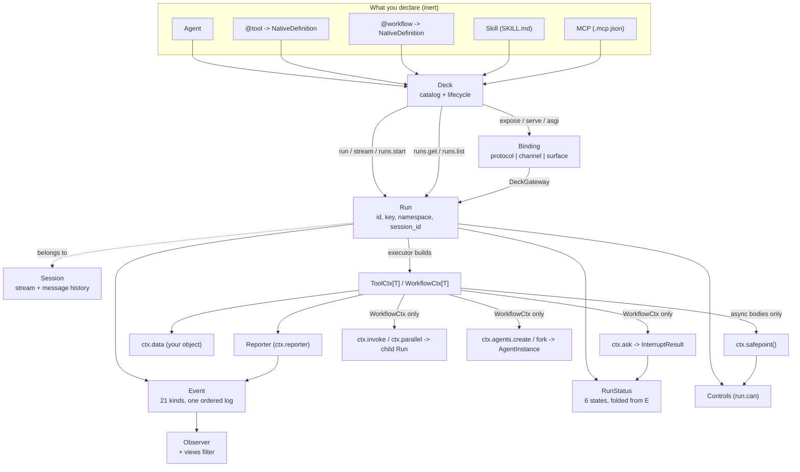

# AgentDeck concept map

The concepts the public API actually has, where the documentation introduces each, where the
terminology conflicts, and which of them a beginner needs.

Traced against `v6.0.3` (`b9a7f76`).

---

## 1. The concepts that exist

Derived from `agentdeck/__init__.py`'s `__all__` plus the public modules, not from the docs.

Relationships worth naming explicitly, because the docs state some and imply others:

| Relationship | Stated where | Correct? |
|---|---|---|
| a declaration is inert until a `Deck` compiles it | `mental-model.mdx:30` | yes |
| `RunStatus` is folded from `Event`, with no status table | `mental-model.mdx:69`, `lifecycle-and-control.mdx:15` | yes (`core/status.py:3-7`) |
| a `Run` outlives the handle | `mental-model.mdx:52`, `runs.mdx:15` | yes, given a durable `AGENTDECK_EVENTS` |
| a `Session` carries a stream and a message history, separately | `sessions.mdx:44-49` | yes, and unusually well explained |
| `ctx` is built by the executor, not by the caller | `core/context.py:346-350` error text | **stated only in an error message** |
| `Controls` (`run.can`) is advisory, not authoritative | `reference/run.mdx:41`, `deck.py:1414-1418` | yes |
| `Reporter` writes to the same log as `Event` | `context.mdx:87` | yes |
| a `Binding` cannot supply a context | `reference/deck.mdx:578`, `native.mdx:65` | yes, and contradicted by `index.mdx:28` |
| `ctx.safepoint()` is the only safe point a native body has | nowhere | **missing** |
| resuming an agent turn replays it | nowhere | **missing** |

---

## 2. Where each concept is introduced

"First taught" means the first page that defines the term rather than using it in passing.

| Concept | First **used** | First **taught** | Gap |
|---|---|---|---|
| Agent | `index.mdx` (landing) | `build-your-deck/agents.mdx` | 4 pages |
| Deck | `index.mdx` | `build-your-deck/deck.mdx` (position 10 in reading order) | 9 pages |
| Run | `overview.mdx:25` | `runs-and-control/runs.mdx` | 10 pages |
| Event | `overview.mdx:27` | `runs-and-control/events.mdx` | 12 pages |
| `@tool` | `README.md` / `index.mdx` | `build-your-deck/tools.mdx` | 5 pages |
| `@workflow` | `mental-model.mdx:27` | `build-your-deck/workflows.mdx` | 3 pages |
| Skill | `mental-model.mdx:28` | never (13-line stub) | n/a |
| ToolCtx / WorkflowCtx | `README.md:53` / `index.mdx` | `build-your-deck/context.mdx` | 8 pages |
| Reporter | `context.mdx:75` | `context.mdx:85` (a subsection) | 0, but has no page |
| Session | `overview.mdx:24` | `runs-and-control/sessions.mdx` | 11 pages |
| RunStatus | `quickstart.mdx:53` (`run.status()`) | `lifecycle-and-control.mdx:18` | 10 pages |
| Namespace | `runs.mdx:36` (table row) | never defined; described as "the label this run was started under", then "isolation boundary" (`reference/deck.mdx:339`), then "tenancy routing, not authentication" (`native.mdx:64`) | n/a |
| Key | `runs.mdx:35` | `runs.mdx:39` | 0 |
| Observer | `reference/deck.mdx:452` | same | 0, but only in the reference |
| views | `reference/deck.mdx` | same | 0, and nowhere else |
| Binding | `index.mdx:29` | `bindings/index.mdx` | 16 pages |
| protocol / channel / surface | `bindings/index.mdx:~20` | same | 0 |
| Transport | `write-your-own.mdx:31` | same | 0 |
| Exposure | `bindings/index.mdx` | `bindings/serve.mdx:58` | 1 |
| Safe point | `lifecycle-and-control.mdx:71` | same, incorrectly (§4) | 0 |
| Interrupt | `workflows.mdx:25` | `workflows.mdx` + `human-input.mdx` (stub) | 0 |
| Execution mode | never named | never | n/a |
| AgentInstance | `workflows.mdx:79` | `reference/python-api.mdx` (one line) | 3 |
| TurnResult | `runs.mdx:26` | `reference/deck.mdx:280` | 6 pages |

Two patterns fall out. Concepts introduced **late relative to first use**: Deck (9), Run (10),
Session (11), RunStatus (10), Binding (16). The landing page and `overview.mdx` use the entire
vocabulary before any of it is defined, and `mental-model.mdx`, which would fix that, sits after
the quickstart.

Concepts introduced **early relative to need**: the protocol/channel/surface taxonomy
(`bindings/index.mdx`, second section, before anyone has served anything), and the v5-to-v6 break
table (`whats-new-6.mdx`, position 2 in the whole site).

---

## 3. Terminology consistency table

| Concept | Docs meaning | Actual meaning | Consistent? | Problem |
|---|---|---|---|---|
| **Deck** | "the single composition root", catalog + lifecycle | same: `Deck` in `agentdeck/deck.py` | yes | two pages share the sidebar title "Deck" |
| **Agent** | "a declaration: a name, instructions, a model, tools" | three things: an `Agent` object, a catalog name, an `AgentInstance` | **no** | `ctx.invoke` accepts the last two and rejects the first; `workflows.mdx:79` says it takes "an agent" |
| **AgentInstance** | "one agent as something runnable" | what `ctx.agent` is and `ctx.agents.create()` mints | yes | defined only in a one-line reference bullet |
| **Tool** | "a leaf capability" | `@tool` -> `NativeDefinition(kind=TOOL)`, or a plain callable in `tools=` | yes | the `@tool`-vs-plain table is exemplary |
| **Workflow** | "ordinary Python that coordinates executions and can suspend in place" | same, and process-bound while suspended | **no** | "suspend in place" is true; "outlives the process" (README) is not |
| **Run** | "a first-class execution you can observe and control" | same, but control is cooperative per executor | **no** | control is presented as a `Run` capability, not as a body contract |
| **Context** | "typed, request-scoped access to your own application state" | a view over `RunContext` holding the caller's object by reference | yes | 3 pages state the HTTP boundary; the landing page ignores it |
| **Reporter** | "the run's report channel", four methods, always sync | `Reporter` in `core/reporting.py`, exactly that | yes | `level="record"` is surfaced as a level with no matching method |
| **Skill** | "prose the model reads on demand through a generated `load_skill` tool" | same, plus two frontmatter rules that fail `build()` | thin | the rules are undocumented |
| **Session** | "a conversation's identity across multiple runs" | same; also the concurrency unit (one turn at a time) | yes | both meanings taught on one page, correctly |
| **Namespace** | 3 different phrasings across 3 pages | a label scoping `runs.get`/`list` and binding routing | yes in substance | never defined before first use; no page owns it |
| **Key** | "the application identity you chose" | `(namespace, key)`, unique, for lookup and idempotency | yes | absent from the Native binding's run summary |
| **Event** | "one ordered, typed log per run" | 21 kinds, envelope + payload, `v = {major: 4}` | yes | "all 22 kinds" on one page |
| **Observer** | "read-only taps on this Deck's event stream" | `Observer` port, fire-and-forget, started once at open | yes | lives inside the Deck reference |
| **View** | "declarative predicates over the event stream" | `agentdeck.views`, 7 built-ins, composed with `\| & ~` | yes | named on exactly one page |
| **Binding** | "one protocol, channel or surface over one transport" | `Binding` protocol: `info`, `build`, `start`, `stop` | yes | - |
| **protocol / channel / surface** | three kinds of binding, by who consumes them | one `Literal` field on `BindingInfo` that nothing branches on | yes | "channel" has no instances; the distinction changes nothing the reader writes |
| **Transport** | `"http"`, `"stdio"`, or your own string | same | yes | - |
| **Surface** (the other one) | also "the HTTP surface", also "an operator surface" | 3 unrelated things | **no** | one word, three meanings, same site |
| **Safe point** | "between stream items, before dispatching a tool, or at a node boundary" | per executor: every stream event (agents), only `ctx.safepoint()` (native async), one cancel-only point (native sync) | **no** | the documented list describes only the agent executor; "node boundary" is residue from the removed graph engine |
| **Pause** vs **Interrupt** | "pause, resume and answer on a live handle" (one row) | `PAUSED` and `WAITING_ANSWER`, each refusing the other's operation | **no** | `RunStatus`'s own docstring says "callers must not conflate them" |
| **Resume** | "the answer continues on the next line rather than replaying" | true for a workflow; an agent turn is **replayed from the log** | **no** | the workflow rule is generalized by silence |
| **Cancel** | "ask it to stop for good" | lands only at a safe point; ignored entirely by a body with none | **no** | reproduced: a workflow with no `safepoint()` completed normally after `cancel()` |
| **Execution mode** | not a term the docs use | `NativeExecution.ASYNC` / `THREAD`, inferred from `async def`, not configurable | n/a | nothing says there is no knob, so a reader arriving from another framework looks for one |
| **Approval** | "pause, resume and answer" (overview) / `ctx.ask(options=...)` (workflows) | `ctx.ask` + `run.answer`, workflow-only | **no** | see Pause vs Interrupt; and a `@tool` cannot ask at all |
| **Interrupt / InterruptResult** | `{type, payload, thread_id, id}` with `thread_id` always `""` | `thread_id` is `""` from `run`/`stream`/`await run`, the run id from `Run.pending()` | **no** | the docstring is right; the reference page is not |
| **Exposure** | "hosts a validated set of bindings" | same; also opens the Deck if it is not already open | yes | the auto-open is not documented |
| **`agentdeck.core`** | "may not use" (plugin boundary) | internal ring per `.importlinter` | **no** | two reference pages import from it, one of them necessarily |

### Overloaded terms

| Term | Meanings | Where |
|---|---|---|
| **Agent** | the `Agent` declaration / a catalog name / an `AgentInstance` | `agents.mdx`, `workflows.mdx:79`, `python-api.mdx` |
| **Surface** | `BindingInfo.kind` value / the HTTP boundary / a UI | `bindings/index.mdx`, `reference/deck.mdx:578`, `sessions.mdx:78` |
| **Context** | the application object / `ToolCtx` / `RunContext` (internal) | `context.mdx`, and the internal one leaks in tracebacks |
| **Control** | `pause`/`resume`/`cancel`/`answer` (the operations) / `Controls` (`run.can`) / the `ControlPort` backend | `lifecycle-and-control.mdx`, `reference/run.mdx`, `reference/settings.mdx` |
| **Stream** | `deck.stream()` / `run.events(follow=True)` / SSE on the wire | `events.mdx`, `native.mdx` |

### Multiple terms for one thing

| One thing | Terms used |
|---|---|
| the Lifecycle & Control page | "Lifecycle & Control" (title), "Run Control" (`reference/deck.mdx:364`, `:598`, and the CLI `--help`) |
| a run parked on a question | "interrupt", "waiting_answer", "pending run", "the approval inbox", "parked" |
| the event log | "the log", "the event stream", "the canonical event log", "one ordered log per run" |
| starting a run | `deck.run`, `deck.stream`, `deck.runs.start`, "a turn", "an invocation", "an execution" |

The last row is the one that costs a reader. `reference/deck.mdx` calls the section "Starting a
turn" and covers three methods; "turn" elsewhere means specifically one agent exchange in a
session (`TurnResult`, "one turn per session"). A workflow run is not a turn, and `deck.run` on a
workflow is under a heading that says it is.

---

## 4. What is missing from the taught model

Concepts the implementation has that the documentation never names.

| Concept | Where it lives | Why a user needs it |
|---|---|---|
| Executor, and that safe points differ per executor | `core/ports/executor.py`, three adapters | it decides whether `cancel()` works at all |
| Turn replay on resume | `runtime/service.py:376-380` | it decides whether a tool may be called twice |
| Process affinity of a suspended workflow | `native/executor.py:105-108` | it decides whether an approval survives a deploy |
| Max turns (30) | `AGENTDECK_RUNNER_MAX_TURNS` | a long agent loop gives up |
| Sync worker pool bound (`min(32, cpu_count+4)`) | `core/workers.py:25` | concurrent sync tools queue |
| Report-drain cost at run close | `CHANGELOG.md` 6.0.3 | a run firing many reports closes slowly |
| `Exposure` opening the Deck itself | `exposure.py:39-41` | whether you need `async with` before `serve` |
| That `run.answer` accepts only JSON-carryable values | `Run.answer` raise site | shapes every HITL integration |

---

## 5. Beginner, advanced, and internal

Classification against the brief's three categories.

### Necessary user knowledge

A reader genuinely cannot build anything correct without these.

| Concept | Currently taught at |
|---|---|
| Agent, `@tool`, `@workflow` as declarations | `build-your-deck/*` |
| Deck as the one composition root | `build-your-deck/deck.mdx`, too late |
| `async with deck` and that a turn-starting call needs an open Deck | `reference/deck.mdx:69-71` only |
| `await deck.run(name, input)` -> `TurnResult`, `.output` | `tools.mdx`, `context.mdx`; **not the quickstart** |
| `asyncio.run(main())` | every runnable page except the quickstart |
| Session identity via `session_id`, and one turn per session | `sessions.mdx`, well |
| `ToolCtx[T]` + `Deck(context=...)` for dependencies | `context.mdx`, well |
| That an event log exists and is the record | `events.mdx` |
| That `memory://` is the default for events and control | `operate/deployment.mdx`, `runs.mdx` callout |
| That a `@tool` may be called twice if the run can be paused | **nowhere** |
| That a native body needs `ctx.safepoint()` to be controllable | **nowhere** |
| That a control is a request, so the next control must observe it landing | **nowhere** |

### Useful advanced knowledge

Helpful later, should not be required to get started.

`Run` handles and `runs.get`/`list`; `follow=` and `from_seq=`; `namespace` and `key`;
`ctx.ask`/`answer`; `ctx.invoke`/`parallel`; `ctx.agents.create`/`fork`; `Observer` and `views`;
`Skills(validate=)`; `session_factory=`; bindings and `Exposure`; `RunStatus` as an enum;
`InterruptResult`; content blocks beyond `str`; `subagents=`/`handoffs=`/`hooks=`.

The quickstart currently requires four items from this list (`Run`, `events`, `follow`,
`status()`) before producing a result.

### Internal implementation detail

Should not be part of the normal user mental model. Flagged where the docs leak it.

| Detail | Leaked at | Should be |
|---|---|---|
| `agentdeck.core.status`, `agentdeck.core.events` import paths | `lifecycle-and-control.mdx:32`, `reference/events.mdx:118` | `agentdeck.RunStatus`; re-export the kind sets |
| `agentdeck.core.errors.*` as a traceback prefix | `quickstart.mdx:157`, `:172` | unavoidable, but no page says it is the same class as `agentdeck.errors.*` |
| `InvocableSpec`, `RunContext`, `Runtime`, `ControlPort`, `LeasePort` | not leaked to users | correct as is |
| `BindingInfo.kind` as a three-way taxonomy | `bindings/index.mdx` second section | one sentence, or defer until something branches on it |
| `level="record"` on the `report` event | `reference/events.mdx:96` | describe it as what `reporter.report()` produces |
| `thread_id` on `InterruptResult` | `reference/deck.mdx:183` | vestigial by the docstring's own account; keep the field, drop it from the taught shape |
| `_RECOVERED_SUSPENDABLE`, the `suspends()` lookup | not leaked | correct, though it is why `UnsupportedControlError` is unraisable |
| `UnsupportedControlError` | 3 pages | not raisable by any shipped configuration; stop teaching it until it is |
| `Agent.run()` | `mental-model.mdx:31`, `reference/deck.mdx:300` | a public method whose whole documentation is a warning |
| `get_settings()` | `examples/jack/jack/server.py:41` | `deck.settings`, which the docs never mention |

---

## 6. The mental model a reader actually builds

Reading the site in nav order, a careful reader ends up believing:

> I declare agents, tools and workflows as plain Python. I hand them to one Deck. Starting one
> gives me a Run: a durable, addressable execution I can stream, pause, resume, cancel and answer,
> from this process or another one, and its status is just its own event log folded up. If a run
> is waiting on a person, it waits until somebody answers, whichever process asks. I serve the
> whole thing over as many bindings as I like by adding a line.

Six of those clauses are right. Four are not:

| Belief | Reality |
|---|---|
| "I can pause and resume any Run" | only where the executor or the body offers a safe point; `resume()` right after `pause()` is a silent no-op |
| "resume picks up where it stopped" | for a workflow, yes; an agent turn is replayed and its tools can run twice |
| "a waiting run waits until somebody answers, from any process" | the log waits; the workflow body does not, and dies with its process |
| "I serve the whole thing over bindings" | not if any callable needs `ctx.data`: no binding can supply a context |

The first three are all the same shape: **the docs describe control and suspension as properties
of a `Run`, and the implementation makes them properties of the executor and the body.** That is
the single mental-model correction this documentation most needs, and it is the one an Execution
page would carry.

The fourth is a boundary the docs state correctly in three places and violate on the landing page.

---

## 7. Proposed introduction order

Not a redesign, just the order the concepts already depend on each other in.

```mermaid
flowchart LR
    q["1. Quickstart<br/>Agent, Deck, async with, deck.run, .output"]
    m["2. Mental model<br/>declare vs run, Deck, Run, Event"]
    t["3. Tools<br/>@tool, sync vs async"]
    c["4. Context<br/>ToolCtx[T], Deck(context=)"]
    w["5. Workflows<br/>@workflow, invoke, ask"]
    a["6. Agents together<br/>handoffs, subagents, hooks"]
    s["7. Skills"]
    r["8. Runs & sessions<br/>handles, key, namespace, session"]
    x["9. Execution<br/>executors, safe points, replay, ceilings"]
    l["10. Lifecycle & control<br/>states, requests, pause vs answer"]
    ob["11. Observability<br/>reporter, observers, views, events"]
    b["12. Bindings"]
    o["13. Operate<br/>durability, deployment"]
    q --> m --> t --> c --> w --> a --> s --> r --> x --> l --> ob --> b --> o
```

Three changes from today's order:

| Change | Reason |
|---|---|
| `mental-model` moves before the quickstart's follow-on pages, and `whats-new-6` moves to Resources | a v5 break table is not step 2 for a new reader |
| a new **Execution** page (9) between Runs and Lifecycle | it is where safe points, replay, and the two ceilings belong, and it is what makes Lifecycle correct |
| a new **Observability** page (11) holding Reporter, Observer and views | three related APIs currently live on three unrelated pages |

`build-your-deck/deck.mdx` folds into the quickstart and the reference; a 43-line page titled the
same as a 603-line page is a search result nobody wants.
