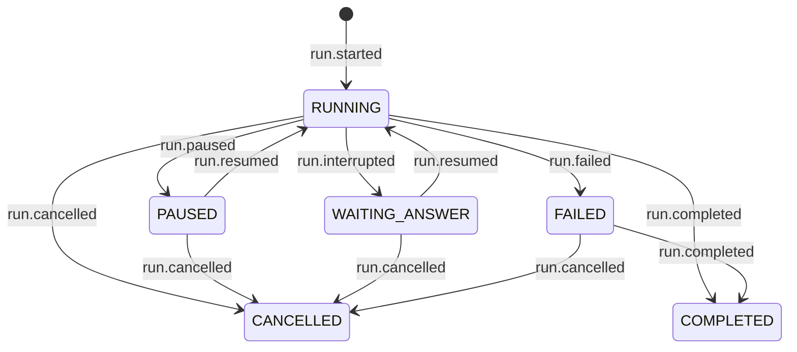

# Run state machine, as implemented

Base: `v6.0.3` (`b9a7f76`). Reconstructed from `agentdeck/core/status.py`,
`agentdeck/runtime/service.py`, `agentdeck/adapters/stores/__init__.py` and every payload
construction site. Compared against `docs/design/run-lifecycle.md`.

Companion to `analysis/EXECUTION_MODEL_AUDIT.md`; findings are cross-referenced by `EXEC-nn`.

---

## 1. Where state lives

There is no status column, table, cache or field. A run's status is
`core/status.status_of(events)`: the last event whose `kind` is in `TRANSITIONS`, folded in log
order. Deleting every in-memory object in the process loses nothing.

```python
def status_of(events):
    status = None
    for event in events:
        status = TRANSITIONS.get(event.kind, status)
    return status
```

Consequences that matter for the rest of this document:

| | |
|---|---|
| appending a lifecycle event **is** the transition | there is no second write to get wrong |
| `None` is a real answer | a run with no `run.started` yet; there is no `PENDING` member |
| last-transition-wins | any accepted append after a terminal event **changes the status** (§6) |
| the fold is total | no state is unreachable from the log alone, after any restart |

---

## 2. States

`core/status.py:32 RunStatus`, six members. Facts from `STATES` (`core/status.py:74`).

| state | terminal | suspended | resumes with | who can be in it |
|---|---|---|---|---|
| `RUNNING` | no | no | n/a | every run, from `run.started` onward |
| `PAUSED` | no | yes | nothing (`Run.resume()`) | a run that honored a PAUSE at a safe point, or a native body that parked |
| `WAITING_ANSWER` | no | yes | a value (`Run.answer(v)`) | a native workflow inside `ctx.ask()` |
| `COMPLETED` | yes | no | n/a | terminal |
| `FAILED` | yes | no | n/a | terminal **in the table, not in the store** (§6) |
| `CANCELLED` | yes | no | n/a | terminal |

`RESUMABLE_STATUSES`, `TERMINAL_STATUSES` and `SUSPENDED_KINDS` are all derived from `STATES` and
`TRANSITIONS` by comprehension, so the kind side and the status side cannot drift.

Which suspended state a suspension gets is decided by **how it resumes**, not by who caused it.
Code pausing itself is `PAUSED`, not a seventh state.

---

## 3. Transitions

`core/status.py:88 TRANSITIONS`, seven kinds. Everything else in the event schema (deltas, tool
calls, reports, usage, control observations) leaves the status exactly where it was.



The last two edges are **not** in `docs/design/run-lifecycle.md`'s diagram and are not intended.
They exist because `_refuse_if_sealed` does not seal `FAILED`. See §6, EXEC-11.

---

## 4. Transition owners

Who constructs each payload, and which code path writes it. This is the table the audit needed and
that no existing document holds.

| kind | constructed at | written by | when |
|---|---|---|---|
| `run.started` | `service.py:247` | `Runtime._claim_session` → `store.claim_start` | the conditional append that opens a run and locks the session |
| `run.resumed` | `service.py:962` | `Runtime._claim_resume` → `store.claim_resume` | the conditional append that takes a suspended run's continuation; carries the answer when there is one |
| `run.interrupted` | `core/context.py:480 _asked` | native executor yields it, `Runtime._record` writes it | `await ctx.ask(...)` |
| `run.paused` | `core/control.py:99 RunPausedError._effect` | native executor (`_play`'s `ControlSignalled` arm) or agents executor, then `_record` | a PAUSE honored at a `Gate` checkpoint |
| `run.completed` | `native/executor.py:213` or `openai_agents/executor.py:284` | the executor yields it, `_record` writes it | the body returned / the SDK turn finished |
| `run.failed` | `service.py:1334 _failed`, `:1341 _engine_failed` | `Runtime._sealing`, from `_play`'s `except Exception` and its no-terminal-event check | user code raised, the store raised, or the engine violated the contract |
| `run.failed` (takeover) | `service.py:871` | `Runtime._close_abandoned` → `store.append` **directly** | a stale run whose session another turn took over |
| `run.cancelled` | `core/control.py:90 RunCancelledError._effect` | executor's `ControlSignalled` arm → `_record` | a CANCEL honored at a `Gate` checkpoint |
| `run.cancelled` | `service.py:532` | `Runtime._terminate` → `_record` | a cancel found pending by a claim on a suspended run |
| `run.cancelled` | `service.py:623` | `Runtime._play`'s `GeneratorExit` arm → `_record` | a consumer closed the generator mid-run |
| `run.cancelled` | `service.py:901` | `Runtime._close_cancelled` → shielded `_record` | this task was cancelled mid-run |
| `run.cancelled` | `service.py:932` | `Runtime.close_cancelled` → `store.append` **directly** | `Deck.aclose` gave up on a run that ignored two cancellations |

Two writers bypass `_record` (`_close_abandoned`, `close_cancelled`). Both do so deliberately, and
both therefore skip `_rolling_up`, which is the delegation-tree pop. `close_cancelled` leaks its
tree entry (EXEC-06, second half).

---

## 5. Preconditions and routing

Two total tables, both built by comprehension over `RunStatus × Operation` and
`RunStatus × verb`, so a member added without a row raises `KeyError` at import.

### `PRECONDITIONS` (`core/status.py:179`)

Read **before** the control port, by `Run._admits` and by `Runtime.resume`/`resume_run`.

| state | `run` | `answer` | `resume` | `pause` | `cancel` |
|---|---|---|---|---|---|
| `RUNNING` | refused (busy) | refused | no-op | legal | legal |
| `PAUSED` | refused (busy) | refused, names `resume` | legal | no-op | legal |
| `WAITING_ANSWER` | refused (busy) | legal | refused, names `answer` | legal | legal |
| `COMPLETED`/`FAILED`/`CANCELLED` | legal (opens a new run) | no-op | no-op | no-op | no-op |

`run` is declared here and enforced nowhere: `claim_start`'s conditional append is what refuses it,
and a pre-check would reintroduce the race the claim closes. The column exists so the table is
total and testable.

### `POLICY` (`core/status.py:274`)

What a pending signal does when it is **read**. Read at exactly two moments: a `Gate` checkpoint on
a live run, and the claim that continues a stopped one.

| state, read at | `cancel` | `pause` | `resume` | nothing |
|---|---|---|---|---|
| `RUNNING`, a gate checkpoint | HALT, consume | HALT, consume | PROCEED, leave | PROCEED |
| `PAUSED`, a resume claims it | TERMINATE, consume | PROCEED, consume | PROCEED, consume | PROCEED |
| `WAITING_ANSWER`, an answer claims it | TERMINATE, consume | **REFUSE**, leave | PROCEED, consume | PROCEED |
| terminal | NO_OP, consume | NO_OP, consume | NO_OP, consume | NO_OP |

`consume` is a compare-and-set (`ControlPort.consume(id, expected) -> bool`), never a blind write,
so an intent that changed under the caller is not destroyed by it.

The invariant the table exists for: **every read of the control port ends in an event or an
explicit no-op, never in silence.** §7 records where that invariant is broken in practice.

---

## 6. Terminal states and sealing

`adapters/stores/__init__.py:_refuse_if_sealed`, shared by all four stores and called from inside
each backend's indivisible write:

```python
if status in (RunStatus.CANCELLED, RunStatus.COMPLETED):
    raise RunStateError(...)
```

`FAILED` is absent. Measured against `MemoryEventStore`:

| log | second append | result | status after |
|---|---|---|---|
| `run.failed` | `run.cancelled` | **ACCEPTED** | `cancelled` |
| `run.failed` | `run.completed` | **ACCEPTED** | `completed` |
| `run.cancelled` | `run.completed` | REFUSED (`RunStateError`) | `cancelled` |
| `run.completed` | `run.cancelled` | REFUSED (`RunStateError`) | `completed` |

The carve-out is deliberate for `report` events and is documented as such
(`docs-site/content/build-your-deck/context.mdx:91`, ADR-D11 §5: "a takeover's `run.failed`
deliberately seals nothing"). It was never narrowed to non-lifecycle payloads, so a *lifecycle*
event is accepted too, and `STATES[FAILED].terminal = True` plus
`run-lifecycle.md`'s "terminal means no outgoing transition" are both false of the store.

Production path that reaches it: `_close_abandoned` writes `run.failed` over a run a takeover
judged stale; if that run is in fact alive, its own terminal event lands afterwards and reverses
the takeover while the session has already been handed to a different turn. See EXEC-11.

---

## 7. Race-sensitive transitions

| race | resolved by | verdict |
|---|---|---|
| two processes starting a turn on one session | `store.claim_start`, one conditional append | **correct**, tested across two real processes (`test_multiprocess_concurrency.py:312`) |
| two processes answering one interrupt | `store.claim_resume`, one conditional append; the loser reads nothing and yields nothing | **correct**, tested (`:211`) |
| a cancel racing completion, cross-process | `_refuse_if_sealed`; exactly one terminal event survives | **correct**, tested (`:272`) |
| a cancel racing completion, native THREAD body | `checkpoint_cancel_only` after the body returns; the cancel wins, the result is discarded | **deliberate**, tested (`test_sync_tool_workers.py:174`) |
| a cancel racing completion, native ASYNC body | nothing. no checkpoint exists; the completion wins | **inconsistent with the row above** (EXEC-10) |
| a cancel racing an exception, native THREAD body | `checkpoint_cancel_only` in the `except`; the cancel wins and **the exception is discarded** | **deliberate**, tested (`:218`) |
| a cancel racing an exception, native ASYNC body | nothing; the exception wins | **inconsistent** (EXEC-10) |
| a pause landing between `_peek` and `claim_resume` | the answer is recorded, and the run meets the pause at its first safe point | **correct**, reasoned in `Runtime.resume`'s comments |
| `_route`'s consume losing to a concurrent signal change | re-reads the port and rules again, second ruling takes nothing | **correct** |
| a takeover racing the taken-over run's own terminal event | `_close_abandoned` catches `RunStateError` and logs; but the reverse order is **accepted** | **defect** (EXEC-11) |
| `close_cancelled` racing the run's own next append | `Runtime._abandoned` is checked synchronously in `_record`, before its first await | **correct**, reasoned at `service.py:1254` |
| a signal arriving inside `Gate`'s 200ms reuse window at end of run | never read; the run reaches its own terminal state | **defect** (EXEC-15) |
| a caller cancelling `deck.run` vs `deck.stream` | `run` awaits the task (cancel forwards), `stream` does not | **inconsistent** (EXEC-08) |

---

## 8. Inconsistencies found

| # | inconsistency | evidence | finding |
|---|---|---|---|
| 1 | `FAILED` is declared terminal and is not sealed | store probe, §6 | EXEC-11 |
| 2 | `RUNNING → CANCELLED` is written while the target is still executing | `_play`'s `GeneratorExit`/`CancelledError` arms write `run.cancelled`, the native body task is not cancelled and runs to completion | EXEC-05 |
| 3 | the same caller action reaches two different terminal states through two front doors | `deck.run` → `cancelled`, `deck.stream` → `completed` | EXEC-08 |
| 4 | the cancel/completion tie-break depends on `inspect.iscoroutinefunction` | §7 rows 5 and 7 | EXEC-10 |
| 5 | `PAUSED` is unreachable for a native `@tool` run, but `run.can.pause` is `True` and `run.pause()` succeeds | `checkpoint_cancel_only` ignores PAUSE; `ToolCtx.safepoint` refuses a sync body | EXEC-03 |
| 6 | `POLICY`'s "never in silence" invariant is broken twice | a signal never read (EXEC-15) and a signal consumed then swallowed as a tool error (EXEC-01) | EXEC-01, EXEC-15 |
| 7 | a run in a terminal state can still hold a pending control-port row forever | nothing prunes on terminal; `POLICY`'s terminal row can only consume if something reads | EXEC-03, EXEC-15 |
| 8 | two writers bypass `_record` and so bypass `_rolling_up` | `_close_abandoned`, `close_cancelled` | EXEC-06 |
| 9 | a run whose claim was refused is left in the delegation tree with no state at all | `delegate` before `_claim_session` | EXEC-06 |

None of these is an *illegal declared transition*. Every one is a transition a caller wrote without
having achieved what the transition asserts, or a table that describes something other than what
the code enforces.

---

## 9. What is right, and should not be touched

Recorded so a later change does not trade it away.

| | |
|---|---|
| no status table, no cache, no field | the single biggest correctness decision in the system |
| four tables, total by construction, `KeyError` at import on a missing cell | a missing rule is a failed import, not a wrong answer at runtime |
| every derived set derived, never listed twice | `TERMINAL_STATUSES`, `SUSPENDED_KINDS`, `RESUMABLE_STATUSES` |
| `Ruling` carries the action, the intent's fate, and one sentence of why | the sentence doubles as the error message and the test name |
| `consume` is a compare-and-set, never a blind write | the only thing that stops a resume from destroying a cancel |
| the claim is the transition, and it is conditional | the only design that is correct across processes |
| `continuation_of` filters by `run_id`, not just by kind | a stale sibling's `[paused, resumed]` tail in a session log would otherwise read as this run continuing |
| `status_of([])` is `None`, and there is no `PENDING` | `run.started` is row 0; there is no moment to name |
| the drift record in `run-lifecycle.md` is dated and kept with verdicts | the file says what used to be false and why it is not any more |
