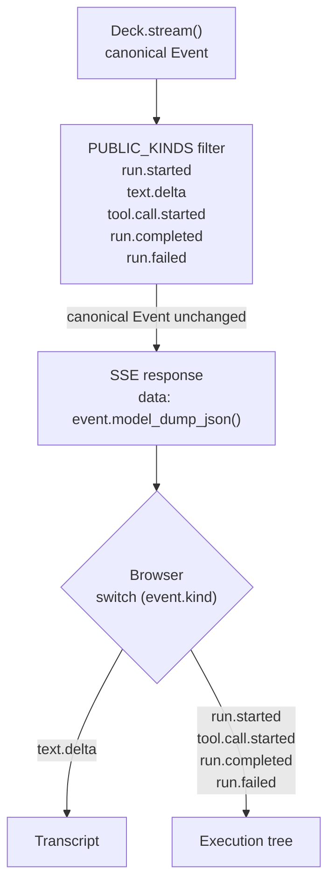

{/* docs_sources:
  - "examples/jack/**"
*/}

# How Jack is built

Jack is the AgentDeck documentation agent running on this site. The same application powers the
live experience at the bottom of the home page, and its source is in the repository.

This page shows what building a real application with AgentDeck looks like: what you write, and
what you get around it.

## The application

Jack answers questions about AgentDeck by reading its documentation.

```text
Question
   → Jack
      → search_docs / read_doc / read_changelog
   → Answer
```

That shape is the whole application, and the code says the same thing:

```python
from agentdeck import Agent, ToolCtx, Deck, tool

@tool
def search_docs(query: str, docs: ToolCtx[DocsCorpus]) -> str:
    """Find AgentDeck documentation pages matching a query."""
    return docs.data.search(query)

@tool
def read_doc(slug: str, docs: ToolCtx[DocsCorpus]) -> str:
    """Read one AgentDeck documentation page in full, by its slug."""
    return docs.data.pages[slug]

jack = Agent(
    name="Jack",
    instructions=instructions,
    tools=[search_docs, read_doc, read_changelog],
)

deck = Deck(agents=[jack], context=DocsCorpus)
```

Three `@tool`s, one agent, one Deck. `ToolCtx[DocsCorpus]` is how a tool reaches the
application's own data; the model is offered only `query` or `slug`.

## The application code stays application code

Almost everything Jack-specific is about what Jack should do: how to search the corpus, how to
read a page, what to say when the documentation does not cover something, and how to cite what
he used. That is the file you would expect to write.

**You write the behavior.** Nothing above reaches for a runtime concern, because it does not
have to.

## AgentDeck provides the system around it

The same small application runs inside a foundation it did not have to build.

```text
Run
├── executions     nested invocations, each addressable
├── events         one ordered log per run
├── reports        progress and status from inside the work
├── state          sessions that outlive a single call
├── interaction    branches that wait for a person
└── control        pause, resume, cancel
```

Around that model, other things connect to the same execution: observers and telemetry, the HTTP
and SSE surfaces, and the website itself. They read the run rather than a translation of it, so
none of them needs Jack to expose anything special.

Jack did not assemble these. They are what a `Deck` gives an application the moment it runs.

## From execution to the website

The live experience on this site is that model, exposed.



The allowlist drops other event kinds without reshaping the canonical events it permits.

The route is a few lines over `deck.stream()`, and the wire is the event log itself:

```python
async for event in deck.stream(AGENT, question, context=corpus, session_id=session_id):
    if event.kind in PUBLIC_KINDS:
        yield f"data: {event.model_dump_json()}\n\n"
```

There is no translation layer on either side. The browser switches on `event.kind`, and so would
a Python process reading the same run back tomorrow. The execution tree you see next to Jack is
built from those events, in the order they arrived.

## See it running

Ask him something on the [home page](/) and watch the tree fill as he works: a tool call appears
when he makes one, and the run resolves when it completes.

## Source

- [`examples/jack`](https://github.com/agentdecksdk/agentdeck/tree/dev/examples/jack)  -  the agent, its tools, the corpus and the route
- [Implementation notes](/jack/notes)  -  the decisions behind this build, and the alternatives they beat
- [Examples](/examples)  -  smaller runnable projects, each exercising a single idea
