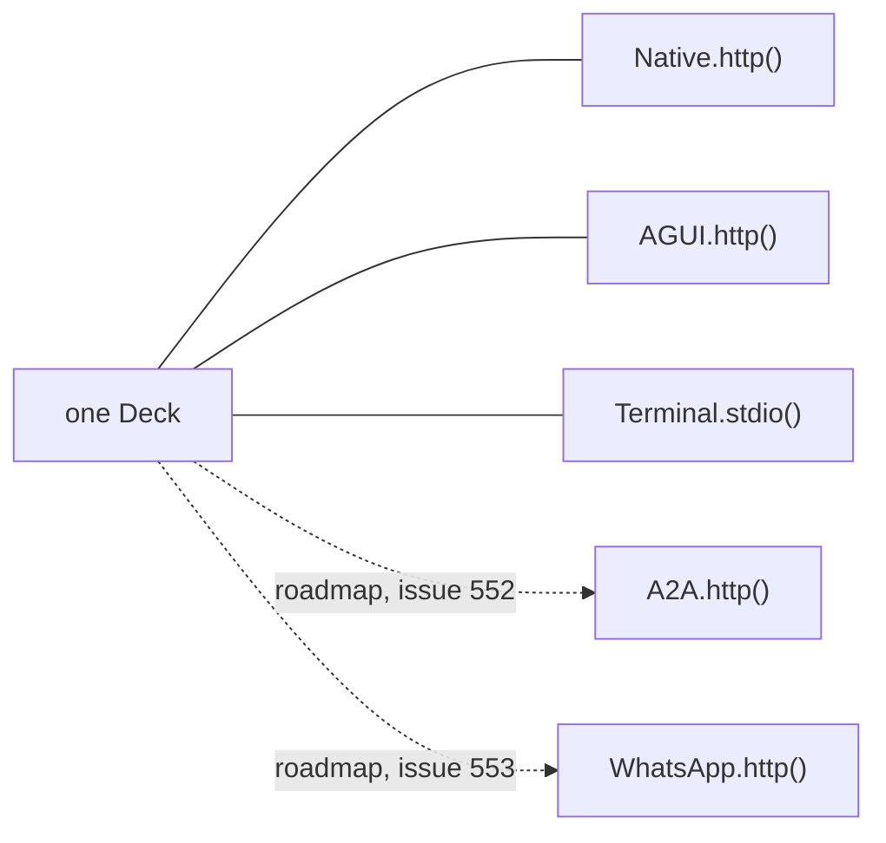

{/* docs_sources:
  - "agentdeck/deck.py"
  - "agentdeck/bindings/__init__.py"
  - "agentdeck/bindings/gateway.py"
  - "docs-site/content/bindings/index.mdx"
  - "CHANGELOG.md"
*/}

# What's new in 6.0

Your application is agents, tools and workflows. How the outside reaches them is a binding you
add in one line, and the runtime never learns which one is talking.

## What changed

One Deck, many bindings, one call:

```python
deck.serve(Native.http("/api"), AGUI.http("/agui"), Terminal.stdio(), port=8000)
```

Each binding is a protocol, channel or surface reaching the same runs, events and controls. The
v1 HTTP wire is gone and `deck.serve` is the new front door:

| break | before (v5) | after (v6.0.0) |
|---|---|---|
| v1 routes gone | `POST /agents/{name}/chat` | `POST /runs`, then `GET /runs/{run_id}/events` |
| `agentdeck-serve` gone; `deck.serve` is the front door, synchronous | `agentdeck-serve` | `deck.serve(Native.http("/api"), port=8000)` |
| `Deck.asgi()` needs a binding | `Deck.from_project().asgi()` | `Deck.from_project().asgi(Native.http())` |
| `DeckGateway.start` drops `context` (binding authors) | `gateway.start(target, input, context=ctx)` | `gateway.start(target, input)` |
| `InterruptReason` drops `"approval"` | `pending.reason == "approval"` | `pending.reason == "human"`; refusal comes from `payload["options"]`, which `Run.answer` already enforces |

`agentdeck chat` is unchanged. Full detail: [migration guide](/resources/migration-guides#v5-to-v600).

## What you have now

- [`Native.http()`](/bindings/native): AgentDeck's own HTTP/SSE protocol, the lossless wire.
- [`Terminal.stdio()`](/bindings/terminal): one session per process, what `agentdeck chat` runs.
- [`AGUI.http()`](/bindings/agui): the AG-UI protocol. Assistant UI, CopilotKit, or any AG-UI
  client point at it with zero AgentDeck-specific code, HITL included.

The SPI is frozen at v1: a binding you [write today](/bindings/write-your-own) keeps working.

## What's on the roadmap

Not shipped. Every row below is a future binding, not an available one.

| binding | tracked at |
|---|---|
| `A2A.http()` | [#552](https://github.com/agentdecksdk/agentdeck/issues/552) |
| `WhatsApp.http()` | [#553](https://github.com/agentdecksdk/agentdeck/issues/553) |
| `@agentdeck/client` | [#551](https://github.com/agentdecksdk/agentdeck/issues/551) |
| `A2UI.http()`, `ACP.stdio()`, `MCP.stdio()`/`MCP.http()`, `WebChat.http()`, `Slack.http()`, `.agentdeck/bindings` config and CLI flags | [roadmap](https://github.com/agentdecksdk/agentdeck/blob/main/docs/design/protocols/roadmap.md) |

## The complete setup, once it lands

One Deck, five bindings, one event stream:



```python
from agentdeck import Deck
from agentdeck.bindings import AGUI, Native, Terminal

# from agentdeck.bindings import A2A, WhatsApp  # roadmap: #552, #553

deck = Deck.from_project()
deck.serve(
    Native.http("/api"),
    AGUI.http("/agui"),
    Terminal.stdio(),
    # A2A.http("/a2a"),             # roadmap: #552
    # WhatsApp.http("/whatsapp"),   # roadmap: #553
    port=8000,
)
```

A run started from WhatsApp is visible in Assistant UI over AG-UI, answerable from the terminal,
and callable by another agent over A2A. `namespace=` on a binding scopes it to one tenant. One
event stream, one set of controls, regardless of which binding started the run.

## What it opens

Write one application. Reach it from a chat UI, a messaging network, an IDE, another agent, an
MCP client, or a script, with no per-surface code. Add a surface by adding a line. Write a
[binding for anything with a wire](/bindings/write-your-own), out of tree, against a frozen SPI.
