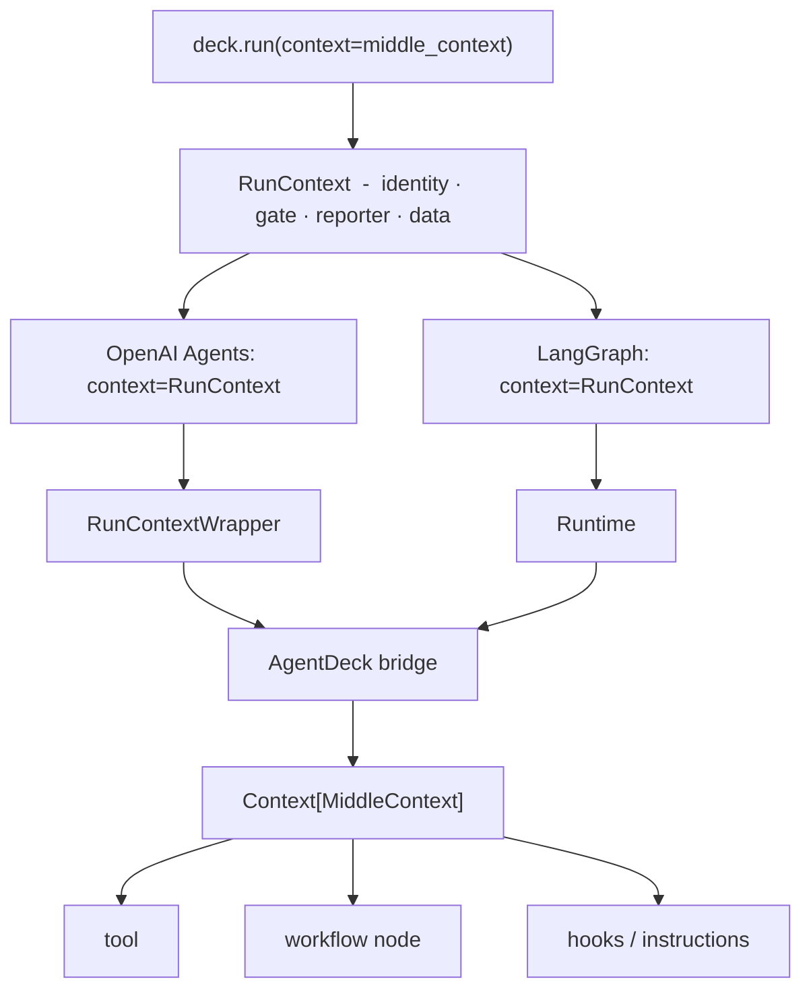

# Review  -  execution context and context injection plan

**Date:** 2026-08-09 (the document carried none; taken from its first commit) · **Subject:**
`plan-context-injection.md`, first draft · **Status:** closed, folded into that plan's ruling table.

Approved with changes. The core direction stands:

> One application context value enters a run once, remains separate from workflow state and model
> context, and is available everywhere that participates in that execution.

The one reversal: the draft's ruling #2, *"injection mechanism: our own, not the SDK's"*, is too
broad. Contract and transport are separate responsibilities  -  AgentDeck owns the first, the engines
already own the second.

One application object, never copied, serialized, turned into workflow state, or sent to the model.

## Recommendations

| § | Recommendation | Where it landed |
|---|---|---|
| 1 | AgentDeck owns the public `Context[T]` contract and injection semantics; engine-native runtime-context facilities do the propagation, and adapters bridge without redefining semantics. | rulings 1 and 2 |
| 2 | Application code never names an engine type  -  the same `Context[T]` annotation works for a tool and for a node. | ruling 1; `core/context.py:88`, exported as `agentdeck.Context` |
| 3 | Do not free the SDK's `context=` slot  -  it is the transport AgentDeck needs; evolve what `RunContext` carries instead. | ruling 2; already the code at `openai_agents/engine.py:185` |
| 4 | Application context moves off `configurable` onto LangGraph's native `Runtime[T]`, leaving `configurable` for genuine LangGraph configuration such as `thread_id`. | ruling 2, narrowed by `plan-166-delivery.md` Ruling B |
| 5 | A callable compiler is still AgentDeck's work: detect `Context[T]`, validate `T`, build the engine-specific bridge, call the original callable. | plan step 3; `authoring/injection.py` |
| 6 | Plain callables stay the canonical portable declaration; a prebuilt engine object is accepted as *engine-native* and inherits no portability guarantee. | plan step 3; #166 slice 2 reversed #172's guardrail in `authoring/compile.py` |
| 7 | Application data inherits by reference; execution identity and control metadata follow the AgentDeck run boundary. | ruling 6 |
| 8 | `RunContext` stays the one internal carrier and gains `data`; no second competing container while the `Execution` split is deferred. | ruling 3; `core/context.py` |
| 9 | Holding `Context[T]` grants application code the dependencies, never the model  -  only explicit user code projects context into instructions or input. | the plan's security rule |
| 10 | Injection is annotation-based: zero parameters is an ordinary callable, exactly one is injected under any name, two is a `build()` error. | ruling 4 |
| 10 | Introspect through `inspect.unwrap` / `inspect.signature` / `typing.get_type_hints`, never raw `__annotations__`; a signature-destroying decorator reports unreliable rather than guessing. | ruling 4; `authoring/injection.py` |
| 11 | Build-time compatibility covers runtime-introspectable types (exact, subtype, `Any`, runtime ABCs); arbitrary structural `Protocol` is best-effort or deferred, because `build()` is not a partial mypy. | ruling 9 |
| 12 | State and context stay strictly separate  -  no service handles in graph state, no mutable workflow data in `ctx.data`. | ruling 7 |
| 13 | A skill needing live `Context[T]` runs in-process; a sandboxed skill cannot receive one, and automatic serialization across that boundary is never implied by serializability. | superseded  -  see divergences |
| 14 | `ctx.namespace` has five incompatible candidate meanings, so it ships without one; a property is easy to add and hard to redefine after release. | `Context` carries `data`, `reporter`, `run_id`, `session_id`, `checkpoint()`; `namespace` absent by design (`core/context.py:100`) |
| 15 | `Context[T]` exposes only members with AgentDeck-level semantics, not the union of both engines' runtime APIs  -  `ctx.langgraph_store` must not exist. | ruling 1 |
| 16 | Two validation levels in the contract, not just the risk section: managed components validate fully at `build()`, opaque or native ones get best-effort plus an invocation-time net. | ruling 9 |
| 17 | Exactly one application object reaches every injection site. | the diagram above |

§18 proposed the revised ruling table and §19 the eight-step sequencing; both were adopted as
written and are now `plan-context-injection.md`'s ruling table and step list, delivered in four
slices by `plan-166-delivery.md`.

## Divergences from what shipped

| § | Divergence |
|---|---|
| 4 | `reporter` and `agentdeck_stream` stay on `configurable`; `plan-166-delivery.md` Ruling B (2026-08-11) amends "`thread_id` and nothing else" to "nothing else *application-owned*". |
| 13 | The sandbox ruling was overtaken by #163: sandboxing left v3 entirely, so ruling 8 states no component is sandboxed and the projection question never arises. A v3 skill is prose an agent reads, with no user callable to inject into at all (`plan-166-delivery.md` slice 4). |
