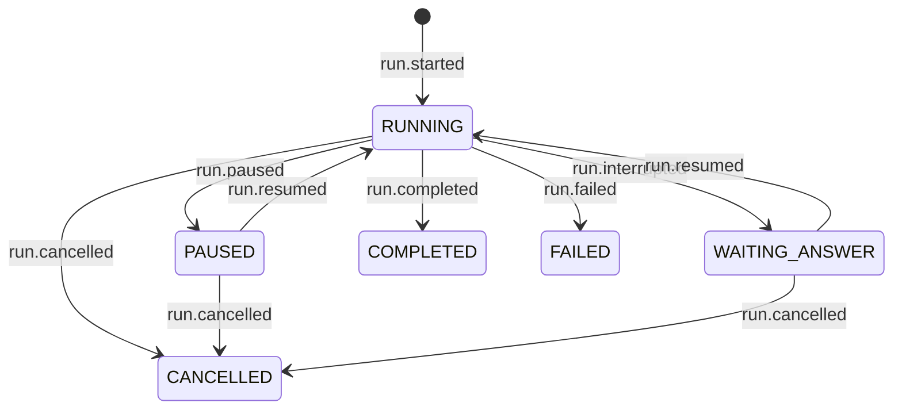

# Run identity and the Run object

What addresses a run, what a caller holds, who drives execution, and why the control plane can
address the wrong tenant today.

Proposal, not built. Supersedes #314's `namespace=` patch and the `deck.runs.<op>(run_id)` shape
ruled in `design/run-operations.md`, which kept the run id as an argument and rejected a per-run
object.

**Revised 2026-08-16.** The earlier revision of this document had `create()`, a `CREATED` state,
`run.created`, `claim_create` and a `holds_session` axis. All of it is withdrawn. `start()` is the
first operation, and the six states in `core/status.py` today are the whole lifecycle.

## The defect this starts from

`agentdeck/adapters/control/sqlite/port.py:25`:

```sql
CREATE TABLE IF NOT EXISTS signals (run_id TEXT PRIMARY KEY, signal TEXT, reason TEXT)
```

`acme/order-1234` and `globex/order-1234` share one row. A cancel for one cancels the other, and
`consume()`'s compare-and-set makes them fight over a single slot. The memory port has the same
shape, and `ControlPort`'s docstring states the false premise out loud:

> No `RunContext` on the port methods  -  `run_id` is globally unique.

It is not. `deck.run(..., run_id=…)` accepts a caller-supplied id (`deck.py:749`) and
`service.py:614` mints a `uuid4()` only when none is given. The event stores key by
`(namespace, session_id)` and are correct; the control plane was built on the premise they
contradict.

This is a live cross-tenant defect. It is also why the fix is an identity change rather than three
keyword arguments: every subsystem addressing a run by a bare caller id is one collision away from
acting on a stranger.

## 1. Identity

Four values, three of them public and one of them optional.

| | who owns it | what it is |
|---|---|---|
| `run.id` | agentdeck | the canonical durable identity, minted, opaque, globally addressable. Persist this to recover the exact run |
| `run.namespace` | the caller | the isolation domain. **Not authorization** |
| `run.key` | the caller | optional stable application identifier, for lookup and idempotency |
| `run.session_id` | the caller | the conversation this run executes against |

`(namespace, key)` is the logical application identity. `id` is the physical one.

```python
run = await deck.runs.start("SupportAgent", input, namespace="acme", key="order-1234")
```

**`id` is minted, never derived from `key`.** `key` is optional, so there is nothing to derive from
when it is absent. This withdraws the `encode(namespace, run_id)` derivation and the `adr:` prefix
reservation proposed in the previous revision; see §11 for what that costs PR #320.

### Why the derivation works today and cannot survive the split

There is no keyless case in the tree right now. `RunContext.run_id` is `run_id or str(uuid4())`
(`runtime/service.py:677`), so one caller-facing id exists, it is never empty, and
`encode(namespace, run_id)` always has both halves. That is the whole reason the derivation is
sound today.

Splitting that one value into a canonical `id` and an optional `key` is what breaks it. With no key
there is nothing to derive an address from, and the alternative, minting a uuid *key* when the
caller gives none, hands back a `run.key` the caller never chose and did not want, which is not what
an application identifier is. Minting `id` and leaving `key` genuinely absent is the only shape that
keeps both values honest.

| caller passes | `run.key` | `run.id` |
|---|---|---|
| nothing | `None` | minted |
| `key="order-1234"` | `"order-1234"` | minted, with `(namespace, key)` indexed to it |

Storage enforces `UNIQUE(namespace, key)` when a key is given. Two namespaces may use one key and
get two different runs:

```
("acme",   "order-1234")   ->  id = run_7f3a…
("globex", "order-1234")   ->  id = run_c19b…
```

No internal path addresses a run by an unscoped caller key. Control, events, telemetry and lookup
all take `id`.

### `run_id` is gone as a caller-facing word

The parameter is `key`. `run_id` survives as the internal column name only until §11's rename
lands. A caller who supplied `run_id=` supplies `key=`, and the value they get back as `run.id` is
a different thing.

## 2. No `create()`

There is no `deck.runs.create()`, no `CREATED` state, no `run.created` event and no `claim_create`.
A run exists because it started.

`start()` is one atomic admission that either succeeds completely or fails:

1. mints the canonical `id`;
2. adopts `(namespace, key)`, refusing a key already in use;
3. takes the session execution right;
4. begins execution.

A lost race fails deterministically. It never yields a second run for one logical identity.

Queueing, scheduling, admission control and session branching are not reasons to ship a generic
`create()` now. They are separate capabilities if a real use case arrives.

## 3. Public API

```
Deck
├── run(...)  -> Result
└── runs
    ├── start(...) -> Run
    ├── get(...)   -> Run
    └── list(...)  -> list[Run]

Run
├── id · key · namespace · session_id
├── status() · pause() · resume() · cancel()
├── pending() · answer()
├── events()
└── await run -> Result
```

`deck.runs` finds or starts runs; once you hold a run, you operate on it.

### The simple path

```python
result = await deck.run(
    "SupportAgent", input, session_id="customer-42", namespace="acme", key="order-1234", context=ctx
)
```

Conceptually `start()` then `await run`, over the same machinery. There is one lifecycle
implementation, not two. `deck.stream()` is the same start followed by `run.events()`.

### The collection

```python
run  = await deck.runs.start(name, input, *, session_id=None, namespace=None,
                             key=None, context=None) -> Run
run  = await deck.runs.get(id) -> Run
run  = await deck.runs.get(*, namespace=None, key=…) -> Run
runs = await deck.runs.list(*, namespace=None, status=None, limit=None) -> list[Run]
```

Three operations, and no per-run operation is duplicated here. `deck.runs.cancel/resume/answer/
status/pending` are removed rather than deprecated.

```python
for run in await deck.runs.list(namespace="acme", status=RunStatus.WAITING_ANSWER):
    await run.answer("approved")
```

### The `Run` contract

```python
class Run:
    _deck: Deck
    id: str
    key: str | None
    namespace: str | None
    session_id: str | None

    async def status(self) -> RunStatus
    async def pause(self, reason: str | None = None) -> bool
    async def resume(self) -> None
    async def cancel(self, reason: str | None = None) -> bool
    async def pending(self) -> Any | None
    async def answer(self, value: Any) -> None
    def events(self, *, from_seq: int = 0, follow: bool = False) -> AsyncIterator[Event]
    def __await__(self)                       # the result
```

A `Run` is a lightweight deck-bound handle. It holds no engine, store, MCP registry, observer or
runtime, and it delegates every operation back through the deck's infrastructure. If it grows one
of those, the design is wrong.

`await run` is the result API. A `result()` alias may exist for ergonomics and must not become a
second lifecycle concept.

**A handle caches no authoritative state.** The durable store is the only authority, so two handles
to one run agree by construction:

```python
a = await deck.runs.get(id)
b = await deck.runs.get(id)
await a.cancel()
assert await b.status() is RunStatus.CANCELLED
```

## 4. `get()`

`get()` rehydrates a handle to a run that already exists. It never creates, starts, resumes, claims
ownership, takes a lock or moves lifecycle state. It returns runs in any state, terminal included,
and raises `NotFoundError` for an unknown one.

Two forms, no fuzzy search and no cross-namespace guessing:

```python
run = await deck.runs.get(run.id)  # canonical
run = await deck.runs.get(namespace="acme", key="order-1234")  # application identity
```

## 5. Session ownership

One session runs one run at a time. Which states hold the session follows from
`STATES[...].suspended` and `.terminal` already in `core/status.py`, so no new axis is declared:

| holds the session | releases it |
|---|---|
| `RUNNING` · `PAUSED` · `WAITING_ANSWER` | `COMPLETED` · `FAILED` · `CANCELLED` |

A second `start()` on a held session raises `SessionBusyError`, naming the holder and the call that
frees it. The invariant is the store's, not a Python pre-check: `claim_start` is already the atomic
conditional append that enforces it (`core/ports/store.py:105`), and #311 already made a parked run
hold until answered, resumed or cancelled.

A future concurrency policy (reject, enqueue, interrupt, branch, race, merge) is out of scope. The
default is the only behaviour: one active run per session.

## 6. Context

`context` is the application's ephemeral environment, supplied when execution starts and never
written to the log.

```python
run = await deck.runs.start("Agent", input, context=ctx)
await run.resume()  # same handle, same process, same context
await run.answer("yes")
```

The handle returned by `start()` retains it for same-process continuation, so `resume(context=…)`
and `answer(…, context=…)` are not parameters. `get()` does not accept `context` at all.

A run recovered after a restart has durable identity and durable state. It does not have the
context. No resolver, provider or factory is introduced now; explicit rebinding is a separate
capability if a real case needs it.

## 7. Lifecycle

Unchanged from what `core/status.py` ships today.



An operation a state does not admit is refused by `PRECONDITIONS` with `RunStateError`. A terminal
run stays retrievable, readable and awaitable, and never silently starts a second execution.

No schema PR, no new event kind, no golden churn, no snapshot change.

## 8. Pending and interrupts

`PendingRun` carries `run_id`, `session_id`, `invocable`, `thread_id`, `payload`
(`runtime/service.py:75`). `InterruptResult` carries `type`, `payload`, `thread_id`
(`authoring/interrupts.py:17`), and `thread_id` is `session_id or run_id`, so for a session-ful run
it is not the run's identity at all. A caller holding one cannot address the run it came from.

Both gain the canonical `id`, and the flow closes with no second lookup:

```python
run = await deck.runs.get(id)
pending = await run.pending()
await run.answer("approved")
```

`PendingRun` as a public type is replaced by `list(status=WAITING_ANSWER)` returning runs.
`thread_id` and checkpoint ids stay internal engine concepts and are never required by the public
API.

## 9. Execution ownership

**The hardest part of this design, stated rather than hidden.**

Today execution is driven by consuming an async generator: `runtime.run()` yields, and the caller's
`async for` is what advances the engine. `deck.runs.start()` returns a `Run` while execution
continues, so the caller can no longer be the sole consumer, and three things that are one thing
today have to come apart:

| | who | how |
|---|---|---|
| execution | exactly one owner, a deck-owned task created by `start()` | drains the engine generator and appends to the store |
| observation | any number of consumers | `run.events()` replays the log from `from_seq` and tails it |
| result waiting | any number of consumers | `await run` waits for the run to stop advancing, then reads the outcome from the log |

The store is the only handoff. Neither `run.events()` nor `await run` may advance execution.

That has to hold identically for the process that called `start()`, a second handle in that
process, a handle from `get()`, another worker, and a run that already finished before anyone
looked.

Four consequences to design against, not to discover:

- **The deck owns the task.** `aclose()` must settle or cancel in-flight execution tasks, the same
  discipline as the sweeper (`deck.py:1419`).
- **No gap between start and observe.** `events()` replays from `seq` 0 before following, so an
  event emitted before a consumer attached is never missed.
- **`await run` reads the outcome from the log**, so `run.completed` must carry everything
  `_turn_result` and `_workflow_result` build today. Verify before building; if it does not, that
  is a payload gap to close first.
- **The wait primitive wakes on terminal *or* suspension**, not on terminal alone. A run that parks
  in `WAITING_ANSWER` has stopped advancing and nothing further will happen without a caller, so a
  waiter that only knows terminal states sleeps through the park. What the surface then does with a
  suspended wake is §15's ruling and stays changeable there; the primitive underneath must be able
  to see it either way.
- **`deck.stream()` must stay byte-identical on the v1 wire.** It becomes start plus
  `events(follow=True)`, and `tests/golden/` is the proof.

## 10. Persistence invariants

Enforced by the store, not by an API check.

| | |
|---|---|
| 1 | canonical run ids are unique |
| 2 | `(namespace, key)` is unique when a key exists |
| 3 | session ownership is taken atomically |
| 4 | control signals target the canonical id |
| 5 | one logical run cannot be split across unrelated log or session keys |
| 6 | concurrent `start()` cannot produce two runs for one logical identity |
| 7 | every handle observes the same durable state |

### What that changes

`events` is keyed `UNIQUE(namespace, log_key, run_id, seq)` (`sqlite/store.py:43`), so a run's
identity is entangled with the log that happens to hold it, which is invariant 5's exposure. The
run-scoped uniqueness becomes `(namespace, id, seq)`. `log_key` is replaced by a nullable
`session_id`: a run in no conversation belongs to no session, rather than to a session named after
itself.

| | change |
|---|---|
| `events` | `id` column; `UNIQUE(namespace, id, seq)`; `log_key` becomes a nullable `session_id` |
| `(namespace, key)` | a unique index, the enforcement point for invariant 2 |
| `claim_start` | additionally adopts `(namespace, key)` in the same conditional append |
| `list_runs` | gains `limit`; already namespace-aware through `ctx` |
| `locate` (#316, merged) | superseded for run addressing. The index it added is the shape the id-scoped read needs; the method goes when `Run` lands |

`StateFacts` is not extended. The `holds_session` axis existed only for `CREATED` and dies with it;
§5's table is read off `terminal` and `suspended`, which are already there.

## 11. Control plane

| | change |
|---|---|
| `ControlPort` | `signal/poll/consume(id, …)`; the "globally unique" premise replaced by the canonical id |
| memory port | `dict[str, ControlSignal]` keyed by id |
| sqlite port | `signals (run_id TEXT PRIMARY KEY, …)` becomes `id`; the primary key changes meaning, so a migration |
| `Gate` | bound to the id (`core/control.py:126`) |
| `Runtime` | signal, poll and consume paths carry the id |
| `ControlSignalled` | message names the id |
| `RunContext` | carries the canonical id, so nothing threads a new value by hand |

### What this costs PR #320, and why the derivation outlives it

PR #320 is this change with a **derived** ref: `encode(namespace, run_id)` producing
`adr:<ns>:<key>`, plus the `adr:` prefix reservation. The port shape it ships is right, and the
source of the value is not.

**The derivation cannot be removed in that PR.** Every caller computes the address locally with no
store in reach: `runtime.signal(run_id, verb, namespace=…)` derives it, and `cli.py` derives it
holding only the control database. A minted id has no cross-process resolution until #324 persists
`(namespace, key) → id`, so deleting `encode` before then ships a control plane a second process
cannot address, which is the one capability the port exists for.

So the rename lands here and the producer swaps in #324:

| | where | |
|---|---|---|
| ports, `Gate`, `Runtime`, `ControlSignalled` take `id` | #315 | the signature is final from the start |
| `RunContext.ref` becomes `RunContext.id` | #315 | still computed, marked as interim |
| `encode`, `REF_PREFIX` and the `adr:` guard are deleted | #324 | the guard protects the derivation and dies with it |
| `RunContext.id` becomes carried, not computed | #324 | the store mints and persists it |

One port migration, not two: the control table's column is renamed once, and only the values
flowing through it change. `encode(None, run_id) == run_id` still holds meanwhile, so #320 keeps the
v1 wire guarantee untouched and the keystone's death stays #324's problem.

The end state is lookup-free too: after #324 the CLI's argument is the canonical `id` itself, so
signalling by id needs no resolution step either.

Its two collision regression tests stay and are the right tests. They are runtime-level because
`deck.runs.pause`/`resume` take no namespace today; that becomes reachable at the deck level once
`Run` lands, and the deck-level assertion is #322's to discharge.

## 12. Compatibility

v3 is a breaking release, so duplicate vocabulary is not preserved for its own sake.

| | |
|---|---|
| `await deck.run(...)` | unchanged experience, one new keyword (`key=`) and one removed (`run_id=`) |
| `run_id=` | renamed to `key=`. Not aliased: the two words mean different things now, and keeping both is the confusion this design exists to remove |
| `deck.runs.status/pause/resume/cancel/answer/pending` | removed, replaced by `Run` |
| `PendingRun` | no longer public; `list(status=WAITING_ANSWER)` returns runs |
| frozen v1 HTTP wire | must not move. `compat.py` is unnamespaced by design and `tests/golden/` replays it every `make test` |
| namespaced control signals | behaviour changes, and that is the fix |
| sqlite control table | a migration: the primary key changes meaning. Existing rows are identity-safe only if no deployment ran namespaced against this port. Verify, do not assume |
| `design/run-operations.md` | its "there is no per-run object" ruling is reversed here, and `00-project-index.md`'s precedence table records it |

## 13. Delivery

**All four shipped 2026-08-16.**

| | | issue | on `dev` |
|---|---|---|---|
| 1 | control plane by canonical id: ports, adapters, `Gate`, `Runtime`, `RunContext`. The cross-tenant fix, shippable alone | #315 | `9c2d50e` |
| 2 | store identity: the run's own column, `UNIQUE(namespace, run_id, seq)`, the `(namespace, key)` index, `claim_start` adopting the key | #324 | `baf66d2` |
| 3 | execution ownership: the deck-owned task, `events()` as observation, `await run` as result waiting | #325 | `2e297b2` |
| 4 | the surface: `Run`, `deck.runs.start/get/list`, `deck.run`/`stream` over the same machinery, `InterruptResult`, docs | #322 | `76e06b1` |

Stage 3 was the one that was not a refactor, and was not planned as part of stage 4.

Two things shipped under different names than this document gave them. The run column stayed
`run_id` rather than becoming `id`, because the table already has an autoincrement `id` primary
key; it holds the minted value regardless, since `Runtime.run()` no longer accepts a caller's
`run_id=` at all. And `locate()` was replaced by `find_by_key()` rather than simply removed, since
`get(namespace=, key=)` needs the read side of the claim.

## 14. Test matrix

Deck level, all of it. #314 exists because runtime-level tests passed while the public surface was
broken, and #311 shipped a namespace test that called `runtime.signal()` directly.

**Identity**

| | asserts |
|---|---|
| same namespace, same key | one logical run, the duplicate refused |
| different namespace, same key | two runs, neither visible to the other |
| generated ids | unique across runs |

**Session ownership**

| start against a session whose run is | |
|---|---|
| free | succeeds |
| `RUNNING` · `PAUSED` · `WAITING_ANSWER` | `SessionBusyError` |
| `COMPLETED` · `FAILED` · `CANCELLED` | succeeds |

**Handles**

| | asserts |
|---|---|
| `get(id)` on a running run, and on a completed one | both return a usable handle |
| `get(namespace=, key=)` | resolves to the same run as `get(id)` |
| `get` on an unknown id | `NotFoundError` |
| two handles, one run | cancel through one is visible through the other |

**Lifecycle**

`RUNNING → PAUSED → RUNNING`, `RUNNING → WAITING_ANSWER → RUNNING`, and `cancel` from `RUNNING`,
`PAUSED` and `WAITING_ANSWER`. Every invalid transition on a terminal run is refused.

**Control-plane isolation**

`acme/order-1234` and `globex/order-1234` alive at once: pause, cancel, resume and answer against
one never touch the other. **Mandatory**: it is the defect this document starts from.

**Execution ownership**

| | asserts |
|---|---|
| two consumers of `run.events()` | both see every event; neither steals execution |
| `await run` from a second handle | returns the same result |
| `events()` on a run that already finished | full replay |
| `deck.run()` and `start()` + `await run` | identical logs |
| `deck.stream()` | `tests/golden/` byte-identical |

**Restart**

Persist a run, rebuild the deck, `get(id)`, and inspect durable status, history and result. Assert
that ephemeral context did **not** survive.

## 15. Rulings

Settled 2026-08-16. All four were open when this document was written.

| question | ruling | what it costs |
|---|---|---|
| is `(namespace, key)` unique for all time, or only among active runs? | **for all time.** A key is consumed permanently and `get(namespace=, key=)` is the recovery path | a per-day idempotency key has to carry the day in the key. The looser reading would weaken invariant 2 into a partial index |
| does a refused duplicate `start()` raise, or return the existing run? | **raises**, naming the run that holds the key | every caller writes a `try`. Returning the existing run is the Stripe convention, but a start that silently did nothing is the worse surprise |
| does `await run` on a `WAITING_ANSWER` run block or raise? | **raises**, carrying the pending request | a caller who wanted to wait polls instead. Blocking hangs forever when nobody answers, and there is no timeout parameter in this design to escape it |
| does `list()` need cross-namespace listing? | **no.** `list()` stays namespace-scoped | an operator view of every parked run has no home yet. Adding one means ruling that the isolation boundary has an above, which is a separate decision and nothing needs it |

The third ruling is the reversible one: §9's wait primitive wakes on suspension either way, so
blocking is a surface change and not a rebuild. The first two are storage invariants and are not.

## Why this shape

Three levels, one progression:

```python
result = await deck.run(...)  # I only want the answer
run = await deck.runs.start(...)  # I need lifecycle control
run = await deck.runs.get(...)  # I already know the run
runs = await deck.runs.list(...)  # I need to discover runs
```

The alternative is what the tree has now: lifecycle scattered across `Deck`, `Runtime`, `Session`
and raw ids, with `namespace`, `run_id`, `thread_id` and `session_id` as four things a caller
coordinates by hand. Temporal's durable handles and LangGraph's thread-to-run model reach
the same separation from the same pressure, with a larger Python surface than this needs.

The API does not expose infrastructure complexity merely because the implementation is complex.
Simple API, strong lifecycle semantics, durable identity, and the complexity inside agentdeck.
