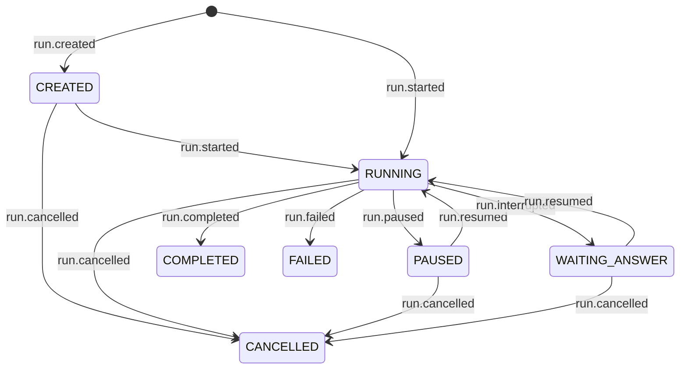

# Run identity and the Run object

What addresses a run, what a caller holds, and why the control plane can address the wrong
tenant today.

Proposal, not built. Supersedes #314's `namespace=` patch, which is the consistent version of
the mistake rather than the fix.

## The defect this starts from

`agentdeck/adapters/control/sqlite/port.py:25`:

```sql
CREATE TABLE IF NOT EXISTS signals (run_id TEXT PRIMARY KEY, signal TEXT, reason TEXT)
```

`acme/order-1234` and `globex/order-1234` share one row. A cancel for one cancels the other, a
pause for one pauses the other, and `consume()`'s compare-and-set makes them fight over a single
slot. The memory port has the same shape (`dict[str, ControlSignal]`), and `ControlPort`'s own
docstring states the false premise out loud:

> No `RunContext` on the port methods — `run_id` is globally unique.

It is not. `deck.run(..., run_id=…)` accepts one (`deck.py:749`) and `service.py:614` mints a
`uuid4()` only when the caller supplies none. The event stores were built correctly and key by
`(namespace, log_key)`; the control plane was built on the premise the stores contradict.

**This is a live cross-tenant defect, not a design smell.** It is also the reason the fix is an
identity change rather than three keyword arguments: every subsystem that addresses a run by a
bare `run_id` is one namespace collision away from acting on a stranger.

## 4. The identity model

Two identities, one derived from the other.

| | who owns it | what it is |
|---|---|---|
| `(namespace, run_id)` | the caller | the logical/idempotency identity, chosen or defaulted |
| `ref` | agentdeck | the durable address, globally unique, opaque |

**`ref` is derived, not minted.** It is a pure function of the pair:

```python
def encode(namespace: str | None, run_id: str) -> str:
    if namespace is None:
        return run_id                                     # byte-identical to today
    return f"adr:{quote(namespace, safe='')}:{quote(run_id, safe='')}"
```

Deriving rather than storing removes the mapping table, the second source of truth, and the
atomic mint that would have had to guard it. Same pair always yields the same ref, in any
process, with no round trip.

`adr:` is reserved: a caller-supplied `run_id` beginning with it is refused at `create()`, which
is what makes an unnamespaced ref unambiguous. Validation at a trust boundary, so the simplicity
ladder does not apply.

### `encode(None, run_id) == run_id` is the compatibility keystone

Every unnamespaced ref is byte-identical to today's `run_id`. Stored ids keep working, the
unnamespaced CLI and HTTP surfaces keep working, and the frozen v1 wire cannot move because
`surfaces/serve/compat.py:10` is unnamespaced by design. Zero migration for every deployment
that never set a namespace, which is all of them on the v1 wire.

The cost, accepted: a ref is not self-evidently a ref. Invariant 5 below is enforced by the port
signatures taking refs, not by looking at a value.

### Why this is not the composite key #314 rejected

#314 rejected `"acme/order-1234"` as a **user-assembled, user-parsed** value, where delimiter
escaping became the caller's problem and a mis-parse addressed the wrong tenant silently. This
is system-minted and parsed by nobody but us. A caller stores `run.id` and hands it back; they
never build one and never split one.

### Invariants

| | |
|---|---|
| 1 | Two namespaces may use one `run_id` and get two different runs |
| 2 | The same `(namespace, run_id)` always resolves to the same run, never a second one |
| 3 | Creating that run is atomic across processes: first create wins, the loser gets the winner's run |
| 4 | Uniqueness is enforced by a conditional append, not inferred from event-log layout |
| 5 | No internal path addresses a run by bare `run_id`; ports take refs |

**Invariant 3 does not disappear because the ref is derived.** Two concurrent
`create("ApprovalFlow", …, namespace="acme", run_id="order-1234")` calls compute the same ref
and both try to append `run.created`. Without a conditional append that is two creation events
for one run, and if they carried different inputs, `start()` has no answer for which input runs.

**Idempotent create**, following the Stripe convention:

| second `create` with the same `(namespace, run_id)` | |
|---|---|
| identical input | returns the existing `Run`, appends nothing |
| different input | raises, naming the key and that it is already in use |

## 3. Lifecycle

`CREATED` becomes a real state, produced by a real event.



Status stays folded from the log, so `CREATED` needs `run.created` or it is unobservable, which
is exactly why #295 deleted `PENDING`.

### `StateFacts` gains a third axis

`core/status.py:63` carries `terminal` and `suspended`. It gains `holds_session`:

| state | terminal | suspended | holds_session |
|---|---|---|---|
| `CREATED` | no | no | **no** |
| `RUNNING` | no | no | yes |
| `PAUSED` | no | yes | yes |
| `WAITING_ANSWER` | no | yes | yes |
| `COMPLETED` · `FAILED` · `CANCELLED` | yes | no | no |

This is what #295's table was built for: a third fact about a state, declared once, with every
derived set following.

### The claim rule becomes three-way

`claim_start` in all four stores:

| the open run it finds | |
|---|---|
| `holds_session=False` (`CREATED`, terminal) | **skipped entirely** — never held, never overridden |
| suspended | held forever, until answered, resumed or cancelled (#311) |
| `RUNNING` | held, unless stale or known dead (#244) |

The first row matters more than it looks. If `CREATED` fell into the stale branch, an old
created-but-unstarted run would be closed `failed` by an unrelated turn, which is precisely the
destroy-to-reclaim failure #311 just removed for parked runs.

The correct race behaviour falls out of it: another turn may claim the session while a run sits
`CREATED`, and that run's `start()` then refuses as session-busy. A `CREATED` run holds nothing,
so it is never in anyone's way.

### The questions `create()` raises, answered

| | |
|---|---|
| Can a `CREATED` run be cancelled? | Yes. Non-terminal, so `run.cancelled` applies. |
| Started exactly once? | Yes, by `claim_start`'s conditional append, the same mechanism that already prevents a double start. |
| Repeated `start()`? | Refused, naming the state, through `PRECONDITIONS` — a new column, not new machinery. |
| Does it hold a session? | No. See above. |
| Survives restart? | Yes. It is in the log, and `get()` finds it. |
| Abandoned ones? | Cost one log row and need no reaper. That is the payoff of not holding a session. |
| Future `SCHEDULED`/`WAITING`? | More `holds_session=False` pre-run states. Additive, one row each. |

## 1. Public API

`deck.runs` is a collection; a `Run` manages itself.

```python
run = await deck.runs.create(name, input, *, namespace=None, run_id=None,
                             session_id=None, context=None) -> Run
run = await deck.runs.start(name, input, *, namespace=None, run_id=None,
                            session_id=None, context=None) -> Run
run = await deck.runs.get(id_or_run_id, *, namespace=None) -> Run
runs = await deck.runs.list(*, namespace=None, status=None, limit=None) -> list[Run]
```

`start()` is sugar and owns no lifecycle of its own:

```python
async def start(self, name, input, **kw) -> Run:
    run = await self.create(name, input, **kw)
    await run.start()
    return run
```

`get()` takes one positional, read two ways: with no `namespace` it is a ref (what `run.id`
returned); with a `namespace` it is the caller's own `run_id`. Both resolve through `encode`,
so there is one lookup path and no overload on the inside.

```python
run = await deck.runs.get(saved_id)                                  # a ref
run = await deck.runs.get("order-1234", namespace="acme")            # logical identity
```

`list()` replaces `pending()`. Filters stay two, deliberately, and no query DSL:

```python
for run in await deck.runs.list(namespace="acme", status="waiting_answer"):
    await run.answer("approved")
```

## 2. The `Run` contract

Bound to its `Deck`. Holds no engine, store, MCP or observer, and is not a second runtime.

```python
class Run:
    id: str                       # the ref: opaque, persist it, hand it back to get()
    run_id: str                   # the caller's own id
    namespace: str | None
    session_id: str | None

    async def start(self) -> None
    async def status(self) -> RunStatus
    async def pause(self, reason: str | None = None) -> bool
    async def resume(self, *, context: object = None) -> None
    async def cancel(self, reason: str | None = None) -> bool
    async def answer(self, value: Any, *, context: object = None) -> None
    async def pending(self) -> Any | None        # the interrupt payload, or None
    async def result(self) -> TurnResult | Any
    def events(self, *, from_seq: int = 0) -> AsyncIterator[Event]
```

`pending()` is the answer to a gap the brief leaves open: `list()` returns `Run` objects and
kills `PendingRun`, but `PendingRun.payload` is the question being asked and an approval flow is
useless without it. It surfaces as a method on the run that is waiting.

Everything currently on `deck.runs.status/pause/resume/cancel/answer` moves here and is not
duplicated.

`status()` returns `RunStatus`, never `None`: a `Run` exists only because a run was found, so
absence is `get()`'s problem and is reported by raising there.

## 5. Internal changes

### Control plane, the correctness fix

| | change |
|---|---|
| `ControlPort` | `signal/poll/consume(ref, …)`; docstring's "globally unique" premise replaced with the derivation |
| memory port | `dict[str, ControlSignal]` keyed by ref |
| sqlite port | `signals (ref TEXT PRIMARY KEY, …)`; **a migration, since the column changes meaning** |
| `Gate` | bound to a ref, not a `run_id` (`core/control.py:126`) |
| `Runtime` signal/poll/consume | pass refs throughout |
| `ControlSignalled` | message names the ref |

`RunContext` gains `ref` as a derived property over the `namespace` and `run_id` it already
holds, so nothing has to thread a new value and no call site can forget one.

### Store

| | change |
|---|---|
| `claim_create` | new: append `run.created` if and only if this `(namespace, run_id)` has no run. Same conditional-append shape as `claim_start`/`claim_resume` |
| `claim_start` | the three-way rule above, replacing the two-way one #311 shipped |
| `list_runs` | gains `limit`; already namespace-aware through `ctx` |
| resolution | `get()` resolves a ref to its `log_key` through `list_runs` within the decoded namespace |

That last row is the one deliberate shortcut. `log_key` is `session_id or run_id`, so a ref does
not name its own log, and resolution is a scan of one namespace. It is what `Deck._status`
already does today (`deck.py:806`).

```python
# ponytail: O(runs in namespace) per get(); a ref -> log_key index in the store is the
# upgrade, warranted when a namespace holds enough runs for this to show up in a profile.
```

## 6. Compatibility

| | |
|---|---|
| unnamespaced deployments | **nothing changes.** `encode(None, rid) == rid`, so stored ids, the CLI and the v1 wire all keep working |
| frozen v1 HTTP wire | cannot move: `compat.py` is unnamespaced by design, and `tests/golden/` replays it every `make test` |
| namespaced control signals | **behaviour changes and that is the fix.** A signal that used to hit both tenants now hits one |
| sqlite control table | schema migration: the primary key changes meaning. Existing rows are unnamespaced and migrate as identity |
| `deck.runs.status/pause/resume/cancel/answer` | move to `Run`. A deprecated bridge is possible but should be short-lived |
| `deck.runs.pending()` | replaced by `list(status="waiting_answer")`, which returns richer objects |
| `deck.runs.cancel(namespace=…)` | the parameter #311 added is absorbed; `Run` carries the namespace |
| `deck.run()` / `deck.stream()` | **kept**, as the run-to-completion front door the README and the frozen wire depend on, redefined as sugar over `create → start → result`. One lifecycle implementation, not two |
| `run.created` | a new event kind: a dedicated schema PR, D8 minor, one new snapshot |

### Delivery, three stages

| | |
|---|---|
| 1 | the schema PR: `run.created`, `RunStatus.CREATED`, `holds_session`, snapshot |
| 2 | identity and control: `encode`, ports, four control adapters, `Gate`, `Runtime`, `claim_create`, the three-way claim rule |
| 3 | the surface: `Run`, `deck.runs.*`, `InterruptResult`, docs |

Stage 2 is where the cross-tenant defect is actually fixed, and it is shippable without stage 3.

## Interrupts

`InterruptResult` (`authoring/interrupts.py:17`) carries `type`, `payload` and `thread_id`, and
`thread_id` is `session_id or run_id`, so for any run with a session it is not the run id at all.
A caller holding one cannot address the run it came from.

It gains the ref, and the flow closes with no second lookup:

```python
run = await deck.runs.start("ApprovalFlow", order, namespace="acme")
if await run.pending() is not None:
    await run.answer("approved")
```

`thread_id` and `session_id` stay what they are: execution and checkpoint concepts, never the
identity of an agentdeck run.

## 7. Test matrix

Deck level, all of it. #314 exists because runtime-level tests passed while the public surface
was broken, and #311 shipped a namespace test that called `runtime.signal()` directly.

| | asserts |
|---|---|
| same `run_id`, two namespaces | two distinct runs, neither visible to the other |
| repeated `create`, identical input | the same run, no second `run.created` in the log |
| repeated `create`, different input | raises, naming the key |
| concurrent `create` from two processes | one `run.created`, both callers hold the same run |
| `create` → `start` | one run, one `run.started` |
| `deck.runs.start()` | identical log to the two-step, proving it is sugar |
| `create` → restart → `get()` → `start()` | survives the process boundary |
| `RUNNING` → `pause` → `resume` | resumes, no state lost |
| `WAITING_ANSWER` → restart → `get()`/`list()` → `answer` | the approval outlives the process |
| `cancel` from another worker | lands on the right run |
| **control signal, colliding ids across namespaces** | `acme/order-1234` cancelled, `globex/order-1234` untouched. **The regression test for the defect this document starts from** |
| `list(namespace=…, status=…)` | returns `Run` objects, filtered |
| same `run_id`, different session context | refused, naming the conflict |
| no namespace anywhere | byte-identical behaviour to today |
| `CREATED` run, unrelated turn on the same session | the turn succeeds; the `CREATED` run's `start()` then refuses |
| `start()` twice | the second refuses, naming the state |

## 8. Open

Genuinely unsettled by the existing architecture.

**Does `get()` raise or return `None` for an unknown ref?** #294 ruled that the *port* returns
`RunStatus | None` and that the Deck must not answer the same question twice. `get()` is a
different question, and returning `None` from a factory forces an `if` at every call site. Raise
`NotFoundError`, probably, but it is a reversal of the shape #294 chose and should be ruled, not
assumed.

**Does a `CREATED` run reserve its session?** The design says no, and the whole third-way claim
rule depends on that. The counter-case is a caller who creates ten runs on one session expecting
them to execute in order, and gets whichever starts first. That is arguably correct and
arguably a footgun.

**Is the ref stable if a caller supplies no `run_id`?** It is derived from the minted `uuid4`, so
yes, but it also means an auto-id run has no idempotency: retrying `create()` mints a new id and
therefore a new run. That is today's behaviour and worth stating rather than discovering.

**Deprecation window for `deck.runs.*` control ops.** A bridge is easy and a bridge that lives
forever is the duplicate surface the brief bans. Needs a version, not a policy.

**Does `list()` need cross-namespace listing?** An operator view of every parked run has no
namespace to pass. It does not exist today either, and adding it means deciding whether the
isolation boundary has an above.
