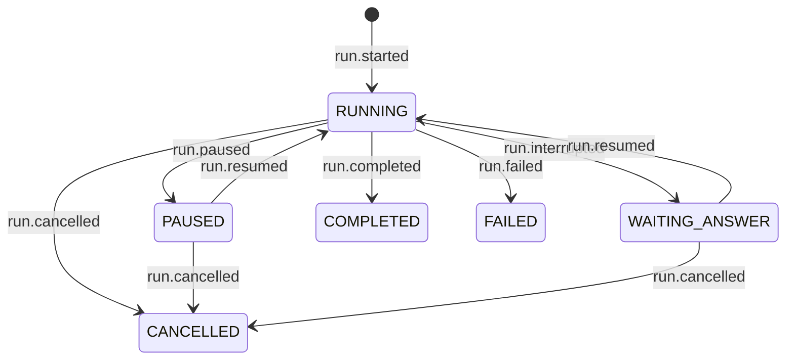

# The run lifecycle

Which event moves a run's state, what is true of each state, which operation is legal in one, and
what a pending signal does when it is read.

`design/agentdeck-v2-architecture.md` §4.4 summarises this file; on the lifecycle this file wins.

**The rule underneath all of it:** the log *is* the state. `core/status.py` folds a run's lifecycle
events, there is no status table, and appending is the only way a decision becomes true. Nothing
holds a status field and nothing caches a fold.

**Built.** #295 built the four tables, the routing and the rename; this file describes the tree.
*Drift* and *Declared, never produced* are dated audit records of the tree at `da46439`, kept with
their verdicts rather than deleted  -  they are what the tables were written against, and they still
spell the parked state `WAITING_HUMAN`, which is what it was called then.

## The machine

Six states and the seven `LIFECYCLE_KINDS` that move them. No other kind in the schema moves a
state. `run.resumed` carries the answer when it leaves `WAITING_ANSWER` and `None` when it lifts a
pause, which is how one kind serves both edges.

## What is true of each state

Held today as three collections in two modules  -  `RESUMABLE_STATUSES` and `TERMINAL_STATUSES` in
`core/status.py`, `SUSPENDED_KINDS` in `runtime/service.py`  -  each carrying a third of this table.

| state | terminal | suspended | resumes with |
|---|---|---|---|
| `RUNNING` | no | no |  -  |
| `PAUSED` | no | yes | nothing |
| `WAITING_ANSWER` | no | yes | a value |
| `COMPLETED` · `FAILED` · `CANCELLED` | yes | no |  -  |

**Which state a suspension gets is decided by how it resumes, not by who caused it.** With a value
is `WAITING_ANSWER`; with nothing is `PAUSED`. So code pausing itself would be `PAUSED`, not a
seventh state.

**Terminal** means no outgoing transition and nothing owed. The play loop stops reading after a
terminal kind so nothing can follow one into the log, a signal arriving afterwards is a no-op
rather than an error, and `CANCELLED` is excluded from resumable because terminal is terminal. A
later `run()` opens a **new** run on the session and never re-enters this one.

## Which operation is legal in which state

Preconditions, checked before anything is read from the control port.

| state | `run` | `answer` | `resume` | `pause` | `cancel` |
|---|---|---|---|---|---|
| `RUNNING` | refused, session busy | refused, nothing awaits one | no-op | recorded | recorded |
| `PAUSED` | refused, session busy | refused, naming `resume` | legal | recorded | claimed, terminates at once |
| `WAITING_ANSWER` | refused, session busy | legal | refused, naming `answer` | recorded | claimed, terminates at once |
| terminal | opens a **new** run | no-op | no-op | recorded, never read | recorded, never read |

`pause` and `cancel` were one merged column before #311: both were "recorded", read only once
something next claimed the run. `cancel` against a suspended run no longer waits for that  -  it
claims the run itself and terminates it in the same call, because nothing else was ever
guaranteed to (`signal()`'s own docstring). `pause` still only records; lifting or answering a
suspended run is what acts on it.

## What a pending signal does when it is read

A signal is a request, never a record. It is read at one of two moments: a gate checkpoint while
the run is live, or the claim that begins the operation continuing a stopped run. The columns are
**what was pending at that moment**, not what the caller just called.

| state, read at | `cancel` | `pause` | `resume` | nothing |
|---|---|---|---|---|
| `RUNNING`, a gate checkpoint | raise: requested, observed, cancelled · *consume* | raise: requested, observed, paused · *consume* | return; a lifted pause has nothing to do · *leave* | return |
| `PAUSED`, a resume claims it | terminate: requested, cancelled · *consume* | the resume **is** the answer to it: lift · *consume* | proceed · *consume* | proceed |
| `WAITING_ANSWER`, an answer claims it | terminate: requested, cancelled · *consume* | **refuse the answer, naming the pause** · *leave* | proceed · *consume* | proceed |
| terminal | no-op · *consume* | no-op · *consume* | no-op · *consume* |  -  |

Sixteen cells, total, asserted at import. A missing ruling is a missing key, which is a failing
test rather than a request that is accepted and read by nothing.

Two cells carry the design's opinions:

**A cancel against a stopped run terminates immediately.** `signal()` itself claims the suspended ->
`RUNNING` transition and appends the two terminating events on top of it (#311)  -  a suspended run
has no loop ever going to poll the gate again, so recording the signal and waiting for a resume or
answer to notice it is waiting for something that may never come. Losing that claim to a
concurrent resume/answer falls through to the routing below, which is what reads the recorded
signal when *that* caller is the one to find it pending.

**A pause against a run waiting for an answer refuses the answer** rather than being lifted by it.
Lifting would let an answer silently override an operator who said stop. Refusing costs the
answerer one round trip and keeps both intents intact. The better end state is to accept the
answer, resume, and stop at the first safe point  -  which a workflow cannot do until it has one
(#128), so it is not the first version.

## Routing

Five steps, in this order.

| | | |
|---|---|---|
| 1 | claim | the conditional append that makes this caller the only actor on the run |
| 2 | fold | read the log, derive the state. `runtime/service.py:259` states why this must follow the claim: an intent read before it "could belong to somebody else's turn" |
| 3 | intent | read the control port |
| 4 | decide | look up the two tables above |
| 5 | append | the ruling's events. Nothing else makes it real |

A `Ruling` carries what to append, **what becomes of the intent** (`consume` or `leave`), and one
sentence of why, which doubles as the error message and the test name. `consume` needs
`ControlPort.consume(run_id, expected) -> bool`, recorded as missing in
`agentdeck-v2-architecture.md` §4.5; `resume_run` hand-rolls it today and documents why an
unconditional write "would overwrite, and silently destroy, a cancel that arrived while the run was
suspended".

**The invariant:** every read of the control port ends in an event or an explicit no-op, **never in
silence**. Silence cannot be tested, logged or seen by a user, which is how three defects survived a
release.

## The declaration

One table per axis, in `core/status.py`  -  not a new module, because 23 import statements across 20
files make a rename churn, and that file already is this subject.

| | replaces |
|---|---|
| `STATES` | `RESUMABLE_STATUSES`, `TERMINAL_STATUSES`, `SUSPENDED_KINDS` |
| `TRANSITIONS` | `_KIND_TO_STATUS`, unchanged in substance |
| `PRECONDITIONS`, `POLICY` | two `if pending.verb is …` branches, a `status=PAUSED` query filter, and, for the cells nothing implements, silence |

Every derived set stays derived, which is the pattern `TERMINAL_STATUSES` already uses: a terminal
kind added without a transition raises at import rather than answering wrongly at runtime.
`tests/core/test_vocabularies_agree.py` is where the totality assertions belong; it exists for this
discipline and already guards the kind tables against the schema.

## Drift

The tree at `da46439`, which still spelled the parked state `WAITING_HUMAN`. Resolved by #295
except where the verdict says otherwise.

| claim | truth in the tree at `da46439` | now |
|---|---|---|
| §4.4: transitions are "guarded in one place (`core/status.py`)" | Guarded in five: `RESUMABLE_STATUSES` and `TERMINAL_STATUSES` (`core/status.py:37,57`), `SUSPENDED_KINDS` (`runtime/service.py:56`), two `if pending.verb is …` branches in `resume_run` (`runtime/service.py:260,268`), and the `status=PAUSED` filter inside `_paused` (`runtime/service.py:362`) | True again: `STATES`, `TRANSITIONS`, `PRECONDITIONS` and `POLICY` are the only places a rule is written |
| §4.4: `CANCELLED` is "reachable from … `WAITING_HUMAN`" | It is not. `Runtime.resume` never polls the control port, so a `cancel` recorded against a parked run is read by nothing (#229); a `pause` vanishes the same way | Reachable: the answer's claim reads the port and rules on what it finds |
| `Deck.runs.resume` on a parked run reports something | It returns `[]`: `_paused` lists only `PAUSED` runs, so the state is never seen | It refuses, naming `answer`. The verb moved to `Run.resume()` in #322 |
| `PAUSED` is reachable for any run | Not for a workflow run  -  the langgraph adapter never calls `gate.checkpoint()` (#128) | Reachable: `LangGraphEngine._play` checkpoints at the node boundary between `updates` chunks (#312) |

## Declared, never produced

| declaration | why nothing produces it |
|---|---|
| `RunStatus.PENDING` *(deleted by #295)* | The fold's identity element for an empty sequence, never a state a run is in: `run.started` is row 0, so there is no moment between "does not exist" and `RUNNING`. `status_of([])` answers `None` now |
| `SafePoint`'s `tool_dispatch` | The only `checkpoint()` call site outside the langgraph engine is bare, so `stream_item` is the only value the openai-agents engine emits; nothing checkpoints before a tool dispatch yet. `node_boundary` moved out of this row when the langgraph engine started emitting it (#312) |
| `RunFailed.error_code`'s `tool_error`, `budget_exceeded`, `deadline` | Only `engine_error`, `cancelled_hard` and `invalid_input` (#621) are ever constructed, and a tool that raises ends the run `completed` (#250) |

## `WAITING_HUMAN` was misnamed

Renamed by #295. `WAITING_ANSWER` pairs the state with the verb that leaves it.

`sleep_until` parks here, so a wall-clock wait was recorded as a human one, and
`RunInterrupted.reason` defaults anything unrecognised to `"human"`
(`adapters/engines/langgraph/engine.py:331`)  -  including a timer payload, which carries no `reason`
at all.

The enum rename is an ordinary API break: the value is in no golden file and no snapshot, because
status is derived and never serialised into a payload, so `coding-standards.md` §7 does not apply.
`RunInterrupted.reason`'s literal *is* in the schema, and renaming it is a separate versioned change.
