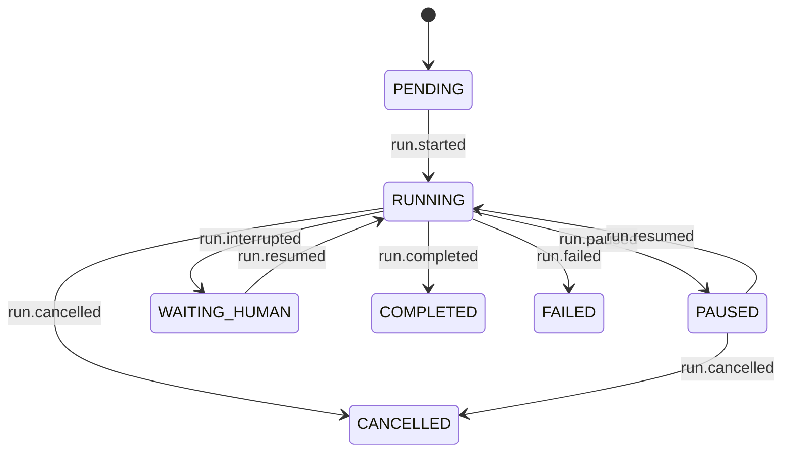

# The run lifecycle

Which event moves a run's state, what is true of each state, and what a request does to a run
sitting in one. Audited against the tree at `da46439`, 2026-08-14.

`design/agentdeck-v2-architecture.md` §4.4 summarises this file; on the lifecycle this file wins.

The log *is* the state — `core/status.py` folds a run's lifecycle events and there is no status
table, so `status_of` after a restart returns whatever the log says.

## The machine

Seven states and the seven `LIFECYCLE_KINDS` that move them, as built; no other kind in the
schema moves a state.

## Per-state properties

Held today as three collections in two modules — `RESUMABLE_STATUSES` and `TERMINAL_STATUSES` in
`core/status.py`, `SUSPENDED_KINDS` in `runtime/service.py` — each carrying a third of this table.

| state | terminal | suspended | resumes with | observable |
|---|---|---|---|---|
| `PENDING` | no | no | — | **no** |
| `RUNNING` | no | no | — | yes |
| `PAUSED` | no | yes | nothing | yes |
| `WAITING_HUMAN` | no | yes | a value | yes |
| `COMPLETED` · `FAILED` · `CANCELLED` | yes | no | — | yes |

## What a request does to a run in each state

A *total* function of (state, intent) — the half that exists in no module. A missing pair is how a
request gets accepted and then read by nothing.

| state | `cancel` | `pause` | `resume` | `answer` |
|---|---|---|---|---|
| `RUNNING` | at next safe point | at next safe point | no-op | refuse |
| `PAUSED` | honored by next resume | no-op | continue, lift the pause | refuse |
| `WAITING_HUMAN` | **terminate** ‡#229 | lift — the answer is the continuation ‡ | **refuse**, naming `answer` ‡ | continue with the value |
| terminal | no-op | no-op | no-op | no-op |
| `PENDING` | refuse | refuse | refuse | refuse |

‡ Ruled, not built: the three `WAITING_HUMAN` cells are what should happen. What happens today is
in *Drift* below — the rest of the table is behaviour.

Two rules govern the table. A ruling names the rows to append **and** what becomes of the request
(`consume` or `leave` — `consume` needs the port method §4.5 records as missing). And **every
control-port read ends in an event or an explicit no-op, never in silence**; silence is
unobservable, which is #229 and its two unfiled siblings at once.

## Drift

| claim | truth in the tree |
|---|---|
| §4.4: transitions are "guarded in one place (`core/status.py`)" | Guarded in five: `RESUMABLE_STATUSES` and `TERMINAL_STATUSES` (`core/status.py:37,57`), `SUSPENDED_KINDS` (`runtime/service.py:56`), two `if pending.verb is …` branches in `resume_run` (`runtime/service.py:260,268`), and the `status=PAUSED` filter inside `_paused` (`runtime/service.py:362`) |
| §4.4: `CANCELLED` is "reachable from … `WAITING_HUMAN`" | It is not. `Runtime.resume` never polls the control port, so a `cancel` recorded against a parked run is read by nothing (#229); a `pause` vanishes the same way |
| `Deck.runs.resume` on a parked run reports something | It returns `[]`: `_paused` lists only `PAUSED` runs, so the state is never seen |
| `PAUSED` is reachable for any run | Not for a workflow run — the langgraph adapter never calls `gate.checkpoint()` (#128) |

## Declared, never produced

| declaration | why nothing produces it |
|---|---|
| `RunStatus.PENDING` | A run with no events has no rows to list, so no caller can observe it — a deletion candidate |
| `SafePoint`'s `tool_dispatch`, `node_boundary` | Every `checkpoint()` call site is bare, so `stream_item` is the only value emitted |
| `RunFailed.error_code`'s `tool_error`, `budget_exceeded`, `deadline` | Only `engine_error` and `cancelled_hard` are ever constructed, and a tool that raises ends the run `completed` (#250) |

## `WAITING_HUMAN` is misnamed

`WAITING_ANSWER` pairs the state with the verb that leaves it.

`sleep_until` parks here, so a wall-clock wait is recorded as a human one, and
`RunInterrupted.reason` defaults anything unrecognised to `"human"`
(`adapters/engines/langgraph/engine.py:331`) — including a timer payload, which carries no
`reason` at all.

The enum rename is an ordinary API break: the value is in no golden file and no snapshot, because
status is derived, so `coding-standards.md` §7 does not apply. `RunInterrupted.reason`'s literal
*is* in the schema, and renaming it is a separate versioned change.
