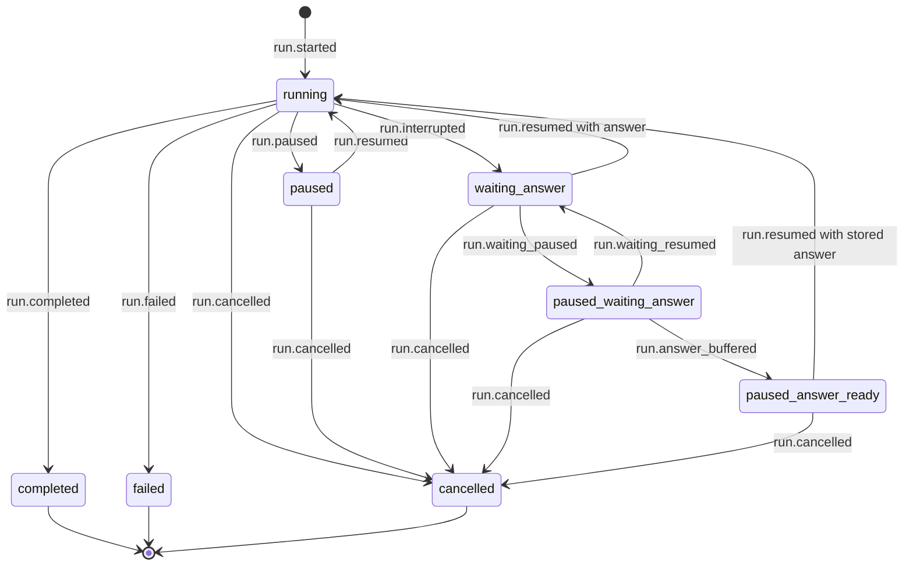

# Lifecycle

Status: TBD

Run states, transitions, and terminal rules.

## Current code state inventory

- `running`
- `paused`
- `waiting_answer`
- `completed`
- `failed`
- `cancelled`

## Proposed state and action contract

This is the 5.1 proposal, not a description of current behavior. It adds `paused_waiting_answer` and `paused_answer_ready` and assumes an executor that supports pausing; otherwise `pause()` and `resume()` refuse as unsupported.

Starting is not an action on an existing `Run`. `deck.run(...)` and `deck.runs.start(...)` admit a new run, whose first state is `running`. The table includes external `Run` actions and the workflow-only in-run action `ctx.ask(...)`.

| Current state | `ctx.ask(...)` | `pause()` | `resume()` | `answer(value)` | `cancel()` |
| --- | --- | --- | --- | --- | --- |
| `running` | Transitions to `waiting_answer` (workflow only) | Accepted: request recorded; remains `running` until a safe point transitions it to `paused` | No-op: already running | Refused: nothing awaits an answer | Accepted: request recorded; remains `running` until a safe point transitions it to `cancelled` |
| `paused` | Not available: no workflow code is executing | No-op: already paused | Transitions to `running` | Refused: use `resume()` | Transitions to `cancelled` |
| `waiting_answer` | Not available: no workflow code is executing | Transitions to `paused_waiting_answer` | Refused: the run requires a value; use `answer(...)` | Transitions to `running` | Transitions to `cancelled` |
| `paused_waiting_answer` | Not available: no workflow code is executing | No-op: already paused | Transitions to `waiting_answer` | Stores the answer and transitions to `paused_answer_ready` | Transitions to `cancelled` |
| `paused_answer_ready` | Not available: no workflow code is executing | No-op: already paused | Transitions to `running` with the stored answer | Refused: an answer is already stored; use `resume()` or `cancel()` | Transitions to `cancelled` |
| `completed` | Not available: no workflow code is executing | No-op: already terminal | No-op: already terminal | No-op: already terminal | No-op: already terminal |
| `failed` | Not available: no workflow code is executing | No-op: already terminal | No-op: already terminal | No-op: already terminal | No-op: already terminal |
| `cancelled` | Not available: no workflow code is executing | No-op: already terminal | No-op: already terminal | No-op: already terminal | No-op: already terminal |

## Proposed state machine



```text
START -- run.started --> RUNNING

RUNNING -- run.paused --> PAUSED
PAUSED -- run.resumed --> RUNNING

RUNNING -- run.interrupted --> WAITING_ANSWER
WAITING_ANSWER -- run.resumed with answer --> RUNNING
WAITING_ANSWER -- run.waiting_paused --> PAUSED_WAITING_ANSWER
PAUSED_WAITING_ANSWER -- run.waiting_resumed --> WAITING_ANSWER
PAUSED_WAITING_ANSWER -- run.answer_buffered --> PAUSED_ANSWER_READY
PAUSED_ANSWER_READY -- run.resumed with stored answer --> RUNNING

RUNNING -- run.completed --> COMPLETED
RUNNING -- run.failed --> FAILED

RUNNING -- run.cancelled --> CANCELLED
PAUSED -- run.cancelled --> CANCELLED
WAITING_ANSWER -- run.cancelled --> CANCELLED
PAUSED_WAITING_ANSWER -- run.cancelled --> CANCELLED
PAUSED_ANSWER_READY -- run.cancelled --> CANCELLED

COMPLETED, FAILED, CANCELLED -- no further transition --> END
```

`pause()` and `cancel()` from `running` first record control intent. The state changes only when the matching lifecycle event is observed at a safe point. Pausing a run waiting for input is immediate: no executing task must reach a safe point. `run.waiting_paused`, `run.waiting_resumed`, and `run.answer_buffered` are proposed new events because existing lifecycle events cannot distinguish these paths from `paused` to `running`. Terminal states are absorbing: no further lifecycle transition is legal.

## Decisions

TBD
