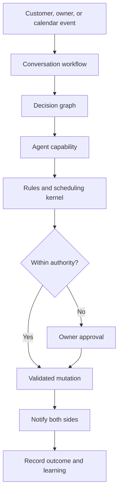
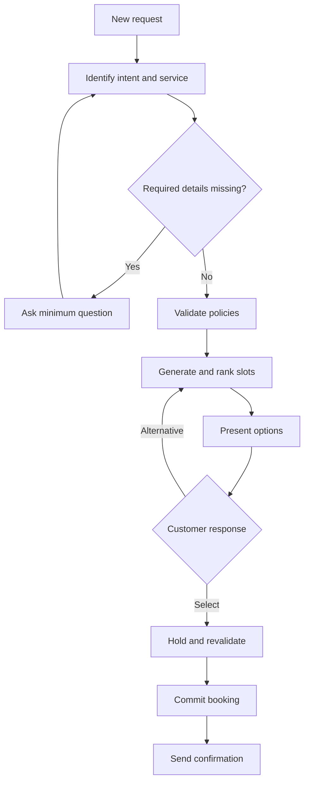
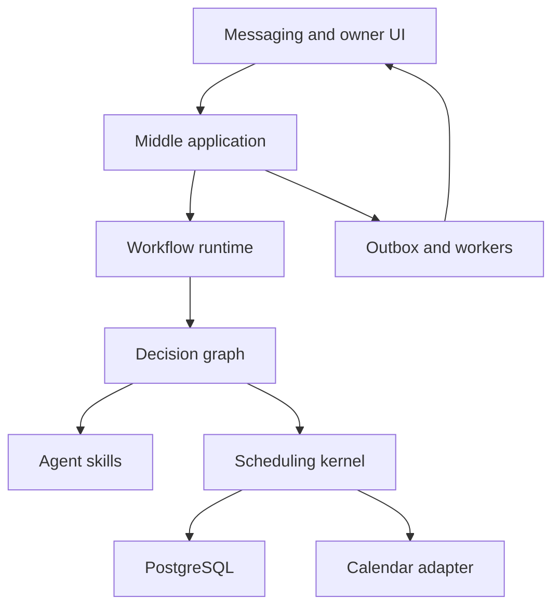

# Middle — Product Requirements Document

**Version:** 1.0  
**Product stage:** V1 / design baseline  
**Date:** 26 July 2026  
**Status:** Draft for product and engineering review  
**Owner:** Middle product team

---

## 1. Executive Summary

Middle is an autonomous scheduling operator that sits between a service business and its customers. It conducts scheduling conversations, understands service requests, coordinates constraints, proposes suitable times, manages approvals, and safely updates the business calendar.

Middle is not a booking page and not a general customer-service chatbot. Its defining behavior is that it actively moves a scheduling request toward a valid outcome while balancing:

- The customer's needs and preferences.
- The business's policies and operating preferences.
- Real calendar availability.
- Calendar quality, including gaps and idle time.
- The limits of the authority granted to the system.

V1 will serve one service business at a time and support five complete operational flows:

1. Business onboarding and configuration.
2. New appointment booking.
3. Appointment rescheduling.
4. Appointment cancellation and basic gap recovery.
5. Exceptions and owner approvals.

The core architecture combines:

- Versioned conversation workflows that control progress.
- A reusable decision graph for scheduling dilemmas.
- Specialized agent capabilities for understanding, reasoning, and communication.
- A deterministic scheduling kernel for correctness.
- Structured business memory for policies, preferences, and learned patterns.
- Human approval for actions outside the agent's authority.

The primary V1 proof is:

> Middle can independently complete common scheduling conversations from first customer message to confirmed calendar event, while escalating only the decisions the owner actually needs to make.

---

## 2. Problem

Small service businesses schedule work through fragmented conversations across messaging, phone calls, forms, and calendars. The owner repeatedly performs the same coordination work:

- Understand what the customer needs.
- Ask for missing details.
- Determine duration and required resources.
- Compare customer preferences with business availability.
- Suggest times.
- Handle negotiation and alternatives.
- Update the calendar.
- Respond to cancellations and changes.
- Decide whether to accept nonstandard requests.

Existing booking systems expose available slots but generally require the customer to navigate a rigid form. Chatbots can hold a conversation but usually do not own the scheduling outcome, optimize the calendar, learn the business's preferences, or safely resolve exceptions.

The result is slow customer response, owner interruption, lost bookings, calendar gaps, and inconsistent decisions.

---

## 3. Product Vision

Middle will become the intelligent operating layer between customers and service businesses.

It will know how the business works, conduct natural conversations on its behalf, make decisions within defined authority, coordinate multiple constraints, and continuously improve the calendar.

The long-term product may support route optimization, dynamic incentives, multiple workers and resources, voice channels, lead qualification, recurring services, and marketplace coordination. These are not required for V1.

---

## 4. Product Principles

### 4.1 Outcome ownership

Middle should advance each request toward a booking, clear rejection, alternative, or owner decision. It must not merely answer questions.

### 4.2 Workflow-led agency

Agents reason and communicate inside explicit workflows. The workflow owns lifecycle state, allowed transitions, retries, limits, and completion.

### 4.3 Deterministic correctness

Agents may propose actions. Deterministic services validate policies, availability, conflicts, holds, and calendar mutations.

### 4.4 Minimum necessary questions

Middle asks only for information required to make the next useful decision. It should not force customers through a long form.

### 4.5 Explicit authority

The business defines what Middle may decide automatically, what requires approval, and what is prohibited.

### 4.6 Structured learning

Middle records decisions and outcomes as structured evidence. Learned behavior remains distinct from owner-defined policy.

### 4.7 Explainability and reversibility

Every important action must be traceable to its inputs, policy, decision, actor, and resulting external mutation.

### 4.8 Graceful uncertainty

When information is ambiguous, confidence is low, or tools are unavailable, Middle asks a focused question, retries safely, or escalates. It does not invent facts or availability.

---

## 5. Goals and Non-Goals

### 5.1 V1 goals

- Allow a business owner to configure services, availability, policies, and agent authority.
- Receive and manage customer scheduling conversations through at least one messaging channel.
- Identify the active scheduling intent and workflow.
- Collect the minimum information required for a valid appointment.
- Generate and rank valid appointment options.
- Negotiate alternatives conversationally.
- Safely hold and confirm a selected slot.
- Reschedule and cancel existing appointments.
- Detect a newly created calendar gap and identify basic recovery opportunities.
- Request concise owner approval for exceptional decisions.
- Learn soft business preferences from owner decisions without silently changing hard policy.
- Provide the owner with a clear operational view and audit history.
- Measure automation, completion, escalation, error, latency, and calendar-quality outcomes.

### 5.2 Non-goals

V1 will not include:

- A consumer marketplace or provider discovery.
- Dynamic marketplace pricing.
- Automated discounts or payments.
- Multi-business or cross-provider negotiation.
- Full vehicle-routing optimization.
- Autonomous changes to confirmed appointments without customer consent.
- Complex multi-resource scheduling such as rooms, equipment, and teams.
- Native voice calling.
- Broad CRM or customer-support automation unrelated to scheduling.
- Fully peer-to-peer autonomous agents.
- Self-modifying workflows or policies.
- Training or fine-tuning foundation models.

---

## 6. Initial Target Market

V1 targets appointment-based service businesses with:

- One owner or dispatcher.
- One primary calendar.
- One to five workers represented in the same business account.
- A manageable service catalog.
- Customer conversations currently handled through messaging.
- Appointment durations that can be determined from a service type and a small number of parameters.

Suitable design partners include beauty services, tutors, consultants, technicians, repair services, clinics with non-clinical scheduling needs, photographers, and home-service operators.

V1 should initially validate one focused vertical. The platform model may remain generic internally, but configuration, terminology, and onboarding should be optimized for the selected design-partner vertical.

---

## 7. Users and Jobs to Be Done

### 7.1 Customer

**Job:** “Help me arrange the right service at a time that works, without making me understand the business's calendar.”

Needs:

- Natural, low-friction communication.
- Fast and accurate availability.
- Clear choices.
- Easy negotiation.
- Confidence that the booking is confirmed.
- Simple changes or cancellation.

### 7.2 Business owner or dispatcher

**Job:** “Handle routine scheduling on my behalf while respecting how I run the business, and involve me only when my judgment is needed.”

Needs:

- Control over services, rules, availability, and authority.
- Visibility into conversations and pending approvals.
- Protection against invalid or duplicate bookings.
- Fewer interruptions.
- Better calendar utilization.
- The ability to correct and teach Middle.

### 7.3 Service worker

**Job:** “Keep my calendar accurate and tell me what I need to know about upcoming work.”

V1 support is limited to calendar visibility and relevant appointment details. A dedicated worker application is not required.

### 7.4 Internal operator

**Job:** “Diagnose failures, inspect decisions, support onboarding, and safely recover workflows.”

Needs:

- Searchable audit history.
- Workflow and tool traces.
- Safe retry and manual recovery controls.
- Configuration version visibility.

---

## 8. V1 Experience Overview



The customer experiences one continuous conversation. Internally, Middle:

1. Resolves identity and context.
2. Selects or resumes the correct workflow.
3. Evaluates the next decision node.
4. Invokes the minimum required agent skill or deterministic tool.
5. validates proposed actions.
6. Executes permitted mutations.
7. Communicates the outcome.
8. Records evidence and observed results.

---

## 9. V1 Scope by Capability

| Capability | V1 requirement |
|---|---|
| Channels | One production messaging channel plus an internal test console |
| Calendar | One provider integration; read, hold abstraction, create, update, cancel, conflict check |
| Business setup | Services, durations, hours, buffers, areas/locations, policies, authority |
| Customers | Identity, contact channel, conversation history, booking history, stated preferences |
| Intents | New booking, reschedule, cancel, answer scheduling question, exception |
| Optimization | Rank valid slots using explicit business and customer preferences |
| Gap recovery | Detect cancellation gap and suggest eligible existing opportunity; no autonomous discounting |
| Approvals | Owner inbox with approve, reject, modify, and teach actions |
| Learning | Structured soft preferences and acceptance statistics |
| Observability | Full workflow, decision, tool, mutation, and message audit |
| Administration | Business dashboard and internal operator view |

---

## 10. Core Workflows

### 10.1 Business onboarding

**Trigger:** Owner creates a Middle workspace.

**Outcome:** Middle has sufficient verified configuration to accept scheduling requests.

**Required stages:**

1. Connect the authoritative calendar.
2. Set business timezone and operating locations.
3. Define services and customer-facing descriptions.
4. Define default duration, preparation time, cleanup time, and optional parameters.
5. Set working hours, breaks, days off, and booking horizon.
6. Set notice, cancellation, rescheduling, and lateness policies.
7. Define scheduling preferences.
8. Define agent authority and approval thresholds.
9. Simulate example requests.
10. Owner reviews and activates Middle.

**Activation requirements:**

- At least one service is active.
- Each active service has a valid duration rule.
- Working hours and timezone are set.
- Calendar permissions are verified.
- Required customer information is defined.
- Authority defaults have been reviewed.
- A test booking succeeds without creating an unintended live appointment.

### 10.2 New booking

**Trigger:** A customer asks to schedule a service.

**Outcome:** Confirmed appointment, active owner approval, or clearly communicated inability to book.



**Functional requirements:**

- Extract service, requested dates/times, flexibility, location, and relevant job parameters.
- Resolve ambiguous services through a focused question or explicit choice.
- Determine required fields dynamically from service configuration.
- Show two to four ranked options by default.
- Describe options in customer-friendly local time.
- Preserve constraints across turns.
- Support requests such as “later,” “not Tuesday,” or “next week in the morning.”
- Recalculate options when constraints change.
- Never present an option that has not passed deterministic validation.
- Revalidate the selected slot before commit.
- Use an idempotency key for every booking mutation.
- If the slot is no longer available, apologize briefly and immediately provide replacements.
- Send confirmation only after the authoritative calendar write succeeds.

### 10.3 Rescheduling

**Trigger:** Customer or owner requests a change to an existing appointment.

**Outcome:** Appointment is safely moved, remains unchanged, or awaits approval.

Requirements:

- Identify the correct appointment.
- Verify that the requester is permitted to change it.
- Apply rescheduling and notice policies.
- Preserve the original booking until a replacement is held and validated.
- Present replacement options using the current request constraints.
- Update the existing event where supported; otherwise use a safe replace operation.
- Avoid a state in which both original and replacement are unintentionally confirmed.
- Notify affected parties.
- Record the reason for rescheduling when supplied.

### 10.4 Cancellation and basic gap recovery

**Trigger:** Customer or owner cancels an appointment.

**Outcome:** Appointment is cancelled correctly and the new calendar gap is evaluated.

Requirements:

- Identify and verify the appointment.
- Explain applicable cancellation policy before final confirmation when required.
- Cancel using an idempotent mutation.
- Notify relevant parties.
- Emit a `CalendarGapCreated` event.
- Identify open requests or flexible future appointments that could fit the gap.
- Rank recovery candidates using compatibility, customer disruption, and business value.
- Require customer acceptance before moving a confirmed appointment.
- Require owner approval for any incentive or policy exception.

V1 may recommend or initiate a recovery conversation. It does not need to guarantee that every gap is filled.

### 10.5 Exception and owner approval

**Trigger:** A requested action is outside configured authority, violates a soft limit, has low confidence, or requires business judgment.

**Outcome:** Owner makes a clear decision with minimal interruption.

Approval request must include:

- The exact decision needed.
- Customer request summary.
- Proposed action.
- Reason approval is required.
- Relevant policy or preference.
- Expected scheduling or business impact when known.
- Expiration time.
- Approve, reject, and modify actions.
- Optional “use this as a future preference” action.

The customer should receive an appropriate holding response without exposing internal reasoning or promising approval.

---

## 11. Conversation Workflow Model

Each workflow instance is durable, resumable, and versioned.

### 11.1 Minimum workflow state

```json
{
  "workflow_id": "wf_123",
  "workflow_type": "new_booking",
  "workflow_version": "1.0",
  "business_id": "biz_123",
  "customer_id": "cus_123",
  "conversation_id": "con_123",
  "status": "awaiting_customer_selection",
  "stage": "slot_proposal",
  "collected_information": {},
  "constraints": {},
  "missing_information": [],
  "pending_decision_id": "dec_456",
  "candidate_slot_ids": [],
  "selected_slot_id": null,
  "active_hold_id": null,
  "requires_owner_approval": false,
  "next_action": "present_options",
  "version": 8,
  "updated_at": "2026-07-26T12:00:00Z"
}
```

### 11.2 Workflow requirements

- One workflow is the owner of each active scheduling outcome.
- A new message must resume an existing relevant workflow when possible.
- Concurrent updates use optimistic locking or equivalent protection.
- Transitions are explicitly enumerated and validated.
- Every transition records actor, input, previous state, new state, and reason.
- Workflows have maximum agent turns, tool calls, duration, and cost budgets.
- Long waits for customer or owner input are durable and do not occupy compute.
- Duplicate incoming messages are detected.
- Retries must not duplicate external mutations.
- Workflow version used at creation remains recorded after upgrades.
- Operators can pause, resume, terminate, or safely retry a failed workflow.

---

## 12. Decision Graph

The decision graph is the reusable reasoning layer shared across workflows. A workflow determines where the request is in its lifecycle; a decision node determines what should happen at a specific dilemma.

### 12.1 Initial V1 decision nodes

1. Identify scheduling intent.
2. Resolve customer and conversation context.
3. Resolve requested service.
4. Determine missing required information.
5. Select the best next question.
6. Interpret date, time, and flexibility constraints.
7. Evaluate whether the request is standard.
8. Determine whether the agent has authority.
9. Generate valid candidate slots.
10. Rank candidate slots.
11. Decide which options to present.
12. Interpret customer selection or rejection.
13. Decide whether to hold, recalculate, or escalate.
14. Resolve an appointment for change or cancellation.
15. Evaluate policy exception.
16. Select owner-approval question.
17. Evaluate gap-recovery candidates.
18. Determine whether an observed outcome should update a learned preference.

### 12.2 Decision-node contract

Each node must define:

```json
{
  "node_type": "evaluate_nonstandard_time",
  "version": "1.0",
  "required_inputs": [],
  "allowed_outputs": [],
  "policies_consulted": [],
  "tools_allowed": [],
  "minimum_confidence": 0.9,
  "authority_rule": "after_hours_limit",
  "escalation_conditions": [],
  "timeout_ms": 5000,
  "fallback": "request_owner_approval",
  "outcome_signals": []
}
```

Each execution returns a structured decision record:

```json
{
  "decision_id": "dec_456",
  "node_type": "evaluate_nonstandard_time",
  "choice": "request_owner_approval",
  "reason_code": "outside_working_hours",
  "confidence": 0.97,
  "evidence_refs": ["policy_17", "calendar_snapshot_29"],
  "proposed_action": {},
  "requires_approval": true,
  "created_at": "2026-07-26T12:00:00Z"
}
```

### 12.3 Graph rules

- Decisions return typed results, not unstructured prose.
- The graph is versioned.
- Nodes may be deterministic, model-assisted, or hybrid.
- Deterministic evaluation is preferred where rules are explicit.
- Model output never directly mutates calendars or policy.
- Each node has a safe fallback.
- Every graph traversal has cycle and step limits.
- Graph changes are tested against recorded scenarios before production.

---

## 13. Agent System

V1 uses a supervisor with bounded specialist capabilities. These are logical agents and may run in one deployable service.

| Component | Responsibility | Allowed behavior |
|---|---|---|
| Supervisor | Own active workflow and choose next decision/capability | Route, enforce limits, assemble responses |
| Conversation capability | Understand messages and draft customer-facing communication | Extract, clarify, summarize, respond |
| Scheduling capability | Frame scheduling constraints and request ranked options | Propose queries; cannot invent or commit slots |
| Business-policy capability | Interpret ambiguous soft policies and prepare exceptions | Recommend or escalate; cannot rewrite policy |
| Exception capability | Create concise owner decision packages | Request approval and interpret owner response |
| Learning capability | Convert outcomes into candidate soft preferences | Update evidence; cannot create hard policy |

### 13.1 Skills

Initial reusable skills:

- `identify-scheduling-intent`
- `collect-service-details`
- `interpret-time-constraints`
- `select-minimum-question`
- `propose-appointment-options`
- `negotiate-alternative-time`
- `prepare-owner-approval`
- `explain-policy-to-customer`
- `recover-calendar-gap`
- `extract-owner-preference`

### 13.2 Tool and permission rules

- Each skill receives only the tools and data it needs.
- Read and write tools are distinct.
- Calendar write tools require validated domain commands.
- All external mutations use scoped credentials and idempotency keys.
- Tool arguments are schema-validated.
- Tool responses are treated as untrusted external data.
- MCP may standardize integration access but does not own business state or correctness.
- Handoffs are typed capability calls; V1 does not allow unrestricted peer-to-peer loops.

---

## 14. Deterministic Scheduling Kernel

The kernel is authoritative for whether a proposed scheduling action is valid.

### 14.1 Responsibilities

- Service duration calculation.
- Preparation, cleanup, and travel buffers.
- Working-hours enforcement.
- Notice and booking-horizon enforcement.
- Calendar availability calculation.
- Overlap and conflict detection.
- Candidate-slot generation.
- Slot ranking feature calculation.
- Slot hold creation and expiration.
- Final pre-commit revalidation.
- Booking, rescheduling, and cancellation commands.
- Idempotency and concurrency control.
- Calendar reconciliation.

### 14.2 Ranking

V1 ranking must be explainable and configurable. Candidate features may include:

- Customer preference match.
- Business working-hour preference.
- Gap creation or reduction.
- Proximity to nearby appointments when location is relevant.
- Buffer efficiency.
- Earliest valid time.
- Owner-defined priority.

The ranker must never turn an invalid slot into a valid one. Initial ranking may use a weighted deterministic score. Learned ranking can be introduced only after sufficient evidence and offline evaluation.

### 14.3 Holds

- A selected slot receives a short-lived Middle hold where technically possible.
- A hold has an owner, expiry, status, and idempotency key.
- The authoritative calendar is checked immediately before confirmation.
- Expired holds cannot be committed.
- Failed commits release or expire holds safely.

---

## 15. Business Memory and Learning

Middle stores business knowledge in separate layers.

| Layer | Example | Who may change it |
|---|---|---|
| Hard policy | Never book after 20:00 | Owner or authorized admin |
| Soft preference | Prefer nearby jobs late in the day | Owner; Middle may propose |
| Learned pattern | Owner usually accepts 30-minute overtime for high-value jobs | Middle from outcomes |
| Customer preference | Customer prefers mornings | Customer evidence; editable |
| Performance evidence | Friday afternoon proposals have low acceptance | Aggregated system evidence |

### 15.1 Learning requirements

- Record the context, recommendation, owner choice, customer choice, and final outcome.
- Maintain confidence, sample size, recency, and provenance for learned patterns.
- Never silently promote learned patterns to hard policies.
- Avoid learning from suspected errors, duplicate events, or overridden operator actions without marking them.
- Let the owner accept, reject, edit, or disable proposed preferences.
- Show a plain-language explanation of why a preference was proposed.
- Support deletion or correction of learned preferences.

### 15.2 V1 learning scope

V1 does not require an online machine-learning model. It must build the correct evidence system and may use transparent frequency-based learning, for example:

> “You approved 9 of the last 10 requests up to 20:30. Should Middle treat requests before 20:30 as normally approvable?”

Owner confirmation remains required before authority changes.

---

## 16. Owner Experience

### 16.1 Main dashboard

The initial owner view should answer:

- What needs my attention?
- What has Middle handled today?
- What is happening in my calendar?
- Is Middle operating correctly?

Required sections:

- Pending approvals.
- Today's appointments.
- Active customer conversations.
- Recently completed automations.
- Failed or blocked requests.
- Basic metrics.

### 16.2 Approval inbox

Owners can:

- Approve.
- Reject.
- Modify the proposed action.
- Add a short instruction.
- Mark the decision as one-time.
- Turn the decision into a proposed future preference.

### 16.3 Configuration

Owners can view and edit:

- Services.
- Durations and buffers.
- Working hours and exceptions.
- Required booking information.
- Policies.
- Scheduling preferences.
- Agent authority.
- Connected calendars and channels.

### 16.4 Conversation oversight

Owners can:

- Inspect the customer-visible conversation.
- See current workflow stage.
- Take over and return control to Middle.
- Correct extracted information.
- Cancel or retry a workflow.

Internal model reasoning is not shown. Owner-facing explanations use structured decision evidence.

---

## 17. Customer Experience Requirements

- Middle identifies itself as the business's scheduling assistant.
- Messages are short, natural, and action-oriented.
- Questions are asked one at a time unless a small grouped question is clearly faster.
- Slot proposals use clear dates, local time, and relevant service details.
- The customer can answer in free text.
- The customer can correct Middle at any point.
- Middle distinguishes a temporary proposal from a confirmed booking.
- Middle does not claim a booking is confirmed before calendar commit succeeds.
- Sensitive internal business preferences are not exposed.
- When waiting for owner approval, Middle sets a realistic expectation without fabricating a response time.
- Customer consent is required before moving an already confirmed appointment.
- Accessibility and localization foundations must support right-to-left languages, including Hebrew, even if the first release uses one primary language.

---

## 18. Data Model

Minimum entities:

- `Business`
- `BusinessUser`
- `Worker`
- `Service`
- `ServiceRule`
- `Policy`
- `AuthorityRule`
- `Preference`
- `LearnedPattern`
- `Customer`
- `CustomerPreference`
- `Conversation`
- `Message`
- `WorkflowInstance`
- `WorkflowTransition`
- `DecisionExecution`
- `ApprovalRequest`
- `CalendarConnection`
- `CalendarSnapshot`
- `SlotCandidate`
- `SlotHold`
- `Appointment`
- `ExternalMutation`
- `DomainEvent`
- `Outcome`
- `AuditRecord`

All important records include business scope, timestamps, actor, source, version, and correlation identifiers.

---

## 19. System Architecture

V1 should be a modular monolith with clear internal boundaries.



### 19.1 Recommended modules

- Channel adapters.
- Conversation service.
- Workflow runtime.
- Decision-graph registry.
- Agent capability adapter.
- Business configuration and policy service.
- Scheduling kernel.
- Calendar integration.
- Approval service.
- Memory and learning service.
- Notification service.
- Audit and observability service.
- Background event workers.

### 19.2 Persistence

- PostgreSQL is authoritative for Middle workflow and domain state.
- The external calendar is authoritative for external calendar occupancy.
- An outbox pattern ensures domain events are published reliably.
- Calendar state is reconciled periodically and on relevant webhook events.
- Model conversation context is reconstructed from structured state and selected messages; it is not the sole source of truth.

### 19.3 Framework independence

Microsoft Agent Framework or another agent runtime may be used behind internal interfaces for model calls, tools, middleware, checkpoints, or orchestration. Middle's workflow definitions, decision contracts, domain commands, and persistent state must not depend directly on one framework's proprietary state format.

---

## 20. Integration Requirements

### 20.1 Calendar

- OAuth or equivalent secure connection.
- Read free/busy and relevant event metadata.
- Receive changes through webhook or polling fallback.
- Create, update, and cancel appointments.
- Detect external changes.
- Map Middle appointments to provider event IDs.
- Handle expired authorization and reconnect flows.
- Rate-limit and retry safely.

### 20.2 Messaging

- Inbound message webhook.
- Outbound text messages.
- Delivery status when available.
- Stable conversation/customer identifiers.
- Deduplication.
- Templates where channel rules require them.
- Consent and opt-out compliance.

### 20.3 Maps

Maps and travel-time integration is optional for the first pilot. If the chosen vertical is location-based, V1 must support address normalization and estimated travel time. Route optimization remains out of scope.

---

## 21. Security, Privacy, and Trust

- Business data is tenant-isolated.
- Access uses least privilege and role-based authorization.
- Calendar and messaging credentials are encrypted and never passed to models.
- Personally identifiable information is minimized in model prompts.
- Sensitive tool output is filtered before model use.
- All calendar mutations are audited.
- Owner takeover immediately prevents further autonomous customer-facing action for that workflow.
- Retention periods are configurable or documented.
- Customers can request correction or deletion according to applicable law.
- Production prompts and tool schemas are versioned.
- Prompt-injection defenses treat customer messages, calendar descriptions, and tool content as untrusted.
- High-impact actions outside explicit authority always require approval.

---

## 22. Reliability and Performance

### 22.1 Reliability requirements

- No duplicate appointment from duplicate input or retry.
- No confirmed message without successful calendar commit.
- No calendar write based only on model-produced availability.
- All external mutations are idempotent.
- Workflow recovery survives process restart.
- Failed tool calls use bounded retries with backoff.
- Poison messages enter a recoverable dead-letter state.
- Reconciliation detects divergence between Middle and calendar state.

### 22.2 Initial service targets

| Metric | V1 target |
|---|---:|
| Platform availability during pilot | 99.5% |
| First acknowledgement after inbound message | p95 under 5 seconds |
| Standard next response without external approval | p95 under 12 seconds |
| Duplicate confirmed bookings caused by Middle | 0 |
| Calendar mutations with audit record | 100% |
| Recoverable workflows after process restart | 100% |

These are pilot targets and should be revised after observing real provider and channel latency.

---

## 23. Observability and Evaluation

Every request receives a correlation ID spanning:

- Channel messages.
- Workflow transitions.
- Decision executions.
- Agent/model calls.
- Tool calls.
- Calendar reads and writes.
- Approval actions.
- Notifications.
- Final outcomes.

### 23.1 Operational dashboards

- Active and stalled workflows.
- Failure rate by workflow stage.
- Tool and provider latency.
- Calendar reconciliation failures.
- Approval backlog and age.
- Model cost and token usage.
- Handoff and decision counts.

### 23.2 Evaluation suite

Before release, V1 requires a scenario set covering:

- Normal bookings.
- Ambiguous services.
- Missing information.
- Flexible and strict time requests.
- Slot taken during conversation.
- Duplicate messages.
- Concurrent customer requests.
- Rescheduling-policy violations.
- Cancellation.
- Owner approval accepted, rejected, modified, and expired.
- Calendar outage.
- Messaging outage.
- External calendar edits.
- Prompt injection and malicious tool content.
- Hebrew and right-to-left message interpretation if included in pilot.

Each scenario defines expected workflow path, allowed decisions, prohibited actions, customer-visible result, and calendar end state.

---

## 24. Success Metrics

### 24.1 North-star metric

**Valid scheduling outcomes completed by Middle without owner intervention.**

A valid outcome is a confirmed booking, confirmed reschedule, confirmed cancellation, or correct terminal response that passes audit rules.

### 24.2 Product metrics

| Category | Metric |
|---|---|
| Automation | Percentage of eligible workflows completed without owner intervention |
| Conversion | Percentage of qualified new-booking requests that become confirmed appointments |
| Speed | Median time from first request to confirmed outcome |
| Customer effort | Median customer messages required per completed booking |
| Owner effort | Approval requests and manual takeovers per 100 workflows |
| Correctness | Invalid proposals, failed commits, duplicate bookings, policy violations |
| Calendar quality | Gap time created/reduced and usable hours filled |
| Learning | Proposed preferences accepted by owner and reduction in repeat approvals |
| Reliability | Workflow failure and recovery rate |
| Economics | Model and infrastructure cost per completed workflow |

### 24.3 Pilot success criteria

After a minimum meaningful pilot volume:

- At least 60% of eligible standard booking workflows complete without owner intervention.
- At least 90% of Middle-proposed slots are valid at presentation time.
- At least 95% of successfully selected available slots commit without operator recovery.
- Median owner review time per escalated request is below 30 seconds.
- No critical policy or duplicate-booking incident.
- Design partners report a measurable reduction in scheduling interruptions.

The team should establish the minimum sample size before treating these figures as conclusive.

---

## 25. Functional Acceptance Criteria

V1 is feature-complete when:

1. An owner can onboard and activate a valid business configuration.
2. A customer can complete a standard new booking entirely through conversation.
3. Middle asks only configured required questions before generating options.
4. All proposed options are generated by the scheduling kernel.
5. A selected slot is revalidated and safely committed.
6. A customer can reschedule an identified appointment without losing it prematurely.
7. A customer can cancel an appointment and receive confirmation.
8. Cancellation produces a gap event and candidate recovery evaluation.
9. Out-of-authority decisions produce usable owner approvals.
10. Approval decisions resume the original workflow correctly.
11. Owner edits to configuration affect new decisions with traceable versions.
12. Repeated owner decisions can produce a reviewable soft-preference proposal.
13. No learned pattern silently changes hard policy or authority.
14. Every calendar mutation is idempotent and auditable.
15. Workflows resume after application restart.
16. Operators can inspect and safely recover failed workflows.
17. Metrics and traces support diagnosis from customer message to calendar result.

---

## 26. Release Plan

### Phase 0 — Design partner and domain definition

- Select initial vertical and two to five design partners.
- Observe real scheduling conversations.
- Define service schema, policies, and exception taxonomy.
- Create the first evaluation set.

**Exit:** At least 50 representative scheduling scenarios and a stable V1 domain vocabulary.

### Phase 1 — Internal scheduling loop

- Business configuration.
- Calendar adapter.
- Scheduling kernel.
- Workflow runtime.
- New-booking decision graph.
- Internal test console.

**Exit:** Standard scenarios pass end to end against a test calendar.

### Phase 2 — Controlled pilot

- Production messaging channel.
- Owner dashboard and approval inbox.
- Reschedule, cancel, and exception workflows.
- Full audit and operational alerts.
- Human monitoring.

**Exit:** One business can use Middle with operator oversight and no critical correctness incidents.

### Phase 3 — V1 general pilot

- Basic gap recovery.
- Structured learning and preference proposals.
- Configuration improvements.
- Multi-business tenant isolation.
- Pilot metrics and cost controls.

**Exit:** Pilot success criteria are met and onboarding is repeatable.

---

## 27. Risks and Mitigations

| Risk | Impact | Mitigation |
|---|---|---|
| Model misunderstands request | Wrong service or constraints | Confidence thresholds, focused confirmation, typed extraction |
| Slot changes during conversation | Failed or double booking | Holds, revalidation, transactions, idempotency |
| Business rules are incomplete | Excessive escalation or unsafe action | Guided onboarding, safe defaults, policy diagnostics |
| Too many agents increase latency | Poor customer experience and cost | Bounded skills, one supervisor, smaller models, deterministic nodes |
| Handoff loses context | Incorrect decisions | Shared structured workflow state and typed contracts |
| Owner receives too many approvals | Low product value | Authority tuning and reviewable learned preferences |
| System learns incorrect behavior | Policy drift | Separate evidence from policy; require confirmation for authority changes |
| Calendar provider outage | Stalled workflows | Durable waiting, clear messaging, retry, reconciliation |
| Prompt injection through messages/events | Unauthorized actions | Treat external text as data; scoped tools; deterministic authorization |
| Generic product misses vertical needs | Weak adoption | Start with one focused design-partner vertical |
| Optimization disrupts customers | Loss of trust | Customer consent and disruption-aware ranking |

---

## 28. Open Product Decisions

These decisions must be resolved before implementation commitment:

1. Which vertical and design partners define the first release?
2. Which customer messaging channel is first?
3. Which calendar provider is first?
4. Does the pilot support one worker only or up to five workers?
5. Are jobs performed at a fixed business location, customer location, or both?
6. Which customer fields are legally and operationally required?
7. What constitutes a temporary hold for the selected calendar provider?
8. How long may Middle wait for customer or owner replies?
9. Which approval categories exist by default?
10. What authority is safe by default?
11. Which languages are required in the first pilot?
12. What is the human operator coverage model during pilot?

---

## 29. Decisions Already Made

- Middle V1 is a scheduling operator for individual service businesses, not a marketplace.
- The architecture is agent-native but workflow-controlled.
- Conversation workflows own lifecycle state.
- A reusable decision graph represents scheduling dilemmas.
- A supervisor invokes bounded specialist capabilities.
- The booking lifecycle remains an explicit state machine.
- Availability and calendar mutations are deterministic.
- PostgreSQL stores authoritative Middle state.
- The external calendar remains authoritative for calendar occupancy.
- Business learning is structured and distinct from hard policy.
- Owner approval controls decisions outside explicit authority.
- V1 begins as a modular monolith.
- Agent-framework dependencies sit behind internal interfaces.

---

## 30. Recommended Immediate Next Deliverables

1. Select the first vertical and write its business-domain profile.
2. Produce the **New Booking Workflow Specification v0.1**.
3. Produce the **New Booking Decision Graph v0.1** with node contracts.
4. Define the service, policy, authority, appointment, and workflow schemas.
5. Build a 50-case golden scenario dataset from real scheduling conversations.
6. Prototype onboarding and the owner approval inbox.
7. Implement the deterministic availability, hold, and booking command path before adding broad agent autonomy.

The most important next artifact is the New Booking Decision Graph because it will validate whether the proposed workflow, agent boundaries, authority model, and business-learning evidence can operate together in one complete customer journey.
